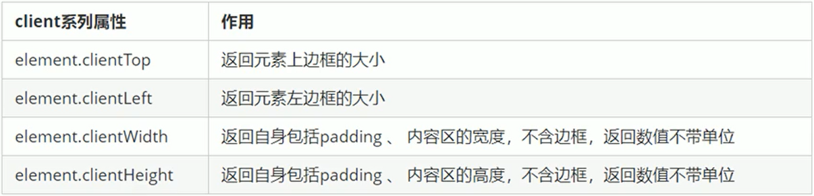

## BOM

BOM( Browser Object Model )即浏览器对象模型，它提供了独立于内容而与浏览器窗口进行交互的对象，其核心对象是 window。

BOM 由一系列相关的对象构成，并且每个对象都提供了很多方法与属性。

BOM 缺乏标准，JavaScript 语法的标准化组织是 ECMA，DOM 的标准化组织是 W3C，BOM 最初是 Netscape 浏览器标准的一部分。

<strong>DOM</strong>

文档对象模型·

- DOM 就是把「文档」当做一个「对象」来看待
- DOM 的顶级对象是 document
- DOM 主要学习的是操作页面元素
- DOM 是 W3C 标准规范

<strong>BOM</strong>

浏览器对象模型

- 把「浏览器」当做一个「对象」来看待

- BOM 的顶级对象是 window
- BOM 学习的是浏览器窗口交互的一些对象
- BOM 是浏览器厂商在各自浏览器上定义的，兼容性较差中
- BOM 包含 DOM

window 对象是浏览器的顶级对象，它具有双重角色。

1. 它是 JS 访问浏览器窗口的一个接口。
2. 它是一个全局对象。定义在全局作用域中的变量、函数都会变成 window 对象的属性和方法（全局变量=window 的属性：“window.变量名”就能打印出该变量的值，同样，函数则变成 window 的方法）。在调用的时候可以省略 window，前面学习的对话框都属于 window 对象方法，如 alert()、prompt()等。

### window 常见事件

#### 窗口加载事件 onload

在平时我们需要把 js 代码放在标签的后面，但当我们添加 window.onload 就可以把 js 代码放在任何地方了.

```javascript
window .onload = function (){在里面写js代码}或者
window.addEventListener ("load" , function() { 在里面写js代码});
```

window.onload 是窗口(页面）加载事件,当文档内容完全加载完成会触发该事件(包括图像、脚本文件、CSS 文件等),就调用的处理函数。

注意 ∶

1. 有了 window.onload 就可以把 JS 代码写到页面元素的上方，因为 onload 是等页面内容全部加载完毕，再去执行处理函数。
2. window.onload 传统注册事件方式只能写一次，如果有多个，会以最后一个 window.onload 为准。
3. 如果使用 addEventListener 则没有限制

#### 窗口加载事件 DOMContentLoaded

```javascript
document.addEventListener("DOMContentLoaded", function () {});
```

DOMContentLoaded 事件触发时，仅当 DOM 加载完成，不包括样式表，图片，flash 等等。le9 以上才支持

如果页面的图片很多的话,从用户访问到 onload 触发可能需要较长的时间,交互效果就不能实现，必然影响用户的体验，此时用 DOMContentLoaded 事件比较合适。

load 等页面内容全部加载完毕，包含页面 dom 元素图片 flash css 等等
DOMContentLoaded 是 DOM 加载完毕，不包含图片 flash css 等就可以，执行加载速度比 load 更快一些

#### 调整窗口大小事件

```javascript
window.onresize = function () {};
window.addEventListener("resize", function () {});
```

window.onresize 是调整窗口大小加载事件，当触发时就调用的处理函数。

注意 ∶

1. 只要窗口大小发生像素变化，就会触发这个事件。
2. 我们经常利用这个事件完成响应式布局。使用 window.innerWidth 获取当前屏幕的宽度

### 定时器

1. setTimeOut(回调函数,倒计时): 倒计时结束之后调用函数

   语法规范: window.setTimeout(回调函数,延时时间);

- “window”在调用的时候可以省略
- 这个延时时间单位是毫秒但是可以省略，如果省略默认的是 0
- 页面中可能有很多的定时器，我们经常给定时器加标识符（名字)

clearTimeout(定时器名字)： 清除 setTimeOut 的定时器；

2. setInterval(回调函数,间隔时间)： 每间隔多少时间就执行一次回调函数

clearInterval(定时器名字)： 清除 setInterval 的定时器；

### this

谁调用这个函数/方法，this 就指向谁

### JS 执行队列

JavaScript 语言的一大特点就是单线程，也就是说，同一个时间只能做一件事。这是因为 Javascript 这门脚本语言诞生的使命所致——JavaScript 是为处理页面中用户的交互，以及操作 DOM 而诞生的

比如我们对某个 DOM 元素进行添加和删除操作，不能同时进行。应该先进行添加，之后再删除。

单线程就意味着，所有任务需要排队，前一个任务结束，才会执行后一个任务。这样所导致的问题是 ∶ 如果 JS 执行的时间过长，这样就会造成页面的渲染不连贯，导致页面渲染加载阻塞的感觉。

为了解决这个问题，利用多核 CPU 的计算能力，HTML5 提出 Web Worker 标准，允许 JavaScript 脚本创建多个线程。于是，JS 中出现了同步和异步。

### 同步

前一个任务结束后再执行后一个任务，程序的执行顺序与任务的排列顺序是一致的、同步的。比如做饭的同步做法:我们要烧水煮饭，等水开了( 10 分钟之后），再去切菜，炒菜。

### 异步

你在做一件事情时，因为这件事情会花费很长时间，在做这件事的同时，你还可以去处理其他事情。比如做饭的异步做法，我们在烧水的同时，利用这 10 分钟，去切菜，炒菜。

他们的本质区别 ∶ 这条流水线上各个流程的执行顺序不同。

### JS 执行机制

1. 先执行执行栈中的同步任务。
2. 异步任务（回调函数)放入任务队列中。
3. 一旦执行栈中的所有同步任务执行完毕，系统就会按次序读取任务队列中的异步任务，于是被读取的异步任务结束等待状态，进入执行栈，开始执行。

### location 对象

window 对象给我们提供了一个 location 属性用于获取或设置窗体的 URL，并且可以用于解析 URL。因为这个属性返回的是一个对象，所以我们将这个属性也称为 location 对象。

#### URL

统一资源定位符(Uniform Resource Locator,URL)是互联网上标准资源的地址。互联网上的每个文件都有一个唯一的 URL，它包含的信息指出文件的位置以及浏览器应该怎么处理它。

URL 的一般语法格式为︰

<div style="background-color: rgb(228, 240, 255);padding:10px;margin-bottom:10px;">
protocol: / /host [ :port]/path/ [ ?query]#fragment
http: / / www.itcast.cn/index.html ?name=andy&age=18#link
</div>


#### location 对象属性


#### location 对象方法


### navigator

navigator 对象包含有关浏览器的信息，它有很多属性，我们最常用的是 userAgent，该属性可以返回由客户机发送服务器的 user-agent 头部的值。

下面前端代码可以判断用户那个终端打开页面，实现跳转

<div style="background-color: rgb(228, 240, 255);padding:10px;margin-bottom:10px;">
if ((navigator.userAgent.match (/(phone|pad|pod|iPhone|iPod| ios|iPad |Android|Mobile|BlackBerry| IEMobile |MQQBrowser| JUC| Fennec / wOSBrowser|BrowserNG| WebOS| Symbian | windows Phone)/i) ) ) {

window . location.href = "";
//手机

}else {

window . location.href = "";
//电脑

}

</div>

### history 对象


### 元素偏移量 offset

offset 概述：
offset 翻译过来就是偏移量，我们使用 offset 系列相关属性可以动态的得到该元素的位置(偏移)、大小等。

- 获得元素距离带有定位父元素的位置
- 获得元素自身的大小(宽度高度)
- 注意:返回的数值都不带单位

  offset 系列常用属性
  

### offset 与 style 区别

offset：

- offset 可以得到任意样式表中的样式值
- offset 系列获得的数值是没有单位的
- offsetWidth 包含 padding+border+width·
- offsetWidth 等属性是只读属性，只能获取不能赋值·

所以，我们想要获取元素大小位置，用 offset 更合适

style：

- style 只能得到行内样式表中的样式值
- style.width 获得的是带有单位的字符串
- style.width 获得不包含 padding 和 border 的值
- style.width 是可读写属性，可以获取也可以赋值

所以，我们想要给元素更改值，则需要用 style 改变·

### 元素可视区 client 系列

client 翻译过来就是客户端，我们使用 client 系列的相关属性来获取元素可视区的相关信息。通过 client 系列的相关属性可以动态的得到该元素的边框大小、元素大小等。



### 立即执行函数

1. 立即执行函数：不需要另外调用，立马能够自己执行的函数.

2. 写法：

```javascript
// 1
(function [函数名](形参1, 形参2) {
  函数体;
})(实参1, 实参2);
// 2
(function [函数名](形参1, 形参2) {})(实参1, 实参2);
```

3. 立即执行函数最大得作用就是独立创建一个作用域，里面的所有变量都是局部变量，不会有命名冲突的现象

### 元素 scroll 系列属性


scrollTop 是用于在盒子中的元素的，页面的被卷去的头部是用 pageYOffset


offsetWidth clientWidth scrollWidth 对比


他们主要用法︰

1. offset 系列经常用于获得元素位置 offsetLeft offsetTop
2. client 经常用于获取元素大小 clientWidth clientHeight
3. scroll 经常用于获取滚动距离 scrollTop scrollLeft

### mouseenter 和 mouseover 的区别

mouseenter 鼠标事件
当鼠标移动到元素上时就会触发 mouseenter 事件类似 mouseover，它们两者之间的差别是：

mouseover 鼠标经过自身盒子会触发，经过子盒子还会触发。mouseenter 只会经过自身盒子触发。之所以这样，是因为 mouseenter 不会冒泡

### 动画实现原理

核心原理 ∶ 通过定时器 setInterval()不断移动盒子位置。

实现步骤︰

1. 获得盒子当前位置
2. 让盒子在当前位置加上 1 个移动距离
3. 利用定时器不断重复这个操作
4. 加一个结束定时器的条件
5. 注意此元素需要添加定位，才能使用 element.style.left

### 缓动动画效果原理

缓动动画就是让元素运动速度有所变化，最常见的是让速度慢慢停下来

思路:

1. 让盒子每次移动的距离慢慢变小，速度就会慢慢落下来。
2. 核心算法︰(目标值-现在的位置)/ 10 做为每次移动的距离步长 3.停止的条件是 ∶ 让当前盒子位置等于目标位置就停止定时器
