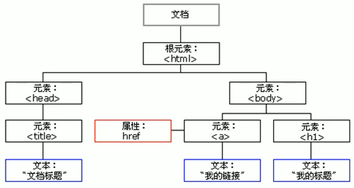
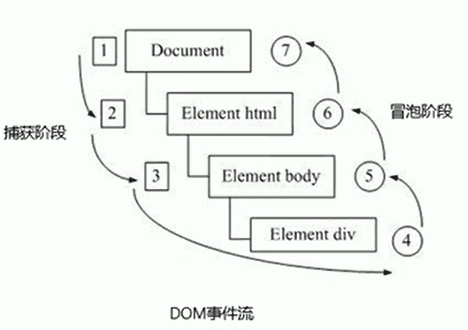
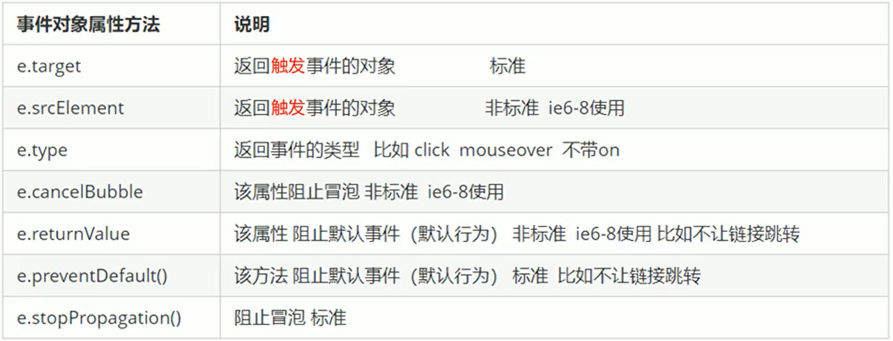
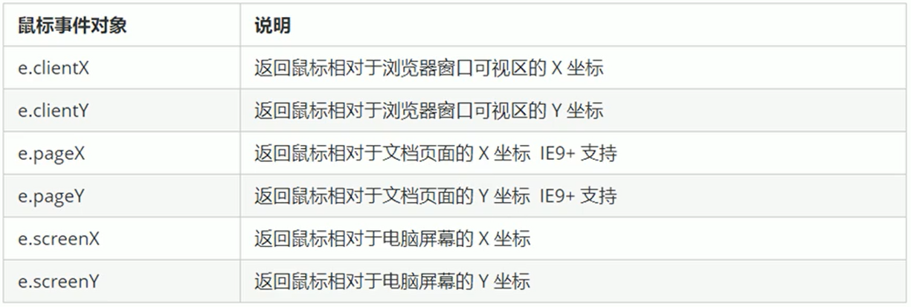

### DOM

### 什么是 DOM

DOM（Document Object Model）文档对象模型，是 W3C 组织推荐的处理可扩展标记语言的标准编程接口。通过这些接口可以改变网页的内容、结构和样式。

DOM 树



- 文档：一个页面就是一个文档
- 元素：页面中的所有标签
- 节点 ∶ 网页中的所有内容都是节点（标签、属性、文本、注释等），DOM 中使用 node 表示

DOM 把以上内容都看做是对象

### 获取页面元素

#### 根据 ID 获取页面元素

1. 使用 getElementById()方法可以获取带有 ID 的元素对象。

   - element 是一个 Element 对象。如果当前文档中拥有特定 ID 的元素，该元素不存在则返回 null.
   - id 是大小写敏感的<strong>字符串</strong>，代表了所要查找的元素的唯一 ID.
   - 返回的是元素对象（object）

使用方式：

```html
<div id="id1">20000</div>
```

```JavaScript

console.log(document.getElementById('id1'));//<div id="id1">20000</div>

// console.dir打印我们返回的元素对象，可以更好的查看里面的属性和方法
console.dir(id1);

```

#### 根据标签获取页面元素

1. 使用 getElementByTagName()方法可以根据标签获取元素对象的集合，并且是以伪数组的形式存储的（有索引、有长度）
   如果页面中没有这个元素存在，则返回空的伪数组形式

```JavaScript

var lis = document.getElementByTagName('li');

console.log(lis);  //获取所有li标签
//lis[0]即第一个li元素
```

2. 使用 element.getElementsByTagName('标签名')，获取指定元素下的子元素

```JavaScript
var ol = document.getElementById('ol');
console.log(ol.getElementsByTagName(' li'));

```

#### 根据类名返回元素对象集合

document.getElementsByClassName ('类名');

#### querySelector

querySelector 返回指定选择器的第一个元素对象(当多个元素的类名是同一个时，只返回第一个)

<strong>注意：类名前面要加‘ . ’ ，id 前面要加‘ # ’</strong>

```JavaScript
var box = document.querySelector('.box ');
var nav = document.querySelector('#nav');
```

querySelectorAll()返回指定选择器的所有元素对象集合（伪数组）

```JavaScript
var allBox = document.querySelectorAll( '.box ');  //返回所有类名为box的元素
console.log(allBox);
var lis = document.querySelectorAl1( 'li');//返回所有标签li的元素
console.log(lis);
```

### 获取特殊元素

```JavaScript
//1.获取body元素
var bodyEle = document.body;
console.log(bodyEle);

console.dir(bodyEle);//获取该元素的所有内容和方法

//2.获取html 元素
var htmlEle = document.documentElement;
console.log(htmlEle);
```

### 事件

```html
<button id="btn">唐伯虎</button>
```

1．事件是有三部分组成：事件源、事件类型、事件处理程序

我们也称为事件三要素

（1）事件源事件被触发的对象 谁 按钮

```JavaScript
var btn = document.getElementById( ' btn' );
```

（2）事件类型如何触发什么事件比如鼠标点击(onclick)还是鼠标经过还是键盘按下

（3）事件处理程序通过一个函数赋值的方式完成

```JavaScript
btn.onclick = function() {

}
```

2. 文档的任何元素都可以添加事件
3. 常见的鼠标事件


### 改变元素内容（不对表单起作用，表单需通过 value 来修改）

```html
<button>显示当前系统时间</button>
<div>某个时间</div>
```

1. element.innerText 非标准
   1. 不识别 html 标签
   2. 去除文本开头和末尾的空格和换行
   3. 可读写

```JavaScript
var btn = document.querySelector('button');
var div = document.querySelector('div');
btn.onclick = function() {
    div.innerText = '123';
    div.innerText = '<strong>123</strong>';
}
console.log(div);//<strong>123</strong>, 不识别html标签
console.log(div.innerText);//<strong>123</strong>, 不识别html标签
```

1. element.innerHTML w3c 标准
   1. 识别 html 标签
   2. 不去除文本开头和末尾的空格和换行
   3. 可读写

```JavaScript
btn.onclick = function() {
    div.innerHTML = '123';
    div.innerHTML = '<strong>123</strong>';  //页面中展示加粗的123，识别html标签
}
console.log(div.innerHTML);//123, 可读写

```

### 改变表单元素的内容

```javascript
var btn = document.querySelector(" button ");
var input = document.querySelector("input");
btn.onclick = function () {
  input.innerHTML = "点击了"; //不起作用，这个是普通盒子比如div标签里面的内容才能操作
  //表单里面的值文字内容是通过value 来修改的
  input.value = "点击了"; //内容被改为点击了
};
```

### 操作元素值修改样式属性

样式属性操作

我们可以通过 JS 修改元素的大小、颜色、位置等样式。

1. element.style（行内样式操作）

```javascript
// 1．获取元素
var div = document.querySelector("div");
// 2．注册事件处理程序
div.onclick = function () {
  //修改背景颜色
  this.style.backgroundColor = "purple";
};
```

2. element.className 类名样式操作

```html
.box{ color: #333; background-color: pink; margin-top:100px; }

<div>123</div>
```

```javascript
var div = document.querySelector("div");
div.onclick = function () {
  this.className = "box"; //点击使该div的class为box
};
```

注意:

1. JS 里面的样式采取驼峰命名法比如 fontSize、backgroundColor
2. JS 修改 style 样式操作，产生的是行内样式，css 权重比较高
3. className 会直接更改元素的类名，会覆盖原先的类名。（如果想要保留原先的类名，又需要新的类名，可以 this.className = 'old new'，两个类的属性有相同的则会被新的替换，新的类中没有的属性，旧的类有则保留）

### 获取属性的值

获取属性值

- element.属性。
- element.getAttribute('属性');

区别:
element.属性获取内置属性值（元素本身自带的属性)
element.getAttribute( '属性');主要获得自定义的属性（标准）我们程序员自定义的属性

```javascript
<div id="demo" index="1"></div>; //index属性是自定义的

var div = document.querySelector("div"); // 1．获取元素的属性值
//(1)element.属性，无法获取自定义属性的值

console.log(div.id); //demo
//(2)element.getAttribute('属性')get得到获取attribute属性，可以获取自定义属性值

console.log(div.getAttribute("id")); //demo
console.log(div.getAttribute("index")); //1
```

### 设置属性值

```javascript
<div id="demo" index="1"></div>; //index属性是自定义的

var div = document.querySelector("div"); // 1．获取元素的属性值
//(1)element.属性，无法获取自定义属性的值
div.id = "demo2";
div.setAttribute("index", 2);
div.setAttribute("class", "footer"); //class特殊，这里写的是class而不是className
```

### 移除属性 element.removeAttribute('属性');

```javascript
div.removeAttribute("index");
```

### 自定义属性

自定义属性只能通过 getAttribute('属性')获取。

但是有些自定义属性很容易引起歧义，不容易判断是元素的内置属性还是自定义属性。

H5 给我们新增了自定义属性 ∶ 1.设置 H5 自定义属性
H5 规定自定义属性 data-开头做为属性名并且赋值。比如

<div data-index='1' ></div>

2． H5 新增 element.dataset.index 或者 element.dataset['index'] ie 11 才开始支持

```javascript
div.setAttribute( 'data-time',20);
console.log(div.getAttribute('data-index'));
/ h5新增的获取自定义属性的方法
// dataset是一个集合里面存放了所有以data开头的自定义属性
console.log(div.dataset);
I
console.log(div.dataset.index);

//如果有一个属性有两个-组成如：
console.log(div.getAttribute( 'data-list-name'));
//那么在获取其属性值的时候应该把-去掉，并且改为小驼峰命名法
console.log(div.dataset['listName']);

```

#### 获取元素通常使用两种方式:

1.利用 DOM 提供的方法获取元素

- document.getElementById()

- document.getElementsByTagName()

- document.querySelector()等

- 逻辑性不强、繁琐

  2.利用节点层级关系获取元素

- 利用父子兄节点关系获取元素

- 逻辑性强，但是兼容性稍差

一般地，节点至少拥有 nodeType (节点类型)、nodeName (节点名称)和 nodeValue

基本属性：

元素节点 nodeType 为 1

属性节点 nodeType 为 2

文本节点 nodeType 为 3(文本节点包含文字、空格、换行等)

我们在实际开发中节点操作主要操作的是元素节点

### 父节点 parentNode

```html
<div class="box">
  <span class="erweima">x</span>
</div>
```

```javascript
var erweima = document.querySelector(".erweima");
console.log(erweima.parentNode); //<div class="box"><span class="erweima" >x</span></div>
```

如果没有父节点则返回 null

### 子节点

#### 1. node.childNodes

parentNode.childNodes 返回包含指定节点的子节点的集合，该集合为即时更新的集合。

注意:返回值里面包含了所有的子节点，包括元素节点，文本节点等。

如果只想要获得里面的元素节点，则需要做以下专门处理。所以我们一般不提倡使用 childNodes

```javascript
var ul = document.querySelector("ul");
for (var i = o; i < ul.childNodes.length; i++) {
  if (ul.childNodes[i].nodeType == 1) {
    // ul.childNodes[i]是元素节点
    console.log(ul.childNodes[i]);
  }
}
```

#### 2. parentNode.children(非标准)

parentNode.children 是一个只读属性，返回所有的子元素节点，是伪元素。它只返回子元素节点，其余节点不返回(这个是我们重点掌握的)。

虽然 children 是一个非标准，但是得到了各个浏览器的支持，因此我们可以放心使用

#### 3. 第一个子节点

parentNode.firstChild

firstChild 返回第一个子节点，找不到则返回 null。同样，也是包含所有的节点。

#### 4. 最后一个子节点

parentNode.lastChild

lastChild 返回最后一个子节点，找不到则返回 null。同样，也是包含所有的节点。

#### 5. parentNode.firstElementChild

firstElementChild 返回第一个子元素节点，找不到则返回 null。

#### 6. parentNode.lastElementChild

lastElementChild 返回最后一个子元素节点，找不到则返回 null。

注意 ∶ 这两个方法有兼容性问题，IE9 以上才支持。

实际开发的写法既没有兼容性问题又返回第一个子元素

```javascript
console.log(ol.children[0]);
console.log(ol.children[ol.children.length - 1]);
```

### 兄弟节点

#### 1. element.nextSibling 得到下一个兄弟节点（包括文本节点），找不到则返回 null

```html
<div>我是div</div>
<span>我是span</span>
<script>
  var div = document.querySelector("div");
  // nextSibling 下一个兄弟节点包含元素节点或者文本节点等等
  console.log(div.nextSibling);
</script>
```

#### 2. element.previous Sibling 得到上一个兄弟节点（包括文本节点），找不到则返回 null

#### 3. nextElementSibling 得到下一个兄弟元素节点

#### 4. previousElementSibling 得到上一个兄弟元素节点

这两个方法可以得到元素节点，但是有兼容性问题，要解决元素节点和兼容性问题可以通过封装函数来解决

```javascript
function getNextElementSibling(element) {
  var el = element;
  while ((el = el.nextSibling)) {
    if (el.nodeType === 1) {
      return el;
    }
  }
  return null;
}
```

#### 节点的添加与删除
1. createElement创建节点 element.appendChild最父元素尾部追加节点
```html
<ul></ul>
<script>
  // 1．创建节点元素节点
  var li1 = document.createElement("li");
  var li2 = document.createElement("li");
  //2．添加节点 node.appendChild(child) node 父级 child是子级,是后面追加元素
  var ul = document.querySelector("ul");
  ul.appendChild(li1);
  //3．添加节点 node.insertBefore(child,指定元素) node 父级 child是子级，在指定元素前面追加元素
  ul.insertBeforeChild(li2, ul.children[0]);
</script>
```
2. element.insertAdjacentHTML(position,text);
   position是相对元素的位置，并且是以下字符串之一：
   + 'beforebegin' 元素自身的前面
   + 'afterbegin' 插入元素内部的第一个节点之前
   + 'beforeend' 插入元素内部的第一个节点之后
   + 'afterend' 元素自身的后面
```html
<ul>
  <li></li>
  <li></li>
  <li></li>
</ul>
<script>
  var ul = document.querySelector("ul");
  var li = '<li class="a">123</>'
 ul.insertAdjacentHTML('beforeend',li);//这时ul的长度为4，多出一个<li class="a">123</>
</script>
```


text是要被解析的HTML或XML，并插入到DOM树中的字符串
1. 删除节点 node.removeChild(child)

```html
<ul>
  <li></li>
  <li></li>
  <li></li>
</ul>
<script>
  var ul = document.querySelector("ul");
  ul.removeChild(ul.children[0]);
</script>
node.removeChild(child)这里的node必须是要删除的节点的父节点，child是要删除的节点
```

##### 阻止链接跳转

javascript:;

```html
<a href="javascript:;"></a
><!--可是使链接不进行跳转-->
```

#### 克隆节点

node.cloneNode(),复制 node

node.cloneNode ()方法返回调用该方法的节点的一个副本。也称为克隆节点/拷贝节点

注意 ∶ 1.如果括号参数为空或者为 false，则是浅拷贝，即只克隆复制节点本身，不克隆里面的子节点。
⒉.如果括号参数为 true，则是深度拷贝，会复制节点本身以及里面所有的子节点。

```javascript
var ul = document.querySelector("ul");
// 1. node.cloneNode();括号为空或者里面是false 浅拷贝只复制标签不复制里面的内容l/
node.cloneNode(true); //括号为true 深拷贝复制标签复制里面的内容

var lili = ul.children[0].cloneNode(true); //复制ul.children[0]
ul.appendChild(lili);
```

1. document.write 是直接将内容写入页面的内容流，但是文档流执行完毕，则它会导致页面全部重绘
2. innerHTML，是将内容写入某个 DOM 节点，不会导致页面全部重绘
3. innerHTML 创建多个元素效率更高（拼接字符串效率则会比较低，采取数组形式拼接则效率高），结构稍微复杂
4. createElement ()创建多个元素效率稍低一点点，但是结构更清晰

### DOM 重点核心

关于 dom 操作，我们主要针对于元素的操作。主要有创建、增、删、改、查、属性操作、事件操作。

1. 创建

- document.write
- innerHTML3. createElement

2. 增

- appendChild
- insertBefore

3. 删

- removeChild

4. 改
   主要修改 dom 的元素属性，dom 元素的内容、属性,表单的值等

- 修改元素属性:src、href、title 等
- 修改普通元素内容:innerHTML、innerText
- 修改表单元素: value、type、disabled 等
- 修改元素样式: style、className

5. 查
   主要获取查询 dom 的元素

- DOM 提供的 API 方法: getElementById、getElementsByTagName 古老用法不太推荐
- H5 提供的新方法:querySelector、querySelectorAll 提倡
- 利用节点操作获取元素:父(parentNode)、子(children)、兄(previousElementSibling.
  nextElementSibling)提倡

6. 属性操作
   主要针对于自定义属性。

- setAttribute :设置 dom 的属性值
- getAttribute:得到 dom 的属性值
- removeAttribute 移除属性

7. 事件操作
   给元素注册事件，采取事件源.事件类型=事件处理程序

### 注册事件的两种方式

1. 注册事件概述
   给元素添加事件，称为注册事件或者绑定事件。

注册事件有两种方式:传统方式和方法监听注册方式

#### 传统注册方式

利用 on 开头的事件 onclick。

```html
<button onclick="alert('hi~')"></button>
<script>
  btn.onclick = function () {};
</script>
```

- 特点：注册事件的唯一性
- 同一个元素同一个事件只能设置一个处理函数，最后注册的处理函数将会覆盖前面注册的处理函数

#### 方法监听注册方式

w3c 标准推荐方式·

addEventListener()它是一个方法·

IE9 之前的 IE 不支持此方法，可使用 attachEvent()代替·

特点 ∶ 同一个元素同一个事件可以注册多个监听器按注册顺序依次执行

```javascript
var btns = document.querySelectorAll("button"); // 1．传统方式注册事件
btns[0].onclick = function () {
  alert("hi");
};

btns[0].onclick = function () {
  alert("hao a u");
};
// 2．事件侦听注册事件 addEventListener
//（1）里面的事件类型是字符串必定加引号而且不带on
//（2）同一个元素同一个事件可以添加多个侦听器（事件处理程序)
btns[1].addEventListener("click ", function () {
  alert(22);
});

btns[1].addEventListener("click", function () {
  alert(33);
});

btns[2].addEventListener("click ", fn); //里面的fn不需要调用加小括号

function fn() {
  alert(44);
}
//点击btns[1]时，先弹出22，再弹出33
```

### 删除事件（解绑事件）

1. 传统注册方式
   eventTarget.onclick =null;
2. 方法监听注册方式

- eventTarget.removeEventListener(type，listener[,useCapture] );
- eventTarget.detachEvent (eventNameWithOn,callback);

```javascript
var divs = document.querySelectorAll("div");
divs[0].onclick = function () {
  alert(11);
  // 1．传统方式删除事件divs[0].onclick = null;
};
// 2.removeEventListener删除事件
divs[1].addEventListener("click", fn); //里面的fn不需要调用加小括号
function fn() {
  alert(22);
  divs[1].removeEventListener(" click", fn);
}
// 3.
divs[2].attachEvent("onclick", fn1);
function fn1() {
  alert(33);
  divs[2].detachEvent("onclick ", fn1);
}
```

### 事件流

事件流描述的是从页面中接收事件的顺序。
事件发生时会在元素节点之间按照特定的顺序传播，这个传播过程即 DOM 事件流。

比如我们给一个 div 注册了点击事件:
DOM 事件流分为 3 个阶段︰

- 捕获阶段
- 当前目标阶段
- 冒泡阶段



事件冒泡 ∶IE 最早提出，事件开始时由最具体的元素接收，然后逐级向上传播到到 DOM 最顶层节点的过程。

事件捕获 ∶ 网景 最早提出，由 DOM 最顶层节点开始，然后逐级向下传播到到最具体的元素接收的过程。

事件发生时会在元素节点之间按照特定的顺序传播，这个传播过程即 DOM 事件流。

注意

1. Js 代码中只能执行捕获或者冒泡其中的一个阶段。
2. onclick 和 attachEvent 只能得到冒泡阶段。
3. addEventListener(type，listener[,useCapture] )第三个参数如果是 true，表示在事件捕获阶段调用事件处理程序;如果是 false(默认是 false )，表示在事件冒泡阶段调用事件处理程序。
4. 实际开发中我们很少使用事件捕获，我们更关注事件冒泡。
5. 有些事件是没有冒泡的，比如 onblur、onfocus、onmouseerker、onmouseleave
6. 事件冒泡有时候会带来麻烦，有时候又会帮助很巧妙的做某些事件，我们后面讲解。

#### 事件捕获

具体解释：当一个元素以及其父级元素都绑定了一个同一个事件，比如：

```html
<div class='father'>
   <div class = 'son'>

   </div>
</div>

<script>
   var son = document.querySelector('.son');
   var father = document.querySelector('.father');
   son.addEventListener('click',function(){
      alert('son');
   }.true)
    father.addEventListener('click',function(){
      alert('father');
   }.true)
</>
```

这时按照捕获的顺序是从外往里执行，当点击 son 时先弹出 father 再弹出 son

#### 事件冒泡

具体解释：当一个元素以及其父级元素都绑定了一个同一个事件，比如：

```html
<div class="father">
  <div class="son"></div>
</div>

<script>
  var son = document.querySelector(".son");
  var father = document.querySelector(".father");
  son.addEventListener(
    "click",
    function () {
      alert("son");
    }.false
  );
  father.addEventListener(
    "click",
    function () {
      alert("father");
    }.false
  );
</script>
```

这时按照捕获的顺序是从里往外执行，当点击 son 时先弹出 son 再弹出 father

### 事件对象

1. 什么是事件对象

```javascript
eventTarget.onclick = function (event) {};
eventTarget.addEventListener("click ", function (event) {});
//这个event就是事件对象，我们还喜欢的写成e 或者evt
```

官方解释:event 对象代表事件的状态，比如键盘按键的状态、鼠标的位置、鼠标按钮的状态。

简单理解︰事件发生后，跟事件相关的一系列信息数据的集合都放到这个对象里面，这个对象就是事件对象 event，它有很多属性和方法。

比如︰

1. 谁绑定了这个事件。
2. 鼠标触发事件的话，会得到鼠标的相关信息，如鼠标位置。
3. 键盘触发事件的话，会得到键盘的相关信息，如按了哪个键。

- 这个 event 是个形参，系统帮我们设定为事件对象，不需要传递实参过去。
- 当我们注册事件时，event 对象就会被系统自动创建，并依次传递给事件监听器（事件处理函数）。

- 这个事件对象我们可以自己命名比如 event . evt、e
- 事件对象也有兼容性问题 ie678 通过 window.event 兼容性的写法 e = e |window.event;

#### 事件对象的常见属性和方法



```javascript
// 1. e.target返回的是触发事件的对象（元素）this返回的是绑定事件的对象（元素)
//区别:e.target点击了那个元素，就返回那个元素 this那个元素绑定了这个点击事件，那么就返回谁
var div = document.querySelector("div ");
div.addEventListener("click ", function (e) {
  console.log(e.target);
  console.log(this);
  //当这个div没有子元素时，两个console.log均把该div元素打印出来
});
var ul = document.querySelector("ul"); //ul下有li
ul.addEventListener(" click ", function (e) {
  //我们给ul 绑定了事件 那么this就指向ul
  console.log(this); //不管是点击ul还是点击ul下的li均返回ul元素
  // e.target 指向我们点击的那个对象谁触发了这个事件我们点击的是li e.target 指向的就是li
  console.log(e.target); //点击ul下的li则返回该li元素，点击ul就返回ul元素
});
```

#### 事件对象阻止默认行为

```javascript
//阻止默认行为（事件）比如：让链接不跳转或者让提交按钮不提交
var a = document.querySelector("a");
a.addEventListener("click", function (e) {
  e.preventDefault(); //dom标准写法
});
// 3．传统的注册方式
a.onclick = function (e) {
  //普通浏览器 e.preventDefault();方法
  e.preventDefault();
  //低版本浏览器ie678 returnValue属性
  e.returnValue;
  //我们可以利用return false 也能阻止默认行为没有兼容性问题特点: return后面的代码不执行了，而且只限于传统的注册方式
  return false;
  alert(11);
};
```

#### 阻止事件冒泡 stopPropagation()

只阻止该层的事件冒泡

```html
<div class="father">
  <div class="son"></div>
</div>

<script>
  var son = document.querySelector(".son");
  var father = document.querySelector(".father");
  son.addEventListener(
    "click",
    function (e) {
      e.stopPropagation(); //阻止事件冒泡
      alert("son");
    }.false
  );
  father.addEventListener(
    "click",
    function (e) {
      alert("father");
    }.false
  );
</script>
```

### 事件委托

事件委托也称为事件代理，在 jQuery 里面称为事件委派。

<strong>事件委托的原理：</strong>

不是每个子节点单独设置事件监听器，而是事件监听器设置在其父节点上，然后利用冒泡原理影响设置每个子节点。

以上案例: 给 ul 注册点击事件，然后利用事件对象的 target 来找到当前点击的 li，因为点击 li，事件会冒泡到 ul 上，ul 有注册事件，就会触发事件监听器。

<strong>事件委托的作用：</strong>

我们只操作了一次 DOM，提高了程序的性能。

### 常用鼠标事件对象



### 常用键盘事件


三个事件的执行优先级：up==》down==》press

### 键盘事件对象

| 键盘事件对象属性 | 说明                |
| ---------------- | ------------------- |
| keyCode          | 返回该键的 ASCII 值 |

在获取 keyCode 时的事件类型：
onkeydown 和 onkeyup 不区分字母大小写，onkeypress 区分字母大小写。在我们实际开发中，我们更多的使用 keydown 和 keyup，它能识别所有的键（包括功能键）

keypress 不识别功能键，但是 keyCode 属性能区分大小写，返回不同的 ASCII 值

```javascript
document.addEventListener('keyup', function(e) {

   console.log( ' up: ' + e.keycode);
   //我们可以利用keycode返回的ASCII码值来判断用户按下了那个键
   if (e.keyCode === 65) {
      alert('您按下的a键');
   }else {
      alert(您没有按下a键');
   }
})

```
