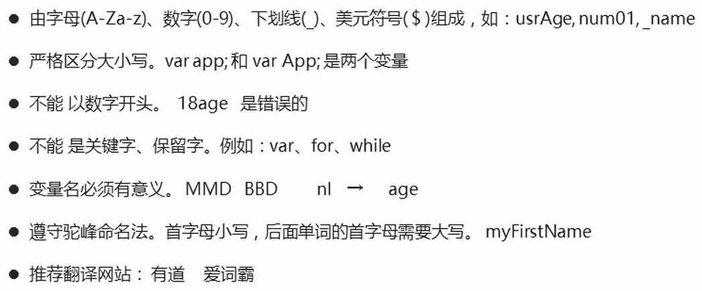
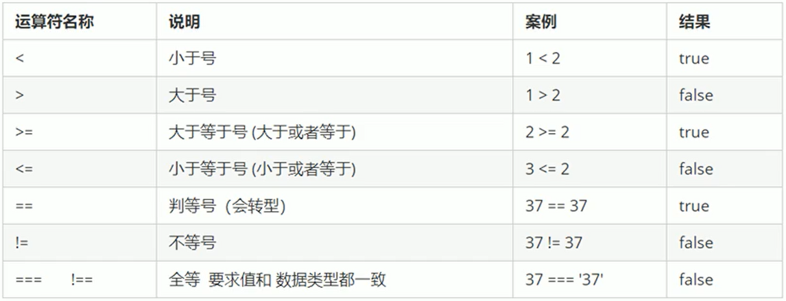

### JavaScript 是什么？

- JavaScript 是世界上最流行的语言之一，是高级语言，也是一种运行在客户端的脚本语言（Script 就是脚本的意思）
- 脚本语言： 不需要编译，运行过程种由 js 解释器（js 引擎）逐行来进行解释并执行
- 现在也可以基于 Node.js 技术进行服务器端编程

JS 产生的最初目的是解决表单验证的问题

#### 浏览器

浏览器分为两部分 渲染引擎和 JS 引擎

- 渲染引擎迎来解析 HTML 和 CSS，俗称内核，比如 chrome 浏览器的 blink，老版本的 webkit
- JS 引擎：也称为 JS 解释器。用来读取网页中的 JS 代码，对其进行处理后运行，比如 chrome 的 V8

浏览器本身并不会执行 JS 代码，而是通过内置的 JS 引擎来执行 JS 代码。JS 引擎执行代码时逐行解释每一句源码转换为机器语言，然后由计算机去执行，所以 JS 语言归为脚本语言，会逐行解释执行.

#### JS 的组成

JavaScript 包括：ECMAcript（JS 语法）、DOM（页面文档对象模型）、BOM（浏览器对象模型）

#### JS 书写规范

在 HTML 中使用双引号，在 JS 中使用单引号

引入外部 js 文件

```html
<script src="myjs.js"></srcipt>
```

中间不要写任何代码

JS 注释：

- 单行注释 // &nbsp; &nbsp;&nbsp;&nbsp; （快捷键 ctrl+/）
- 多行注释 /\*\*/ &nbsp; &nbsp;&nbsp;&nbsp; （快捷键 shift+alt+a）

### 变量

变量的本质：变量是程序向内存申请的一块用来存放数据的空间（变量是内存中的空间）

```javascript
1
var myname; /*声明变量*/
myname = 'Jenny' /*变量的赋值*/

2
var name = 'Jenny' /*变量的初始化*/

3
myname = 'Tom' /*变量值的覆盖，变量值以最后一次的赋值为最终值*/

4
var age = 10, sex = '女', grade = 90; /*同时声明多个变量时，可以只写一个var，变量之间用逗号隔开*/

5
var patato;
console.log(patato);  //只声明不赋值输出Undefined  不声明则报错

6
tel = 123；
console.log(123)  //不声明直接赋值可以使用，但不提倡，是全局变量

7.
var a = b = c = 9;
相当于: var a = 9; b = 9; c = 9;//因此b、c是全局变量

集体声明应该是： var a =9, b = 9,c = 9;
```

### 变量命名规范



### 数据类型

基本数据类型

- 数字 number
  - 数字类型中有一个特殊的值 NaN 代表的不是一个有效数字，但属于 number 类型
- 字符串 string
- 布尔 boolean
- null
- undefined
-

复杂数据类型

- 对象 object
  - 普通对象
  - 数组对象
  - 正则对象
  - 日期对象
- 函数 function
- 特殊类型 Symbol

#### 为什么需要数据类型

在计算机中，不同的数据所需占用的存储空间是不同的，为了充分利用存数空间，于是定义了不同的数据类型。

JavaScript 是一种弱类型/动态语言，这意味着不用提前声明变量的类型，在程序运行过程中，类型会被自动确定。并且会根据值的变化而变化数据类型。

JavaScript 的变量数据类型是只有程序在运行过程中，根据等号右边的值（变量值）来确定的。

```javascript
var x = 10; //number类型
x = "hhhh"; //字符串类型
```

### 基本数据类型

| 基本数据类型 | 说明                                               | 默认值    |
| ------------ | -------------------------------------------------- | --------- |
| Number       | 数字类型，包含整型值、浮点型值，如 12、0.12        | 0         |
| Boolean      | 布尔值类型，如 true、false，等价于 1 和 0          | false     |
| String       | 字符串类型，如'Jenny'、'张三' ，注意字符串要带引号 | ''        |
| Undefined    | 声明但未定义                                       | Undefined |
| Null         | var a = null; 直接复制为 null                      | null      |

#### Number 数字类型

- 在程序里面数字前面加 0 表示八进制

```javascript
var num1 = 010;
console.log(num1); //8
```

- 在程序里面数字前面加 0x 表示十六进制

```javascript
var num1 = 0xa;
console.log(num1); //10
```

数字类型范围：

最大值：Number.MAX_VALUE;

最小值：Number.MIN_VALUE;

数字类型的特殊值（注意这是值）：

无穷大：Infinity
无穷小：-Infinity
非数值：NaN

```javascript
var num = Number.MAX_VALUE * 2;
console.log(num); //Infinity
```

### isNaN 检测是否是非有效数字

```javascript
isNaN(123); //false
isNaN("123"); //false
isNaN("null"); //false
isNaN("undefined"); //true
isNaN({ age: 9 }); //true
isNaN([12, 23]); //true
isNaN([12]); //false
isNaN(/^a/); //true
isNaN(function () {}); //true
```

#### isNaN 检测的机制

1. 首先验证当前要检测的值是否数据字类型的，如果不是，浏览器会默认把值转换为数据类型

- 把非数据类型的值转换为数字
  - 把其他基本类型转换为数字 => Number(): 例：字符串转换为数字：Number('123') -> 13

* 复杂数据类型的值转换为数字
  - 调用该数据的 toString 方法转换为字符串，再把字符串调取 Number 转换为数字；例：{age:12} -> "[Object object]" -> NaN
  - [12,123].toString() -> '12,23' -> NaN

2. 当前检测的值已经是数字类型，是有效数字返回 false，不是则返回 true（数字类型中只有 NaN 不是有效数字，其余都是有效数字）

#### 字符串类型 String

字符串类型可以是引号中的任意文本，可以是双引号内的文本也可以是单引号内的文本，在 JavaScript 中建议使用单引号。

```JavaScript
var strMsg = "Jenny" ;  //单引号
var strMsg2 = 'Tom';   //双引号

var strMsg3 = '我是"Jenny"';  //外单内双
var strMsg4 = "我是'Jenny'";  //外双内单

var worse = 'hhhhh"; //报错 不能一单一双
```

#### 转义字符

|     |        |     |     |          |
| --- | ------ | --- | --- | -------- |
| \\' | 单引号 |     | \n  | 换行符   |
| \\" | 双引号 |     | \r  | 回车符   |
| \\& | &      |     | \t  | tab 缩进 |
| \\\ | \      |     | \b  | 退格符   |
| \f  | 换页符 |

##### 字符串长度

v.length（v 是变量）

```JavaScript
var myName = 'Jenny';
console.log(maName.length); //显示5
```

##### 字符串拼接

- 使用“+”

- 字符串跟任意类型的数据拼接都是字符串

```JavaScript
var str1 = '我是';
var str2 = 'Jenny';

console.log(str1+str2); //我是珍妮

console.log(str2+168); //Jenny168
console.log(str2+true); //Jennytrue

console.log('2'+168); //2168

```

### boolean 类型转换

**`在js中，只有“0/NaN/空字符串/null/undefined”这五个值转换为布尔类型的false，其余都转为true，如空数组、空对象转换为布尔类型都是true`**

### null 和 undefined

> 都代表空或没
>
> - null：空对象指针
> - undefined：未定义

null 一般是指意料之中的没有，即手动赋值为 null

undefined 代表的是没有一般人都不认为手动控制的，大部分都是浏览器资助自主为空，赋值也可以不赋值；只声明未赋值时，这个变量就为 undefined

### 复杂数据类型

object 对象数据类型

> 普通对象
>
> - 由大括号包裹起来
> - 由零到多组属性名和属性值（键值对）组成

```javascript
let obj = {
  name: "jenny",
  sex: "女",
};
//获取属性值
obj.name;
obj["name"];
obj[name]; //name is not defined

var name = "tom";

obj.name; //jenny
obj["name"]; //jenny
obj[name]; //相当于obj["tom"] undefined

//彻底删除属性
delete obj["sex"];
```

对象的属性名是不允许重复的，是唯一的。

### prompt 弹出输入框

```JavaScript
var myName = prompt("请输入您的年龄");
alert("您的年龄是" + myName + "岁");
```

### 不同数据类型相加

```JavaScript
console.log(1+true); //2
console.log(Undefined+1); //NaN  Undefined和数字相加，最后结果是NaN
console.log(null+1); //1
```

### 检测数据类型

- typeof
- instanceof
- constructor
- Object.prototype.toString.call

#### typeof 获取数据类型

```JavaScript
console.log(typeof 123);//number

console.log(typeof NaN);//number

console.log(typeof 'Jenny');//string

console.log(typeof true);//boolean

console.log(typeof undefined);//undefined

console.log(typeof null);//object  因为null代表空对象指针，但没有指向任何的内存空间

console.log(typeof {});//object

console.log(typeof /^a$/);//object

console.log(typeof function(){});//function

console.log(typeof []);//object

console.log(typeof prompt(""));//不管输入什么。在输入框内输入的值都是string类型
```

### 数据类型转换

#### 把其他数据类型转换为 number 类型

1. 发生的情况
   - isNaN 检测的时候:当检测的值不是数字类型,浏览器会自己调用 Number 方法把它先 2<转换为数字，然后再检测是否为非有效数字
   - 基于 parseInt\parseFloat\Number 手动转换为数字类型
   - 数学运算+ - \* / %，但是“ + ”不仅仅是数学运算，还可能是字符串拼接（n++一定是数学运算，n+=+1 可能是字符串拼接）
2. 转换规律
   - 默认转换（非人为手动转换）调用 Number 方法
   - Number("") Number(" ") Number("\n") Number("\t") Number(null) 都是转换为 0
   - Number(undefined) Number("带有字符串的") 都是转换为 NaN
   - 引用类型转换为数字，首先调用 toString 方法转换为字符串，再转换为数字

#### 把其他类型值转换为字符串

- 基于 alert/confirm/prompt/document.write 等方法输出内容的时候，会把输出的值转换为字符串再输出
- 基于“ + ”进行字符串拼接
- 引用类型转换为数字，首先调用 toString 方法转换为字符串，再转换为数字
- 给对象设置属性名的时候，如果该属性名不是字符串则先转换为字符串再当做属性存储到对象中
- 手动调用 toString/toFixed/join/String 等方法的时候
- [].toString()是空串，{}.toString()是"[object Object]" null.toString() 是"null"

#### 其他值转换为布尔类型

- 基于!/!!/Boolean 等方法的转换
- 条件判断中的条件

只有 0/NaN/""/null/undefined 五个值会转换为 false，其余都是 true

使用表单或者 prompt 获取过来的数据默认是字符串类型的，当我们需要进行加法运算或其他时，就需要进行数据类型的转换。

#### 特殊转换 "+"

```javascript
[12] + 10 => '1210' //按理说“ + ”运算在没有字符串的时候是数学运算，有字符串才是字符串拼接
//但这里，引用类型在转换为数字类型的时候，先转换成字符串，而这里有了字符串，则直接变成了字符串拼接

[] + 10 => "10"

{} + 10 => 10  //在这里是分成了两部分，{}代表一个代码块（块级作用域） +10才是我们的操作
//相当于 {}；+10

{} + [] => 0
```

#### 特殊转换 "==" 左右两边的数据类型不一样，则先转换为相同的类型再比较

对象==对象：不一定相等，因为操作的是引用地址，地址不同则不相等

```javascript
{}=={} => false
```

除了相同数据类型之间进行比较，其余都是把数据转换为数字再进行比较

NaN 和任何值都不相等，包括它自己

#### 转换成字符串类型

| 方法             | 说明                                   | 案例                                   |
| ---------------- | -------------------------------------- | -------------------------------------- |
| toString()       | 转换为字符串                           | var num = 1； alert（num.toString()）; |
| String()强制转换 | 转换为字符串                           | var num = 1； alert（String(num)）;    |
| 加号拼接字符串   | 任何数据类型和字符串拼接结果都是字符串 | var num = 1； alert（num+""）;         |

更常用的是第三种，加号拼接字符串，也称为隐式转换

#### 转换为数字类型（重点）

| 方式                            | 说明                           | 案例                |
| ------------------------------- | ------------------------------ | ------------------- |
| parseInt(string)函数            | 将 string 类型转换为整数数值   | parseInt('123')     |
| parseFloat(string)函数          | 将 string 类型转换为浮点数数值 | parseFloat('123.1') |
| Number()强制转换                | 将 string 类型转换为数值型     | Number("123")       |
| 隐式转换（减法 - 乘法\* 除法/） | 利用算术运算                   | '12'-0              |

```JavaScript
console.log(parseInt(3.94));  // 3 取整
console.log(parseInt('120px')); //120 会去掉数字后面的非数字的字符串
console.log(parseInt('em120px')); //NaN

console.log(parseFloat(3.94));  //3.94
console.log(parseFloat('120px')); //120 会去掉数字后面的非数字的字符串
console.log(parseFloat('em120px')); //NaN

console.log(Number('123'));//123

console.log('12'-0); //输出数字型的12 “ - ”、“ * ”、“ / ”都可以
```

#### 转换为 Bool 类型

代表空和否定的值都会被转换为 false，如: ''、0、NaN、null、undefined,其余都会转换为 true

```JavaScript
console.log(Boolean(''));  // false
console.log(Boolean(0)); //false
console.log(Boolean(NaN)); //false

console.log(Boolean('adfsdgdfg')); //true
console.log(Boolean(123)); //true
```

#### 标识符

标识符是指开发人为变量、属性、函数、参数取的名字（不能是关键字和保留字）

### 运算符

#### 算术运算符

| 运算符 |      |                   |
| ------ | ---- | ----------------- |
| +      | 加   | console.log(1+1)  |
| -      | 减   | console.log(1-1)  |
| \*     | 乘   | console.log(1\*1) |
| /      | 除   | console.log(1/1)  |
| %      | 取余 | console.log(1%1)  |

算数优先级跟我们正常的算数运算一样

浮点数的算数运算会出问题，因为是用十进制转化为二进制

```JavaScript
console.log(0.1+0.2)  //  3.0000000004
console.log(0.07*100)  //  7.000000000001

因此我们不能直接用浮点数进行相比较或计算。
```

判断一个数能够被整除，常用取余的最终结果是否为 0 来判断

#### 递增和递减运算符

```JavaScript
var num = 1;

//前置递增运算符
++num；//类似于num = num + 1 ，先加1，再返回值

console.log(++num);//2

//后置递增运算符 先返回值再加1；多用后置自增，单独写
var age = 1;
console.log(age++); //1

```

递增运算符合递减运算符的运算方式一样

#### 比较运算符



```JavaScript
console.log(2 >= 3); //false
console.log(2 == 2); //true

console.log(2 == '2'); //true  == 会把字符串转换为数字类型。

console.log(2 === '2'); //false  ==== 全等，要求数据的值和数据类型全部相同
```

#### 逻辑运算符（布尔运算符）


```javascript
console.log(3>2 && 2>3); //false

逻辑中断，能确定该表达式的值时直接返回

console.log(123 && 456); //456
console.log(0 && 456); //0

console.log(123 || 456); //123

var = num = 0;
console.log(123 || num++);
console.log(num);  // 0, 因为在上一条代码中，直接返回了123，后续的表达式不再执行.
```

#### 运算符优先级


- 一元运算符里面的逻辑非优先级很高
- 逻辑与比逻辑或优先级高

### 流程控制

#### 顺序流程控制

按照代码的先后顺序依次执行

#### 分支流程控制

根据不同的条件判断，执行不同的路径代码从而得到不同的结果

#### if 语法结构

```javascript
单分支语句：

if(条件表达式){
    //表达式结果为true，否则不执行该段代码块，直接执行下一阶段的代码
}

双分支语句：

if(条件表达式){
    //表达式结果为true，否则不执行该段代码块，直接执行下一阶段的代码
}else{
    //if中的表达式为false执行该段代码块
}


多分支语句：

if(条件表达式1){
    //表达式1结果为true退出整个if分支语句，否则不执行该段代码块，直接执行下一阶段的代码
}else if(条件表达式2){
    //表达式2结果为true退出整个if分支语句，否则不执行该段代码块，直接执行下一阶段的代码
}else if(条件表达式3){
  //表达式3结果为true退出整个if分支语句，否则不执行该段代码块，直接执行下一阶段的代码
}else{
//上述条件都不成立则执行该段代码
}

```

#### 三元表达式

有三个元素组成的表达式叫做三元表达式

一元表达式：++num； 二元表达式：3+5；

三元表达式： A?B:C

```javascript
var num = 10;
console.log(num > 5 ? "yes" : "no"); //输出yes
```

三元表达式，A?B:C ，若 A 成立，则返回 B，否则返回 C；

#### switch 语句

```javascript
switch(表达式){
    case value1:
        执行语句1;
        break;
    case value2:
        执行语句2;
        break;
    case value3:
        执行语句3;
        break;
    ...
    default:
        执行最后的语句;

    //执行思路，表达式中的值对应上case后面的value则执行该case下的语句，
    //如果都不匹配，则执行default下的语句；

    //适用于固定的值

    //break用于退出循环，如果不加break，则执行完符合该case的value的语句后执行下一个case的语句
}
```

### 循环语句

循环的目的，重复执行某段代码。由循环体和循环的终止条件组成的语句就是循环语句。

#### for 循环

for 重复执行某段代码，通常跟计数有关。

```javascript
for (初始化变量; 条件表达式; 操作表达式) {
  //要循环的代码
}

//先执行初始化变量，再根据条件表达式进行判断是变量否满足，然后执行要循环的
//代码，最后执行操作表达式，紧接着进行下一次循环，判断变量是否满足条件表达式...
```

#### while 循环

```javascript
while (条件表达式) {
  //循环体
}
//当条件表达式为true时。执行循环体
```

#### do while 循环

```javascript
do {
  //循环体
} while (条件表达式);
//执行一次之后，判断是否满足条件，满足条件则继续执行
```

#### continue break

continue 关键字用于立即跳出本次循环，继续下一次循环
例子：有 5 个包子，第三个有虫子，扔掉第三个，吃下一个包子

break 关键字用于立即退出整个循环，循环结束
例子：有 5 个包子，第三个有虫子，剩下的包子都不吃了

### 数组

数组就是存储在一个变量下的一组数据的集合。

JS 中创建数组有两种方式：

- 利用 new 创建数组

var 数组名 = new Array();
例：

```javascript
var arr = new Array(); // 传建一个空的数组
```

- 利用数组字面量创建数组

var 数组名 = [];

[]里面可以存放任意类型的数据。

数组的索引（下标）从 0 开始。

例：

```javascript
var arr = ["a", "b", 1, true]; // 传建带初始值的数组
console.log(arr[0]); // a
console.log(arr[3]); // true
console.log(arr[4]); // undefined
```

在数组中可以使用 reverse()方法来使数组反转.

```javascript
var arr = [1, 2, 3];

console.log(arr); // [1, 2, 3]

arr.reverse();

console.log(arr); // [3, 2, 1]
```

在数组中可以使用 join()方法来连接输出的数组.

```javascript
var arr = new Array(3);
arr[0] = "George";
arr[1] = "John";
arr[2] = "Thomas";

console.log(arr.join(".")); //George.John.Thomas
console.log(arr.join("！")); //George！John！Thomas
```

#### 新增数组元素

1. 通过修改 length 长度新增数组元素

```javascript
var arr = [1, 2, 3, 4, 5, 6]; // 传建带初始值的数组
arr.length = 8;
console.log(arr[8]); //undefined
```

2. 修改索引号

```javascript
var arr = [1, 2, 3, 4, 5, 6]; // 传建带初始值的数组
arr[arr.length] = 9;
console.log(arr.length - 1); //9

arr = "hhh";
console.log(arr); //hhh
```

<strong>不要直接给数组的变量直接赋值，否则数组里面的元素会全都消失</strong>

### 函数

函数就是封装了一段可以被重复执行调用的代码块。减少代码的冗余

函数的使用：声明函数、调用函数

```javascript
第一种声明方式：
    function 函数名(形参1,形参2...){  //形参：形式上的参数
        //函数体
    }

    函数名(实参1, 实参2...)  //调用函数，实参：实际上的参数

第二种声明方式：  （这种方式属于函数表达式）
    var 变量名= function(){
        //函数体
    }
    变量名();  //调用函数，但这个变量名不是函数名.因此这种函数也称为匿名函数.
```

- function 声明函数的关键字，该全部小写
- 函数是做某件事，所以函数名一般是动词
- 函数需要调用才能执行，调用方式：函数名（参数 1，参数 2）;

```javascript
function sayHi() {
  //声明函数
  alert("hi~");
}

sayHi(); //调用函数
```

- 形参可以看做是不用声明的变量
- 形参和实参的个数可以不相匹配
- 实参个数多于形参个数，则多出的实参不参与函数的运算
- 形参个数多于实参，则没有接受值的变量就是 undefined

#### return

```javascript
function sayHi() {
  //函数体
  return 返回的结果;
}
```

- 如果一个函数有返回值则返回 return 后的值，如果没有 return 则返回 undefined
- return 除了可以返回结果之外还可以终止函数。在 return 后面的函数不会再执行.

#### 实名函数

`function fn(){}`

#### 匿名函数

- 函数表达式:把一个函数赋值给一个变量

  `var fn = function(){}`

- 立即执行函数

  `~function(){}()`

#### 伪数组

1. 有 length 属性
2. 按照索引的方式进行存储
3. 没有数组可使用的方法如 pop(),push()等

#### arguments 的使用

- 当我们不确定有多少个参数传递的时候，可以用 arguments 来获取。
- 在 JavaScript 中，arguments 实际上它是当前函数的一个内置对象。
- 所有函数都内置了一个 arguments 对象，arguments 对象中存储了传递的所有实参.
- 不管是否有实参或形参，arguments 都存在
- 存在形式：

{
0: 'a',
1: 'b',
length:2,
callee: 当前函数本身
}

argumens 是一个类数组，不能调用数组的 api

和...arg 区分：

```javascript
function fn(...arg) {
  //arg是实参的集合，但它是数组，而arguments是类数组
  var sum = 0;
  for (let i = 0; i < arguments.length; i++) {
    sum += arguments[i];
  }
  return sum;
}
console.log(fn(1, 5, 6, 9, 10)); //31
```

### javascript 作用域

作用域就是在某个范围内才能起的作用和效果，目的是减少命名冲突

1. 全局作用域：在全局范围内有效
2. 局部作用域：只在局部起效，在函数内部就是局部作用域

```javascript
var num = 10;
console.log(num); //10

function fn() {
  var num = 20;
  console.log(num); // 20，两个num不会冲突
}

fn(); //10 20
```

1. 全局变量
   在上述代码中，在外面的 num 是全局变量
2. 局部变量
   在上述代码中，函数 fn 内的 num 是局部变量。
3. 全局变量可以在全局中使用，局部变量只能在该局部中使用。在局部中，该局部作用域的优先级大于全局作用域。
4. 如果在函数内部没有声明就直接赋值的变量就会成为全局变量。
5. 全局变量只有浏览器关闭的时候才会被销毁，比较占内存资源。但局部变量是程序执行完毕就会销毁，比较节约内存资源。

<strong>在函数内部的变量才是局部变量，在 if 语句、fot 循环语句声明的变量不是局部变量</strong>

### 预解析

JavaScript 代码是由浏览器中的 JavaScript 解析器来执行的。JavaScript 解析器在运行 JavaScript 代码的时候分为两步：预解析和代码执行。

1. js 引擎运行 js 分为两步：预解析 代码执行

   (1) 预解析：js 引擎会把 js 里面所有的 var 还有 function 提升到当前作用域的最前面。（把所有的变量声明和函数提前）

   (2) 代码执行： 按照代码书写的顺序自上而下执行

2. 预解析分为变量预解析（变量提升）和函数预解析（函数提升）

   （1）变量提升 就是把所有的变量声明提升到当前的作用域最前面，赋值操作没有提升
   （2）函数提升 把所有的函数提升到当前的作用域最前面

```javascript
1;
console.log(num); //报错

2;
console.log(num); //undefined
var num = 10;

3;
fn(); // 11
function fun() {
  console.log(11);
}

4;
fun(); //报错，提升的时候只把var fun提升了，因为fun是变量的声明不，能作为函数使用；
var fun = function () {
  console.log(22);
};
```

## 对象

对象十一组无序的相关属性和方法的集合，所有的事物都是对象，例如字符串、数值、数组、函数等。

对象是由属性和方法组成的。

- 属性： 事物的特征（常用名词）；
- 方法： 事物的行为（常用动词）；

保存一个值是，可以使用变量，保存一组值可以使用数组。当要保存一个人的完整信息可以使用对象。

#### 创建对象的三种方式

一、 利用字面量创建对象

- 用{}包含对象的属性和方法

```javascript
var obj = {
  uname: "jenny",
  age: 18,
  belong: beautiful,
  sayHi: function () {
    console.log("hi~");
  },
};
```

1. 里面的属性或者方法采用键值对的形式

   键（属性名）：值（属性值）

2. 多个属性或者方法中间用逗号隔开
3. 方法冒号后面跟的是一个匿名函数 sayHi 是方法，后面的 function 是匿名函数

- 使用对象

1. 调用对象的属性 对象名.属性名

```javascript
console.log(obj.name); // jenny
```

2. 对象名['属性名']

```javascript
console.log(obj["age"]); // 18 注意，[]里面有单引号包裹属性
```

属性名只能是字符串或数字类型。

当我们存储的属性名不是字符串也不是数字的时候，浏览器会把这个值转换为字符串（调用 toString 方法）然后再进行存储

属性名是数字类型只能通过对象名[数字]或对象名['数字']来调用

1. 调用对象的方法 对象名.方法名()

```javascript
obj.saiHi(); // hi~
```

二、 利用 new Object 创建对象

```javascript
var obj = new Object(); //创建了一个空的对象

obj.uname = "jenny";
obj.age = 18;
obj.belong = "beautiful";
obj.sayHi = function () {
  console.log("hi~");
};

调用方法与用{}创建的对象的方法一致

console.log(obj.name); // jenny
obj.saiHi(); // hi~
```

1. 直接使用对象.属性名=值的方法，添加对象的属性和方法
2. 每个属性和方法之间用分号结束；

三、 利用构造函数创建对象

在前面的两种创建对象的方式一次只能创建一个对象，而使用构造函数可以根据需求创建不同的对象。把相同的属性放在构造函数里面去。

```javascript
function 函数构造名() {   //函数构造名首字母要大写
  this.属性 = 值;
  this.方法 = function () {
    函数体;
    return ...;
  };
}

调用：
new 构造函数名();

function Start(uname,age,sex){
  this.name = uname;
  this.age = age;
  this.sex = sex;
  this.sing = function(sang){
    console.log(sang);
  }
}
var jenny = new Start('Jenny',18,'female');
console.log(jenny.name);  //Jenny
jenny.sing('QQ爱');  //QQ爱

var tom = new Start('Tom',18,'female');
console.log(tom.name);  //Tom
```

方法和属性全面必须添加 this.

#### 构造函数和对象

构造函数泛指某一大类，类似于 java 的类

对象特指一个具体的事物
如 Jenny 是一个对象，是美女的一类

我们利用构造函数创建对象的过程称为对象的实例化。

### 变量、属性、函数、方法的区别

1. 变量和属性

   相同点：都用来存储数据；

   不同点：变量是单独声明并赋值，使用时直接可以使用变量名，并且它是单独存在的。而属性在对象里面不需要声明，使用的时候必须是 对象.属性。

2. 函数和方法

   相同点： 都是实现某种功能做某件事。

   不同点：函数是单独声明并且调用的函数是单独存在的。方法 在对象里面，调用必须是 对象.方法

#### new 关键字执行过程

1. 在内存中创建一个新的空对象
2. 让 this 指向这个新的对象
3. 执行构造函数里面的代码，给这个新对象添加属性和方法
4. 返回这个新对象（所以构造函数里面不需要 return）

#### 遍历对象 for..in

```javascript
function Start(uname, age, sex) {
  this.name = uname;
  this.age = age;
  this.sex = sex;
  this.sing = function (sang) {
    console.log(sang);
  };
}
var jenny = new Start("Jenny", 18, "female");
for (var k in jenny) {
  //这里的变量常用key或k
  console.log(k); //name,age,sex 得到属性名
  console.log(jenny[k]); // Jenny, 18, female 得到属性值
}
```

### 内置对象

JavaScript 中的对象分为 3 种：自定义对象、内置对象、浏览器对象

内置对象就是指 js 语言自带的一些对象，这些对象供开发者使用，并提供了一些常用的或是最基本而必要的功能（属性和方法）。可帮助我们快速开发。

#### Math 对象

Math 是一个已经构建好的对象，可以直接使用其方法。

```javascript
console.log(Math.Max(1, 99, 3)); //99
console.log(Math.Max(1, 99, "hhh")); //NaN
console.log(Math.Max()); //-Infinity
console.log(Math.Max(...arr)); //返回数组arr中的最大值，...是es6的运算符
```

利用对象封装自己的数学对象

```javascript
var myMath = {
  PI: 3.1415926,
  max: function () {
    var max = arguments[0];
    for (var i = 1; i < arguments.length; i++) {
      max = max > arguments[i] ? max : arguments[i];
    }
    return max;
  },
  min: function () {
    var min = arguments[0];
    for (var i = 1; i < arguments.length; i++) {
      min = min < arguments[i] ? min : arguments[i];
    }
    return min;
  },
};

console.log(myMath.min(2, 7, 0)); //0
```

```javascript
1. 绝对值方法

console.log(Math.abs(-1)); //1
console.log(Math.abs('-1')); //1 隐式转换，把字符串转换为数值
console.log(Math.abs('hhh')); //NaN

2. 三个取整方法
（1） Math.floor() 向下取整
console.log(Math.floor(1.9)); // 1

（2）Math.ceil() 向上取整
console.log(Math.ceil(1.1)); // 2

（3）Math.round() 四舍五入
console.log(Math.round(1.9)); // 2
console.log(Math.round(1.1)); // 1
console.log(Math.round(-1.1)); // -1
console.log(Math.round(-1.5)); // -1

对于.5 是往大了取
```

随机数方法 random();

一个浮点型伪随机数字，在 0（包括 0）和 1（不包括）之间。

```javascript
console.log(Math.random()); //返回 [0,1)的浮点型随机数字
console.log(Math.random() * 10); //返回 [0,10)的浮点型随机数字

若我们想得到两个数之间的随机整数 并且包含这两个整数可以使用以下公式
Math.floor(Math.random()*(max-min+1))+min;

function getRandom(min,max){
  return Math.floor(Math.random()*(max-min+1))+min;
}
console.log(getRandom(1,10));


随机点名
var arr = ['张三','李四','大傻'];
console.log(arr[getRandom(0,4)]);
```

#### Date 对象

用来处理时间和日期，Date()日期对象是一个构造函数，必须使用 new 来调用创建我们的日期对象。必须实例化

```javascript
var date = new Date();
console.log(date); //返回系统的当前时间

//参数常用的写法 数字型：2020,10,01 字符型： 2020-10-1 8：10:20
var date1 = new Date(2019, 10, 1); //返回的日期不准确
var date2 = new Date("2021 - 4 - 5 8：8: 8"); //返回的日期不准确
console.log(date2); //javascript.html:13 Mon Apr 05 2021 08:08:08 GMT+0800 (中国标准时间)
```

Date 构造函数的参数，如果括号里面有时间，就返回参数里面的额时间。例如日期格式字符串为'2021-4-5' 可以写成 new Date('2021-4-5')或 new Date('2021/4/5')。

格式化日期年月日周


```javascript
var date = new Date();
console.log(date.getFullYear()); //返回当前日期的年份
console.log(date.getMonth() + 1); //不加1的话返回的月份会比实际日期小一个月
console.log(date.getDate()); //返回当前是几号
console.log(date.getDay()); //返回的是星期几，但返回的是阿拉伯数字
```

#### 时间戳

获取 1970 年 1 月 1 号总共过了多少毫秒

```javascript
var date = new Date();
console.log(date.valueOf());
console.log(date.getTime());
//最常用的写法
var date1 = +new Date();
console.log(date1);

var date1 = +new Date(time);
time时间距离1970年1月1日的毫秒数;
//H5 新增的获得总的毫秒.
console.log(Date.now());
```

#### 利用时间戳完成倒计时

1. 让已定的未来的时间减去现在时间的总的毫秒数，得到的就是剩余时间的毫秒数
2. 把剩余的时间总的毫秒数转换为天、时、分、秒
   转换公式如下：

1000 毫秒等于 1 秒

- d = parseInt(总秒数/60/60/24) 计算天数
- h = parseInt(总秒数/60/60%24) 计算小时
- m = parseInt(总秒数/60%60) 计算分
- m = parseInt(总秒数%60) 计算秒

#### 数组对象

创建数组的两种方式

1.  利用数组字面量

```javascript
var arr = [1, 2, 3];
```

2. 利用 new Array()

```javascript
var arr = new Array(2); //这里的2是指这个数组的长度，里面有两个空的数组元素
```

### 检测是否是数组

1. instanceof 二元操作符，检测左边的对象是否是右边的类的实力，返回 boolean 的数据类型

```javascript
var arr = new Array(2); //这里的2是指这个数组的长度，里面有两个空的数组元素
var obj = {};
console.log(arr instanceog Array); //返回true
console.log(obj instanceof Object);//返回true
```

2. Array.isArray() H5 新增的方法 ie9+才支持

```javascript
var arr = new Array(2); //这里的2是指这个数组的长度，里面有两个空的数组元素
var obj = {};
console.log(Array.isArray(arr)); //返回true
console.log(Array.isArray(obj)); //返回false
```

### 添加或删除数组元素的方法


```javascript
var arr = [1, 2, 3];
console.log(arr.push(4, "hhh")); //返回5,此时的数组被改变arr = [1, 2, 3,4,'hhh'];
```

#### 数组排序


```javascript
var arr = [1, 2, 3];
console.log(arr.reverse()); //返回3,2,1,此时的数组被改变arr = [3,2,1];
```

对于 sort()方法的排序，对于一位数的排序正常，但是不是只有一位数的数字的排序，先比较最前面的数字，再比较后面的数字。但可以在 sort 里增加函数实现升序或降序操作。

```javascript
var arr = [13, 3, 2];
console.log(arr.sort()); //返回13,2,3,此时的数组被改变arr = [13,2,3];

arr.sort(function (a, b) {
  return a - b; //升序排列
  return b - a; //降序排列
});
```

#### 返回数组元素索引号

- indexOf：从头开始查找

```javascript
var arr = [13, 3, 2];
console.log(arr.indexOf(3)); //1 返回了数组中值为3的索引号

var arr1 = [13, 3, 2, 3];
console.log(arr.indexOf(3)); //1 找到了就直接返回
console.log(arr.indexOf(4)); //-1 如果数组中没有该元素则返回-1
```

- lastIndexOf：从后面开始查找

```javascript
var arr1 = [13, 3, 2, 3];
console.log(arr.lastIndexOf：从后面开始查找(3)); // 3找到了就直接返回
```

#### 数组去重（重点）

```javascript
/*
1.遍历旧数组，将旧数组元素查询新数组，如果该元素在新数组里面没有出现过，就添加该元素至新数组
2. 利用indexOf()方法判断该元素在新数组中是否存在，返回-1说明不存在
*/

function unique(arr) {
  var newArr = [];
  for (var i = 0; i < arr.length; i++) {
    if (newArr.indexOf(arr[i]) === -1) {
      newArr.push(arr[i]);
    }
  }
  return newArr;
}
console.log(unique([1, 2, 2, 3, 4, 4, 5, 6, 6, 8]));
```

#### 数组的其他方法


```javascript
1. contact()不会影响原数组

var array1 = ['a', 'b', 'c'];
var array2 = ['d', 'e', 'f'];
var array3 = array1.concat(array2);
console.log(array3);
// expected output: Array ["a", "b", "c", "d", "e", "f"]

2. slice(begin,end)不会影响原数组 截取并返回 arr[begin]到arr[end]的值但不包括arr[end];

var animals = ['ant', 'bison', 'camel', 'duck', 'elephant'];

console.log(animals.slice(2));
// expected output: Array ["camel", "duck", "elephant"]

console.log(animals.slice(2, 4));
// expected output: Array ["camel", "duck"]

console.log(animals.slice(1, 5));
// expected output: Array ["bison", "camel", "duck", "elephant"]

3. splice()会影响原来的数组
var array = ['a','b','c'];
array.splice(1,2,'apple','banana');//从第一个即array[1]开始删除两个元素，并且在该位置插入apple、banana

array.splice(0,0,'q');//在arr[0]开始，删除0个元素，并且在该位置插入q

array.splice(0,2);// 在arr[0]开始，删除2个元素
array.splice(1);// 在arr[1]开始，删除后面的所有元素
```

#### 数组转换为字符串

```javascript
1. toString()
var array = ['a','b','c'];
console.log(array.toString);//a,b,c

2. join(自定义的分隔符)
var array = ['a','b','c'];
console.log(array.join('!')); //a!b!c 默认分隔符是逗号
```

### 基本包装类型

为了方便操作基本数据类型，JavaScript 还提供了三个特殊的引用型：String、Number、Boolean

```javascript
var str = "jenny";
console.log(str.length); //5
```

在此看出，变量 str 也有 length 方法。在正常情况下对象和复杂数据类型都有属性和方法。字符串数据类型本属于简单数据类型，js 引擎把简单的数据类型包装成了复杂数据类型.

```javascript
var str = 'jenny';
(1) 把简单数据类型包装为复杂数据类型
  var temp = new String('jenny');
(2) 把临时变量的值给str
  str = temp;
(3) 销毁临时变量
  temp = null;
```

#### 字符串不可变

```javascript
var str = "jenny";
console.log(str); //jenny

str = "tom";
console.log(str); //tom
```

在上述代码中可以看到输出的 str 的值发生了改变，但实际上'jenny'的值没有变，而是新开了一个空间值为'tom'，然后让 str 指向该空间。
因此不要大量拼接字符串（修改字符串），否则会大量占据空间。
字符串的所有方法都不会修改字符串本身

indexOf('要查找的字符',[起始位置]) 中括号代表可写可不写和 lastIndexOf()方法对字符串对象也是适用的

```javascript
var str = 'jenny';
console.log(str.indexOf('j'));// 0
console.log(str.indexOf('n'));// 2
console.log(str.indexOf('n'，3));// 3
console.log(str.lastIndexOf('n'));// 3

```

#### 根据位置返回字符


charCodeAt()可以用于判断按下的是键盘的哪个键

### 数据类型内存分配

简单类型又叫做基本数据类型或者值类型，复杂类型又叫做引用类型

- 值类型:简单数据类型/基本数据类型，在存储时变量中存储的是值本身，因此叫做值类型 stringnumber , boolean , undefined , null

但对 null 使用 typeOf 得出的是 object，这是 js 设计公司出现的一个错误，因此当我们定义一个对象但却没想好放什么的时候就可以 var a = null;

- 引用类型:复杂数据类型，在存储时变量中存储的仅仅是地址(引用)，因此叫做引用数据类型。通过 new 创建的的对象（系统对象，自定义对象），如 object、Array、Date 等

### 浅聊 js 的运行机制（堆栈内存和不同数据类的操作方式）

1.  当浏览器（内核\引擎）渲染和解析 JS 的时候，会提供一个 js 代码运行的环境，我们把这个环境称之为“全局作用域（global\window scope）”

2.  代码自上而下执行（之前还有一个变量提升阶段）

    1） 基本数据类型的值会存储在当前作用域下

    var a = 12;

    - 首先开辟一个栈内存空间存储 a 的值 12
    - 在当前作用域中声明一个变量 a
    - 让声明的变量和存储的 12 进行关联

    基本数据类型（也叫作值类型），是按照值来操作的；

         var a = 12;
         var b = a;

    是把 a 克隆，再赋值给 b，和原有的值没有关系，克隆的 a 的值有一块新的内存空间。此时的 a 和 b 除了值的数据相同之外没有其他关系。

    基本数据类型的值存储的空间也叫作栈内存

    2） 复杂数据类型，按照内存空间的引用地址操作

    引用数据类型的值不能直接存储到当前的作用域下（因为可能存储的内容过于复杂），需要先开辟为一个控件，把内容存储到这个空间中

            var obj1 = {n:100};

    - 首先开辟一个新的堆内存空间，如果是对象：把对象中键值对一次存储起来（为保证后面可以找到这个空间，这个空间有一个 16 进制的地址）；如果是函数：开辟新的堆内存把函数体重的代码当做“字符串”存储到内存中
    - 声明一个变量
    - 让变量和空间地址关联在一起（把空间地址赋值给变量）

            var obj1 = {n:100};
            obj2 = obj1;

    obj1 中存储的是其值的空间地址，obj2 = obj1 是把 obj1 的空间地址赋值给 obj2；这样就出现多个变量关联同一个空间的现象；因此改变 obj2 的这个对象的某个属性值的时候，obj1 当中的数据也会发生改变（改变的都是同一块内存当中的对象）

    复杂数据类型的值存储的空间也叫作堆内存

    

### 函数的执行

目的：把之前存储到堆内存中的代码字符串变为真正的 js 代码自上而下执行，从而实现应有的功能。

1. 函数执行，首先会形成一个私有作用域（一个供代码执行的环境，也是一个栈内存）
2. 把之前在堆内存中存储的字符串复制一份过来，变为真正的 js 代码，在新开辟的作用域中自上而下执行

### 变量提升机制

当栈内存(作用域)形成，js 代码自上而下执行之前，浏览器首先会把的行提前所有带"VAR"/"FUNCTION”关键词的进行提前"声明”或者"定义”，这种预先处理机制称之为"变量提升”

=>声明(declare) : var a (默认值 undefined)

=>定义(defined) : a=12(定义其实就是赋值操作)

[变量提升阶段]

=>带"VAR"的只声明未定义

=>带"FUNCTION"的声明和赋值都完成了
（迎合 ES6 中的块级作用域，新版浏览器对于函数（在条件判断中的函数），不管条件是否成立，都只是先声明，没有定义，类似于 VAR）

### 检测某个对象中是否存在某个属性

'属性' in object

```javascript
var obj = {
  age: 18,
  sex: "female",
};
console.log("age" in obj); //true
console.log("a" in obj); //false
```
