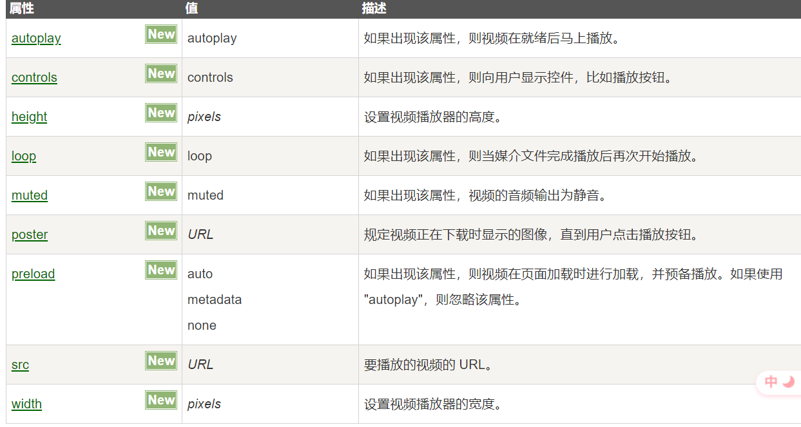

## 编写前端代码固定格式

```html
<!DOCTYPE html>
<html>
  <head>
    <title> </title>
  </head>

  <body></body>
</html>
```

### <!DOCTYPE>

\<!DOCTYPE> 声明不是 HTML 标签；它是指示 web 浏览器关于页面使用哪个 HTML 版本进行编写的指令。如果不写 <!DOCTYPE> 浏览器会使用“怪癖模式”渲染网页

- 该声明没有结束标签，对大小写不敏感
- 在 html5 中对<!DOCTYPE>的声明只有\<!DOCTYPE html>

#### SGML,XMLHTML 之间的关系

- SGML:Standard Generalized Markup Language(标准通用标记语言);
- XML:Extensible Markup Language(可扩展标记语言);
- HTML:HyperText Markup Language(超文本标记语言)

SGML 是现时常用的超文本格式的最高层级标准,是可以定义标记语言的元语言,甚至可以定义不必采用< >的常规方式.(来自 wiki)

XML 是用来传送及携带数据信息,不用来表现或展示数据,HTML 语言则用来表示数据.XML 是从 SGML 简化修改出来的.

那么也就是说,SGML 可以算是 XML 和 HTML 的 parent,SGML 提供了一种定义标记语言的方式,告诉他的 child 可以做什么不可以做什么,必须包括什么元素,例如标签,以及语言的基本结构.

HTML 是 SGML 的 Youngest son,是创建页面形式和外观的标记语言,还可通过 javascript 添加其他的功能

因此利用 SGML 创建了 HTML 参照和必须共同遵守的 DTD（文档类型定义 Document Type Definition）,你会经常在 HTML 页面的头部发现“DOCTYPE”属性，用来定义用于解析目标 DTD

而 XML 是 SGML 的 Eldest child,它具有不同于 HTML 的功能,XML 有 HTML 没有的权限,XML 可以定义自己的应用程序等等

(作者：神奇的少年 链接：https://www.jianshu.com/p/f4a8bf70a48d 来源：简书)

#### 为什么 html5 的文档头这么简洁？

html5 不基于 SGML,因此不需要对 DTD 进行引用，但是需要 doctype 来规范浏览器的行为（让浏览器按照他们应该的方式来运行）

而 HTML4.01 基于 SGML，所以需要对 DTD 进行引用，才能告知浏览器文档所使用的文档类型。

ps:SGML 是标准通用标记语言,简单的说，就是比 HTML,XML 更老的标准，这两者都是由 SGML 发展而来的。
BUT，HTML5 不是的。

### html

- html 元素可告知浏览器其自身是一个 HTML 文档
- html 元素是文档的根元素

### html 注释和 JavaScript 注释

- html 注释：\<!--注释内容-->
- JavaScript 注释：// 此后的这一样内容都会被注释掉 、

  /\* 注释内容 \*/

### title

- title 元素的内容显示在浏览器的标题栏中
- \<title> 标签是 \<head> 标签中唯一要求包含的东西。

### 相对路径和绝对路径

#### 相对路径

- ./ ：代表文件当前所在的目录（可以省略不写）

- ../ ：代表文件所在的父级目录

- ../../ ：代表文件所在的父级目录的父级目录

- / ：代表文件所在的根目录，可以理解成项目内部的绝对路径

#### 绝对路径

绝对路径是指完整的网址，假设图一中项目的网站域名为“www.test.com”，那么000.css的绝对路径应该是“https://www.test.com/HelloHBuilder/html/css/css1/000.css”。


### 从 HTML5 规范弄清 i、em、b、strong 元素的区别

- <strong>i</strong>: i 元素代表在普通文本中具有不同语态或语气的一段文本，某种程度上表明一段不同特性的文本，比如一个分类学名称，一个技术术语，一个外语习语，一个音译，一个想法，或者西方文本中的一艘船名。
- <strong>em</strong>: em 元素代表对其内容的强调。
- <strong>b</strong>:b 被用来传达传统上用粗体表达的意义：比如一段文本摘要中的关键词、一段审查中的产品名称、文本驱动软件中的可执行语句或者一篇文章的导语。
- <strong>strong</strong>: strong 元素代表内容的强烈的重要性、严重性或者紧急性,比 em 的强调要更加强烈一些。

\<b>和\<strong>的区别：

b 属于物理标签（实体标签），只是视觉上的效果，告诉浏览器应该以什么样的格式显示文字。strong 属于逻辑标签，强烈强调浏览器这些文本有着一定的重要性

\<i>和\<em>的区别：
类似于 b 和 strong，i 是物理元素，em 是逻辑元素，i 只是让浏览器显示出斜体（italic）效果，而 em 是强调（emphasize）浏览器这些文本有着一定的重要性。\<b>和\<i>在现在的体系中是不提倡被使用的，因为他们只是表现加粗和斜体而不具有任何的语义上的意义。而且对于搜索引擎来说\<strong>和\<em>比\<b>\<i>重要，所以这两者通常都被\<strong>\<em>所代替了。\<strong>比\<em>的强调更加强烈一些。

## CSS

#### 样式格式书写

#### 标签选择器：

```css
.p {
  color: red;
}
```

这时，该文档中的所有 p 的文字颜色都为 red；

#### 类选择器：类选择器以 . 定义，后接自定义的类名

```css
.my-class {
  color: red;
  background-color: pink;
}
```

花括号里面的内容即为样式声明，选择器和花括号之间有空格间隔，属性与属性值之间同样也以空格间隔开来，保证代码的规范，以类名为选择器的叫做类选择器，以标签为选择器的叫做标签选择器。

一个标签可以指明多个类名如：

```html
<div class="div div1">我有两个类哦！</div>
<div class="div div2">我也有两个类哦！</div>
```

通常我们将标签之间共有的属性放到同一个类中，而不同的属性再放到各自独有的类中，这样可以避免代码的冗余，也方便代码的修改。

当同一个属性在共有的类中和在自己的类中均存在并且属性值不同时，系统将把在 css 代码中，（当权重相同时）顺序写在后面的属性即为最终值。如：

```css
.pink-div {
  width: 120px;
  background-color: pink;
}
.deep-pink-div {
  background-color: deeppink;
}
.box {
  width: 100px;
  height: 100px;
}
```

```html
<div class="box pinkDiv">123</div>
<div class="box deepPinkDiv">123</div>
<div class="pinkDiv box">123</div>
```

pink-div 和 box 中都分别声明了不同的 width，但此时浏览器页面显示第一个和第三个 div 的宽度均为 100px，因为在 css 代码中，box 的顺序在 pink-div 后面。

#### id 选择器：样式以#定义，结构 id 调用，只能调用一次

#### 通配符选择器，样式以\*定义

```css
* {
  color: red;
}
```

这里把所有的标签同意修改样式。常用于：

```css
* {
  margin: 0;
  padding: 0;
}
```

#### font-family

font-family 定义字体系列，可由多个属性值构成，使用优先级从左到右依次递减。若其中一个属性值由两个及以上单词构成，则该属性值需加单引号：'属性值'，属性值之间用逗号隔开

```css
.box {
  width: 100px;
  height: 100px;
}
```

#### font-size

font-size 定义字体的大小，由于不同浏览器对字体的默认值不同，因此最好对网页自定义字体的大小。

#### font-weight

font-weight 定义字体的粗细，常用属性有 bold（加粗）、normal（正常字体）、数字（自定义数字的粗细程度）
如：

```css
h3 {
  font-weight: 400;
  /*不加单位，相当于 font-weight:normal; 这里的h3没有了加粗效果，变为正常的字体粗细*/
}
p {
  font-weight: 700;
  /*相当于font-weight: bold； */
}
```

#### font-style

font-style: normal/italic 控制字体倾斜或不倾斜

#### 字体属性的总和属性 font

font 的格式：

```css
div {
  font: font-style font-weight font-size/line-height font-family;
  /*不能颠倒顺序，属性之间以空格隔开，size和family必须保留，其他可以不写*/
}
```

#### 字体的颜色 color

color 可有三种属性值定义：

- 预定义颜色值：red、green 等
- 十六进制：#ff0000、#ffffff 等
- rgb(255,0,0)等

#### text-decoration

```css
 .t{
     text-decoration: none; /*删除下划线*/

     text-decoration：underline;  /*添加下划线*/

 }
```

#### text-indent

使文本段的首行缩进自定义距离。 单位有两个：px 、em。 px 则是绝对的大小单位，而 em 是相对单位，1em 指的是相当于当前一个文字的大小，2em 则两个文字大小。

```css
.t {
  text-indent: 2em; /*对于当前文本缩进两个文字的距离*/
}
```

#### line-hight

行间距包括上间距和文本高度和下间距。因为文本高度是固定不变的，所以当 line-hight 改变时，是上、下间距改变。
可用于使文字垂直居中，当定义的 line-height 与预定的高度一样时，即 line-height=height，可省略 height，并且这时，文字垂直居中

### CSS 的三种样式表

1. 行内样式表（行内式）：写在标签内部如，\<p style="width:200px;">111\</p>

2. 内部样式表（嵌入式）：将所有的样式放在 html 页面\<style>标签中
3. 外部样式表（链接式）：将样式写到后缀为 css 的文件中，再通过\<link>标签引入 html 页面内。如：<link rel="stylesheet" href="css文件路径">

### Emmet 语法

1. 生成标签直接输入标签名按 tab 键即可比如 div 然后 tab 键，就可以生成\<div>\</div>
2. 如果想要生成多个相同标签加上\*就可以了,比如 div\*3 就可以快速生成 3 个 div
3. 如果有父子级关系的标签，可以用>,比如 ul>li 就可以生成:

```html
<ul>
  <li></li>
  <li></li>
  <li></li>
</ul>
```

4. 如果有兄弟关系的标签，用+就可以了比如 div+p，就可以生成

```html
<div></div>
<p></p>
```

5. 如果生成带有类名或者 id 名字的，直接写 demo 或者 #two tab 键就可以了
6. 如果生成的 div 类名是有顺序的，可以用自增符号\$
7. 如果想要在生成的标签内部写内容可以用{}表示

### CSS 的复合选择器

#### 后代选择器

语法：元素 1 元素 2 {样式声明}，元素 2 是元素 1 的后代，如：

```css
ul li {
  color: pink;
} /*这是ul下的li字体颜色变为粉色。*/
.my div a {
  color: green;
} /*类名为my的标签下的div下的a的颜色变为green*/
```

(注意，后代可以指儿子。孙子、重孙子等等...)

#### 子选择器(重要)

子选择器是指选所有最近一级的子元素（只能是它的儿子）。

语法：元素 1>元素 2{样式声明}

在元素 1 下的最近一级的所有元素 2。如：

```html
<div>
  <p>哈哈哈哈</p>
  <h3>
    <p>哦吼</p>
  </h3>
</div>
```

```css
div > p {
  color: blanchedalmond;
}
```

只选择了 div 的下级，而下下级的 p 没有选择

#### 并集选择器

两个或以上的选择器共同进行样式的声明

```html
<div class="big">
  <span>熊大<span>
  <p>熊二</p>
  <div>
    <span>光头强</span>
  </div>
</div>

<ul class="pig">
  <li>佩奇</li>
  <li>乔治</li>
  <li>猪妈妈</li>
</ul>
```

```css
.pig li,
.big p,
.big span {
  background-color: pink;
}
```

效果：pig 下的 li，和 big 下的熊大、熊二背景颜色变为 pink

注意：

- 并集选择器一般竖着写，选择器之间用逗号隔开，最后一个选择器后面不需要加逗号

#### 伪类选择器

伪类选择器用于向某些选择器添加特殊的效果。伪类选择器最大的特点就是用冒号：表示，如 a：hover，这个是链接伪类选择器。

#### 链接伪类选择器

- a:link /\*选择所有未被访问的链接\*/
- a:visited /\*选择所有已被访问的链接\*/
- a:hover /\*选择鼠标指针位于其上的链接\*/
- a:active /\*选择活动链接（鼠标按下未弹起）\*/

顺序不能变，即按照 LVAH 的顺序，否则可能不生效

实际开发中常常直接用：

```css
a {
  color: grey;
  text-decoration: none;
}
a:hover {
  color: aquamarine;
  text-decoration: underline;
}
```

#### :focus 伪类选择器

:focus 伪类选择器用于选取获得焦点的表单元素
焦点就是光标，一般情况下\<input>类表单元素才能获取，因此这个选择器也主要针对于表单元素来说。例：

```css
input:focus {
  background-color: yellow;
  outline: none; /*去掉input的自带的边框*/
}
```

当 input 获得焦点时，即鼠标点击该 input 时，背景颜色变为黄色。

### CSS 的元素显示模式

HTML 元素一般分为块元素（如：div、p、li...）和行内元素（如：span、a）。

块元素：

- 块元素独占一行
- 可以自定义宽度、高度、内边距（宽度未定义时默认是父级的 100%）
- 里面可以放行内或者块级元素
- 文字类的元素内不能使用块级元素，如 p 标签不能嵌套块级元素，否则会出错

行内元素：

- 一行可以显示多个行内元素
- 不可以自定义宽度和高度，默认宽度就是其内容的宽度
- 行内元素只能容纳文本或其他行内元素
- 特殊情况下链接\<a>可以转换为块级模式

行内块元素：
在行内元素中有几个特殊的标签——\、\<input/>、\<td>,它们同时具有块元素和行内元素的特点

- 在同一行中，相邻的行内块元素之间有间距。
- 默认宽度就是其本身内容的宽度
- 可自定义高度、宽度和内边距

### display

属性：block，inline，inline-block。

- block 属性可以将行内元素转换为块级元素，如

```css
a {
  display: block;
}
```

这时就可以为 a 标签设置宽高了。

- inline 属性可以将块级元素转换为行内元素，如：

```css
div {
  display: inline;
}
```

此时 div 可以在同一行中显示，但不可以为 div 设置宽高。

- inline-block

```css
span {
  display: inline-block;
}
```

既可以在同一行显示，又可以为其设置宽高。但注意，被设置为 inline-block 的元素会按照文档流进行元素的位置分配，因此 margin: 0 auto 是对其不管用的。并且元素之间拥有一定的间距.

## CSS 背景

#### 背景颜色

background-color: 颜色值，默认 transparent（透明的）。

#### 背景图片

background-image 属性描述了元素的背景图像，实际开发常见于 logo 或者一些装饰性的小图片或者是超大的背景图片，优点是非常便于控制位置。
background-image： none | url;

#### 背景平铺

平铺指的是当背景图片小于标签大小时，背景图片会重复出现以铺满整个标签。
background-repeat，定义背景是否平铺，属性有 repeat（平铺）、no-repeat（不平铺）、repeat-x（沿着 x 轴平铺）、repeat-y（沿着 y 轴平铺）。

#### 背景位置

利用 background-position 属性可以改变图片在背景中的位置。
background-position: x y；

1.  参数时方位名词

- 水平方向:left、center 和 right，垂直方向:top、center 和 bottom。
- 当只有一个属性值时，浏览器会默认将第二个值设置为 center。;

当我们想用一张很大的图片（已经超过本机屏幕大小）作为背景，又想让图片最中央的内容准确显示在页面中央时，我们常用 background-position: center;

2. 参数是精确值
   background-position 也可以设置具体的值，如：background-position: 20px 50px;

- 参数时精确单位时，第一个一定是 x 坐标，第二个一定是 y 坐标
- 如果只指定一个数值，那么该数值一定是 x 坐标，另一个默认垂直居中。

3. 参数也可以是混合单位（精确值和方位名词）

#### CSS 背景图像固定

background-attachment: fixed || scrool;

- fixed: 背景图像固定显示在我们的屏幕中
- scrool： 背景图像随着对象内容滚动而离开视线区

#### 背景复合写法

background: 背景颜色 背景图片地址 背景平铺 背景图像滚动 背景图片位置

顺序可替换

#### 背景颜色半透明

background: rgba(0,0,0,.3),最后一个参数时 alpha 透明度，取值在 0~1 之间，0 是百分百的透明。

### CSS 三大特性

#### 层叠性

当有属性冲突时，如：

```css
div {
  color: red;
  width: 100px;
}
div {
  color: pink;
}
```

则后面出现的 color: pink 覆盖上面的 color: red 但 width 依旧是 100px；

#### 继承性

子标签继承父标签的某些样式，如：文本颜色和字号等与文字直接有关的（text- ，font-， line- 这些元素开头的，以及 color 属性），如：

```html
<div>
  <p>123</p>
</div>
```

当我们给 div 定义了一些文字相关的属性如 color 属性时，在该标签下的 p 标签的 color 属性则会继承这些属性。

### CSS 优先级

- 选择器相同，则执行层叠性（后来者居上）
- 选择器不同，看选择器的权重：

| 选择器                   | 选择器权重 |
| ------------------------ | ---------- |
| 继承或通配符选择器（\*） | 0，0，0，0 |
| 标签选择器               | 0，0，0，1 |
| 类选择器，伪类选择器     | 0，0，1，0 |
| ID 选择器                | 0，1，0，0 |
| 行内样式 style=""        | 1，0，0，0 |
| !important               | ∞ 无穷大   |

```css
div {
  color: pink !important; /*这时它的权重最高*/
}
```

指定越明确，权重越高

继承的权重为零！！

```css
.father {
  color: red;
}
p {
  color: pink;
}
```

```html
<div class="father">
  <p>哈哈</p>
</div>
```

这时，虽然类选择器的权重大于标签选择器，但由于继承的权重为 0，因此 p 标签的字体颜色为 pink。

#### 复合选择器的叠加

```css
ul li {
  color: green;
}
li {
  color: pink;
}
.nav li {
  color: red;
}
```

由于选择器的权重会叠加，第一个样式中有两个标签，一个标签选择器的权重是“0，0，0，1”，所以第一个样式权重为“0，0，0，1+0，0，0，1 ”，第二个样式权重为 1.类选择器的权重是“0，0，1，0”，因此第三个样式的权重为“0，0，1，0+0，0，0，1”，故最终 li 的字体颜色为 red.（权重的叠加绝对不会有进位）。

### CSS 盒子模型

#### border 边框

border 的属性有：

- boeder-width 边框的粗细，一般以 px 作为单位
- border-style 边框的样式（solid：实现边框；dashed：虚线边框；dotted：点边框...）
- border-color 边框的颜色
- border：width style color（复合属性），没有顺序。

边框也可以分开写：
border-top，border-bottom，border-left，border-right

当 table 中设置了边框，而相邻的单元格之间的边框相重叠，边框变粗的现象可以用 border-collapse: collapse 解决

border 会影响盒子的大小，因为 border 的像素是增加在盒子之外的。

#### padding 内边距（边框与内容之间的距离）

- padding-left
- padding-right
- padding-top
- padding-bottom

| padding:5px                 | 1 个值，代表上下左右都有 5 像素额内边距                                |
| --------------------------- | ---------------------------------------------------------------------- |
| padding:5px 10px            | 2 个值，代表上下内边距是 5 像素，左右内边距是 10 像素                  |
| padding:5px 10px 20px       | 3 个值，代表上内边距是 5 像素，左右内边距是 10 像素,下内边距是 20 像素 |
| padding：5px 10px 20px 30px | 4 个值，分别是上右下左 顺时针                                          |

如果盒子定义了宽度，则再指定内边距时，padding 会影响盒子的宽度，高度也一样。如果没有定义宽度或高度，则不会影响盒子的宽度或高度。

行内元素的 padding 值在视觉上内边距是增加了，但是 top 和 bottom 的值不会影响排列。


两个 span 元素均与上下的 div 重叠，而重叠的部分分别是 span 的 padding-top 和 padding-bottom。 因为行内元素的 padding-top 和 padding-bottom 值不影响其他元素的排列。

#### text-align：

对于行内元素或者行内块元素的子元素有效

#### margin 内边距（盒子和盒子之间的距离）

- margin-left
- margin-right
- margin-top
- margin-bottom

（行内元素的上下内外边距无效）

margin 值的分布与 padding 完全一致。
外边距可以让块级盒子水平居中，但是必须满足两个条件：

- 盒子必须制定了宽度（因此该方法的水平居中只对块级元素起作用，若要设置块级元素里的行内元素水平居中，只需要在块级元素加 text-align:center 即可）
- 盒子左右的外边距都设置为 auto

即 <strong>margin: 0,auto</strong>
(只要把后面的值设置为 auto 就可以居中了)

#### 嵌套块元素外边距的塌陷

对于两个嵌套关系的块元素，当父元素和子元素都设置了上边距时，父元素的外边距将会变为两者之中上边距最大的那个值，如：

```html
<div>
  <div><div></div></div>
</div>
```

<strong>注意，行内块元素不存在外边距塌陷</strong>

若外层的 div 的上边距设置为 20px，内层的上边距设置为 30px，则最终在页面显示的外层 div 上边距为 30px，而内层的上边距为 0。

有三种解决方案：

- 可以为父元素定义上边框，如：border：1px solid transparent;
- 可以为父元素定义上内边距，如：padding-top：1px;（只要有内边距就可以隔开，这个内边距不是定义父级元素和子元素的距离,同时父元素的盒子也会相应变大）
- 可以为父元素添加 overflow: hidden

  <strong>浮动的元素不会有外边距塌陷的问题</strong>

#### 清除内外边距

由于不同的标签可能在不同的浏览器拥有不同的默认边距，因此我们常常会先清除所有标签的内外边距（也称为格式化）

```css
* {
  margin: 0;
  padding: 0;
}
```

### 圆角边框（重点）

border-radius：length;
可以用像素作为单位，也可以用百分比，当盒子要想把正方形的盒子变为圆，当以像素为单位时，该像素应该是盒子的宽度的一半，若是百分比，则 50%就会变成圆。

border-radius： 左上，右上，右下，左下（顺时针）;

若 border-radius 只有两个值，则该两个值是对角线。
也可以这样设置：border-top-left-radius、border-bottom-right-radius...

### box-shadow 盒子阴影（重点）

| 值       | 说明                                                |
| -------- | --------------------------------------------------- |
| h-shadow | 必需的。水平阴影的位置。允许负值                    |
| v-shadow | 必需的。垂直阴影的位置。允许负值                    |
| blur     | 可选。模糊距离（阴影的虚实程度）                    |
| spread   | 可选。阴影的大小                                    |
| color    | 可选。阴影的颜色。在 CSS 颜色值寻找颜色值的完整列表 |
| inset    | 可选。从外层的阴影（开始时）改变阴影内侧阴影        |

阴影不占用空间

### text-shadow 文本阴影

| 值       | 说明                                                |
| -------- | --------------------------------------------------- |
| h-shadow | 必需的。水平阴影的位置。允许负值                    |
| v-shadow | 必需的。垂直阴影的位置。允许负值                    |
| blur     | 可选。模糊距离（阴影的虚实程度）                    |
| color    | 可选。阴影的颜色。在 CSS 颜色值寻找颜色值的完整列表 |

### 标准流（普通流/文档流）

所谓的标准流：就是标签按照规定好默认方式排列。

1. 块级元素会独占一行，从上向下顺序排列。

- 常用元素： div、hr、p、h1~h6、ul、ol、dl、form、table

2. 行内元素会按照顺序，从左到右顺序排列，碰到父元素边缘则自动换行。

- 常用元素： span、a、i、em 等行内元素

标准流是最基本的布局方式。

### float 浮动

1. 为什么需要使用浮动

浮动最典型的应用： 可以让多个块级元素一行内排列显示，并且块级元素之间没有间距。
网页布局第一准则： 多个块级元素纵向排列找标准流，多个块级元素横向排列找浮动

浮动最原始的愿望是解决文字环绕图片的问题

2. 什么是浮动

float 属性用于创建浮动框，将其移动到一边，直到左边缘或右边缘触及包含块或另一个浮动框的边缘。如：
假设首先定义一个 div 向左浮动，此时只有一个浮动的块级元素，因此该 div 会浮动到 body 的边缘。当又定义了一个 div 向左浮动，此时该 div 会向左浮动直到碰到上一个向左浮动的 div 元素。

#### 浮动的特性（重难点）

设置了浮动（float）的元素的最重要特性：

1. 脱离标准普通流的控制（浮） 移动到指定位置（动），俗称脱标
2. 浮动的盒子不再保留原先的位置。

例子：当有两个普通的 div 时，两个 div 分别占领上下两个位置，当上面的 div 设置了浮动后，该 div 元素相当于像界面浮动，因此原先的位置为空，下面的 div 元素占领最初在上面的 div 元素的位置


1. 浮动的盒子随着父元素的顶部对齐，并且按行排列，溢出则换行。
2. 浮动的元素之间没有间距
3. 浮动的元素会具有行内块元素的特性
4. 当块级元素设置了浮动特性后，如果没有给该元素设置宽高，则该元素的宽高即为内容所占区域大小
5. 浮动元素只会覆盖后面的标准流而不会影响前面的标准流。如，当有三个 div 元素，第一个 div 和第三个 div 元素未设置浮动，第二个 div 元素设置为浮动，此时，原本三个排成一列的 div 元素变成，第一个 div 元素位置不变，第二个 div 元素压住第三个 div 元素在第一个 div 元素后面
6. 浮动元素会压住底下的盒子，但不会压住标准流的文字和图片。如

该盒子未添加浮动:


添加浮动后：


可以看见，粉色的 div 元素压住了 p 元素，但是文字却完全露出来。

浮动之所以不会压住文字，是因为浮动产生的最初目的是为了做文字环绕效果的，因此文字会围绕浮动元素

#### 脱离文档流，内容为空（浮动塌陷）

当一个未定义高度的盒子里面装着的都是浮动的元素，此时该盒子的高度为 0，后面的元素会与子元素重叠。因为浮动的元素脱离的文档流，如图。


并且子盒子会脱标，因为父盒子没有高度，因此子盒子不会撑开盒子。因此需要清除浮动。

### 清除浮动

清除浮动的本质是清除浮动元素脱离标准流造成的影响

1. 额外标签法
   在浮动元素的末尾添加一个空的块级标签，该空标签添加 clear: both 属性。但此方法添加了许多无意义的标签，结构化比较差。
2. 父级添加 overflow：hidden、auto、scroll（但无法显示溢出的部分）
3. 给父元素添加 :after 伪元素,如：

   

   父盒子调用 clearfix 类

4. 添加双伪元素清除浮动
   
   
   注意：clear: both 需要在下一个标签使用，而不是当前浮动元素的父级标签.overflow: hidden 则可在下一标签使用，也可以在当前浮动元素的父级标签使用。而上图中的伪元素标签法则在浮动元素的父级元素中添加

### CSS 属性书写顺序（重点）

1. 布局定位属性：display/position/float/clear/visibility/overflow(建议 display 第一个写)
2. 自身属性：width/height/margin/padding/border/background
3. 文本属性：color/font/text-decoration/text-align/vertical-align/white-space/break-word
4. 其他属性 CSS3

#### nav 导航栏制作

实际开发中常用 li+a 的做法，如果直接用 a 搜索引擎容易辨别为有堆砌关键字嫌疑（故意堆砌关键字容易被搜索引擎有降权的的风险），会被认为恶意的引流。

### 定位 position

定位 = 定位模式 + 边偏移。

边偏移： top、left、right、bottom

定位模式：
<strong>1. position: static 静态定位</strong>

默认定位，无边偏移

<strong>2. position: relative 相对定位</strong>

相对于其原来的位置，该元素即使发生边偏移，但仍然占有其原来的位置

<strong>3. position: absolute 绝对定位</strong>

相对于祖先级元素，若没有父级元素或者父元素没有定位，则以浏览器为参照物。若祖先元素有定位即使不加偏移也会以父元素为参照物并且以最近一级的<strong>有定位的祖先元素</strong>为参考点移动位置，绝对定位发生边偏移后不占有任何位置(后面的元素会与绝对定位元素重叠)

<strong>子绝父相</strong>: 子元素使用绝对定位，父元素一定使用相对定位。

由于绝对定位不占有位置，因此父元素需要有位置来限制它。

<strong>4. position: fixed 固定定位</strong>

相对于浏览器可视区位置，主要使用场景：可以在浏览器页面滚动时元素的位置不会改变
以浏览器的可视窗口为参照点移动元素，跟父元素没有任何关系。

固定定位是特殊的绝对定位
固定定位小技巧：固定在版心右侧位置,如图：


让固定定位的盒子 left：50%. 走到浏览器可视区（版心）的一半位置，再让 margin-left：版心宽度的一半

<strong>5. position: sticky 粘性定位 </strong>

粘性定位可以被认为是相对定位和固定定位的混合，以浏览器的可视窗口为参照点移动元素，并占有原先的位置，必须添加 top、left、right、bottom 其中一个才有效。
具体场景如下：拥有粘性定位的元素首先在原位置不动（如标准流一样），当可视区域变化的时候，拥有粘性定位的元素则如固定定位的元素一样，不随页面的滚动而滚动（IE 浏览器不支持）


#### 定位的层叠顺序

z-index: 大于 0、 0、 小于 0（不加单位，并且只有定位的盒子才有这个属性）数值越大，盒子越靠上。如果属性值相同，则按照书写的顺序，后来者居上。

#### 定位拓展

1. 加了绝对定位的盒子不能通过 margin: auto 来水平居中，而是通过：left:50%,margin-left: 负的该盒子的宽度的一半

2. 有绝对定位的行内元素可以直接设置宽高。

3. 有绝对定位的块级元素若没有设置宽高，则其宽度和高度就是其内容的宽度和高度。

4. 浮动元素和绝对定位、固定定位元素都不会出发外边距合并的问题。

与浮动元素不会压住标准流的文字和图片不同，绝对定位和固定定位会压住下面标准流的所有内容。

### 父元素的显示与隐藏

1. display

display: none 隐藏对象并且不再占有原先的位置；

display: block 除了转换为块级元素之外，同时还有显示元素的意思

2. visibility 可见性

visibility: visible 元素可视

visibility: hidden,元素隐藏，并且原来的位置继续占有

3. overflow 溢出

对象是相对于拥有该属性的元素而言，内部内容或其子元素内容超过其高度或宽度。

overflow: visible (默认)

overflow: hidden

overflow: scroll 溢出部分显示滚动条（即使内容没有溢出也会有滚动条）

overflow: auto 内容未溢出时正常显示，溢出时显示滚动条

### 精灵图

1. 为什么需要精灵图？

一个网页中往往会应用很多小的背景图像作为修饰，当网页中的图像过多时，服务器就会频繁地接受和发送请求图片，造成服务器请求压力过大，这将大大降低页面的加载速度。

因此，为了有效地减少服务器接收和发送请求的次数，提高页面的加载速度，出现了 CSS 精灵技术（也称 CSS Sprites 、 CSS 雪碧图）

核心原理：将网页中的一些小背景图像整合到一张大图中，这样服务器只需要一次请求就可以了。

2. 精灵图（sprites）的使用

使用精灵图核心：

1）.精灵技术主要针对于背景图片的使用。就是把多个小背景图片整合到一张大图中。

2）.主要靠移动背景图片来完成对精灵图的使用（background-position）

3）.移动的距离就是这个目标图片的 x 和 y 坐标

4）.需要精确测量每个小背景图片的大小和位置

当我们添加精灵图，未移动位置时，精灵图默认往盒子的左上角对齐

但精灵图也有很大的缺点，就是更改部分图标时会非常麻烦，并且需要精确测量图标的位置大小。

因此就有了字体图标，字体图标的特点：轻量级、灵活性、兼容性.


遇到样式和结构简单的就用字体图标，否则就用精灵图。

字体图标可以直接在网上下载.

#### CSS 三角

如微信聊天框的信息气泡中的小三角

核心：设置 border 值，宽高均为 0；

想在哪边显示三角形，就将其余的 border 的颜色设置为 transparent（透明），三角形的大小可通过设置 border 值的大小改变，如：


效果如图：


注意：设置的 border 值是三角形的高，而 border 值\*2 才是三角形的边长度。

#### 鼠标样式 cursor


#### 取消表单轮廓

outline: none

当我们点击 input、或者 textarea 这些表单框时，会有默认的边框出现，此时我们需要设置 outline: none 来取消掉这个表单轮廓.

对于 textarea 标签，该文本域是可以拖拽使其变大变小的，但实际开发中我们并不需要这种效果，因此可以使用 resize: none 来使其不能拖拽。另外，textarea 的开始标签和结束标签需要写在同一行上，否则文本域中会自动添加一行空白行

#### 垂直对齐

vertical-align 属性，常用于设置图片或者表单（行内块元素）和文字垂直对齐。
（只对行内元素和行内块元素起效）

vertical-align: top（顶线）、middle（中线）、base（基线）、bottom（底线）

顶线、中线、基线、底线如图：


文字默认对齐文字的基线.

#### 解决图片底部默认空白缝隙问题

由于图片默认对齐文字的基线，因此图片底部会留有空白缝隙预备给文字的基线。如要除去此空白缝隙有两种方法：

1. 给图片添加 vertical-align: middlie|top|bottom 属性，只要不是对齐基线就可以（提倡使用）
2. 可以把图片转换成块级元素，因为只有行内元素和行内块元素才有 vertical-align 属性.

#### 溢出的文字用省略号显示

1. 单行文字溢出

首先 white-space:nowrap 使文字不自动换行（normal 就是自动换行；其次把溢出的部分隐藏起来 overflow:hidden;最后将溢出的文字用省略号显示 text-overflow:ellipsis;

2. 多行文字溢出

适用于 webkit 浏览器或移动端

```css
.xxx {
  overflow: hidden;
  text-overflow: ellipsis;
  /*弹性伸缩盒子模型显示*/
  display: -webkit-box;
  /*限制在一个块元素显示的文本的行数*/
  -webkit-line-clamp: 2;
  /*设置或检索伸缩盒对象的子元素的排列方式*/
  -webkit-box-orient: vertical;
}
```

## 常见布局技巧

1. 在很多情况下我们需要有一排的有边框的元素水平挨近显示，如图：
   

但是当我们给其设置边框的时候，两个元素的边框紧挨在一起会使中间的边框变粗.


此时我们可以用 margin 的负值来解决这个问题

margin-left:负的边框的值

但此时如果需要添加 hover 属性让鼠标经过元素的时候显示不同颜色的边框，此时该元素的边框会因为合并，被其他元素的边框压住了而显示不出来，此时我们可以通过下述代码解决问题

```css
.li:hover {
  position: relative; /*不能用绝对定位，因为绝对定位不占有位置*/
  z-index: 1;
  border-color: red;
}
```

但这段代码仅适用于该元素本身是没有定位的，如果元素本身就有定位，则直接设置 z-index 提高层级就好.

### HTML5 新增特性

（仅支持 IE9+以上版本的浏览器）
新增的语义化标签

\<header> 头部标签； \<nav> 导航标签； \<article> 内容标签； \<section> 定义文档某个区域； \<aside> 侧边栏标签； \<footer> 尾部标签

这种语义标准主要是针对搜索引擎的，在 IE9 中，需要把这些元素转换为块级元素，移动端中没有兼容性问题，因此大多用于移动端的开发。

### HTML5 新增的多媒体标签

1. 视频： \<video src="文件地址" controls="controls">\</video>

   使用他们可以很方便的在页面中嵌入音频和视频，而不再使用 flash 或其他插件.

   但 video 标签仅支持 MP4、WebM、Ogg 三种格式的视频，而不同浏览器对不同格式的兼容性也不同：


但我们可以看出，MP4 格式的视频是绝大部分浏览器都支持的，因此当我们在浏览器插入视频时，尽量使用 MP4 格式

video 的属性如下：（注意，谷歌浏览器要加 muted="muted"属性才能自动播放）



1. 音频：\<audio src="文件地址" controls="controls">


1. input 类型

   

2. HTML5 新增的表单属性
   

   注意：新增的 input 类型和表单属性都需要在表单域中实现（\<form>\</form>）

### CSS3 的新特性

新增的 CSS3 特性有兼容性 ie9+才支持

#### 1. 属性选择器


attr 是属性的意思，val 则是属性的值

第二个的例子：

```css
  input[type="text"]/*选择input标签中，type="text"的元素*/
  div[class^="ico"] /*选择div标签中，以类名为ico开头的类 的元素*/
```

属性选择器的权重也是 （0，0，1，0）

在上述代码中 input 是标签选择器，[type="text"]才是属性选择器，所以这两个加起来的权重是 11.

#### 2. 结构伪类选择器


nth-child(n) 选择父元素中的第几个子元素，这里的 n 可以是数字、关键字（even 偶数孩子、odd 奇数孩子）也可以是公式（从 0 开始计算）.

如：

```css
ul :nth-child(3) /*选择ul元素的第一个子元素*/
ul li:nth-child(3) /*选择ul元素下的第三个li元素*/
ul li:nth-child(even)/*选择ul元素下的奇数的li元素*/
ul li:nth-child(n) /*选择 从第0个开始计算，一直到最后一个元素*/
```

前三个伪类选择器和后三个的用法一样，但是有本质的区别。

在我们的 nth-child 选择器中，会把代码里的所有标签都排列序号

```html
<section>
  <p>1</p>
  <div>2</div>
  <div>3</div>
</section>
```

当我们用 section div:nth-child(1) 时，浏览器并不会选择任何一个元素。因为在这段代码中，浏览器先识别 nth-child(1)，发现 section 的第一个子元素并不是 div，不匹配。

而在 section div:nth-of-type(1)中，先看 div，然后在 div 中选择第一个子元素。

结构伪类选择器的权重是（0，0，1，0）

### 伪元素选择器（重点）

伪元素选择器可以帮助我们利用 CSS 创建新标签元素，而不需要 HTML 标签，从而简化 HTML 结构

::before 在父元素内部的前面插入内容
::after 在父元素内部的后面插入内容

- before 和 after 创建一个元素，但是属于行内元素
- 新创建的这个元素在文档树中是找不到的，所以我们称为伪元素
- 语法: element::before ()
- before 和 after 必须有 content 属性
- before 在父元素内容的前面创建元素，after 在父元素内容的后面插入元素
- 伪元素选择器和标签选择器一样，权重为 1

#### 伪元素清除浮动


### CSS3 盒子模型 border-box

box-sizing: content-box 默认值（width+padding+border），添加 padding 和 border 的值会使盒子变大。

box-sizing: border-box 最终的盒子宽度就是 width，添加 padding 和 border 的值不会使盒子变大

后续我们对文档进行初始化可以这样写：

```css
* {
  margin: 0;
  padding: 0;
  box-sizing: border-box;
}
```

#### 过滤器 filter

filter: blur(num) ；blur 是模糊函数，num 越大，越模糊

calc 函数，可用于+（加）、-（减）、\*（乘）、/（除）计算，如：

```css
.son {
  width: calc(100%-30px); /*这是有son为类的元素始终比父元素少30px*/
}
```

### CSS 过渡（重点）

过渡动画，从一个状态渐渐地过渡到另一个状态

transition: 要过渡的属性 花费时间 运动曲线 何时开始

1. 属性:想要变化的 css 属性，宽度高度背景颜色内外边距都可以。如果想要所有的属性都变化过渡，写一个 all 就可以。
2. 花费时间:单位是秒(必须写单位)比如 0.5s
3. 运动曲线:默认是 ease (可以省略）
4. 何时开始:单位是秒(必须写单位)可以设置延迟触发时间 默认是 0s (可以省略)

<strong>谁来变化给谁加.</strong>

```css
.tran {
  width: 100px;
  height: 100px;
  color: pink;
  transition: width 0.5s; /*注意这里，是直接在本类中添加transition属性，而不是在hover那里*/
}
.tran:hover {
  width: 400px;
}
```

如果需要同时变化两个或多个属性可以用逗号隔开（全部属性过渡可以写 all）

```css
.tran {
  width: 100px;
  height: 100px;
  color: pink;
  transition: width 0.5s, height 0.5s;
}
.tran:hover {
  width: 400px;
  height: 200px;
}
```

广义的 HTML5 指的是 HTML5 本身+CSS3+JavaScript

### 行内元素之间空白的缝隙

行内元素之间会有空白的缝隙是因为两个元素之间有回车符，html 将回车符当成空白符处理，而空白符之间有一定长度，因此行内元素与行内块元素之间会有空白缝隙。

解决方法：

- 将行内块元素的结束符和开始符写在同一行
- 父元素中设置 font-size: 0，在子元素上重置正确的 font-size
+ 为元素设置float属性