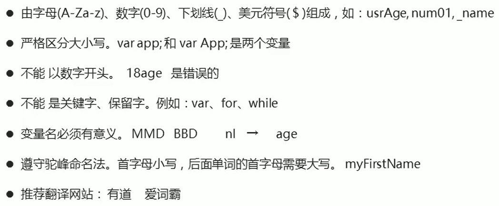
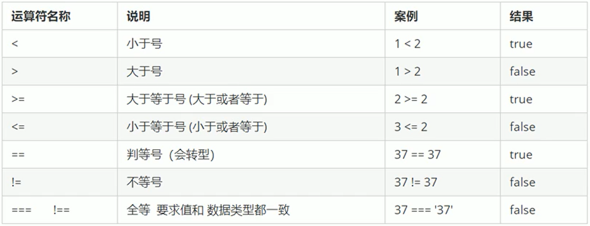
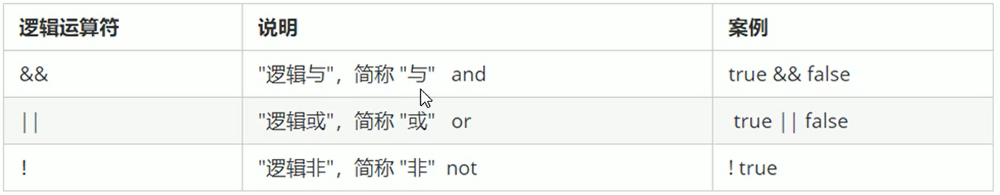
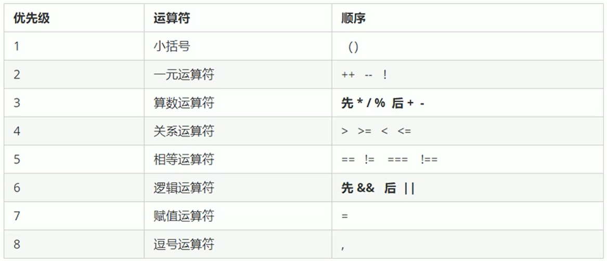

### JavaScript 是什么？

- JavaScript 是世界上最流行的语言之一，是高级语言，也是一种运行在客户端的脚本语言（Script 就是脚本的意思）
- 脚本语言： 不需要编译，运行过程种由 js 解释器（js 引擎）逐行来进行解释并执行
- 现在也可以基于 Node.js 技术进行服务器端编程

JS 产生的最初目的是解决表单验证的问题

#### 浏览器

浏览器分为两部分 渲染引擎和 JS 引擎

- 渲染引擎迎来解析 HTML 和 CSS，俗称内核，比如 chrome 浏览器的 blink，老版本的 webkit
- JS 引擎：也称为 JS 解释器。用来读取网页中的 JS 代码，对其进行处理后运行，比如 chrome 的 V8

浏览器本身并不会执行 JS 代码，而是通过内置的 JS 引擎来执行 JS 代码。JS 引擎执行代码时逐行解释每一句源码转换为机器语言，然后由计算机去执行，所以 JS 语言归为脚本语言，会逐行解释执行.

#### JS 的组成

JavaScript 包括：ECMAcript（JS 语法）、DOM（页面文档对象模型）、BOM（浏览器对象模型）

#### JS 书写规范

在 HTML 中使用双引号，在 JS 中使用单引号

引入外部 js 文件

```html
<script src="myjs.js"></srcipt>
```

中间不要写任何代码

JS 注释：

- 单行注释 // &nbsp; &nbsp;&nbsp;&nbsp; （快捷键 ctrl+/）
- 多行注释 /\*\*/ &nbsp; &nbsp;&nbsp;&nbsp; （快捷键 shift+alt+a）

### 变量

变量的本质：变量是程序向内存申请的一块用来存放数据的空间（变量是内存中的空间）

```javascript
1
var myname; /*声明变量*/
myname = 'Jenny' /*变量的赋值*/

2
var name = 'Jenny' /*变量的初始化*/

3
myname = 'Tom' /*变量值的覆盖，变量值以最后一次的赋值为最终值*/

4
var age = 10, sex = '女', grade = 90; /*同时声明多个变量时，可以只写一个var，变量之间用逗号隔开*/

5
var patato;
console.log(patato);  //只声明不赋值输出Undefined  不声明则报错

6
tel = 123；
console.log(123)  //不声明直接赋值可以使用，但不提倡，是全局变量
```

### 变量命名规范



### 数据类型

#### 为什么需要数据类型

在计算机中，不同的数据所需占用的存储空间是不同的，为了充分利用存数空间，于是定义了不同的数据类型。

JavaScript 是一种弱类型/动态语言，这意味着不用提前声明变量的类型，在程序运行过程中，类型会被自动确定。并且会根据值的变化而变化数据类型。

JavaScript 的变量数据类型是只有程序在运行过程中，根据等号右边的值（变量值）来确定的。

```javascript
var x = 10; //number类型
x = "hhhh"; //字符串类型
```

#### 基本数据类型

| 基本数据类型 | 说明                                               | 默认值    |
| ------------ | -------------------------------------------------- | --------- |
| Number       | 数字类型，包含整型值、浮点型值，如 12、0.12        | 0         |
| Boolean      | 布尔值类型，如 true、false，等价于 1 和 0          | false     |
| String       | 字符串类型，如'Jenny'、'张三' ，注意字符串要带引号 | ''        |
| Undefined    | 声明但未定义                                       | Undefined |
| Null         | var a = null; 直接复制为 null                      | null      |

#### Number 数字类型

- 在程序里面数字前面加 0 表示八进制

```javascript
var num1 = 010;
console.log(num1); //8
```

- 在程序里面数字前面加 0x 表示十六进制

```javascript
var num1 = 0xa;
console.log(num1); //10
```

数字类型范围：

最大值：Number.MAX_VALUE;

最小值：Number.MIN_VALUE;

数字类型的特殊值（注意这是值）：

无穷大：Infinity
无穷小：-Infinity
非数值：NaN

```javascript
var num = Number.MAX_VALUE * 2;
console.log(num); //Infinity
```

#### 验证值是否是 NaN 类型

```JavaScript
console.log(isNaN(12));  //返回false
console.log(isNaN('Jenny')); //返回true
```

#### 字符串类型 String

字符串类型可以是引号中的任意文本，可以是双引号内的文本也可以是单引号内的文本，在 JavaScript 中建议使用单引号。

```JavaScript
var strMsg = "Jenny" ;  //单引号
var strMsg2 = 'Tom';   //双引号

var strMsg3 = '我是"Jenny"';  //外单内双
var strMsg4 = "我是'Jenny'";  //外双内单

var worse = 'hhhhh"; //报错 不能一单一双
```

#### 转义字符

|     |        |     |     |          |
| --- | ------ | --- | --- | -------- |
| \\' | 单引号 |     | \n  | 换行符   |
| \\" | 双引号 |     | \r  | 回车符   |
| \\& | &      |     | \t  | tab 缩进 |
| \\\ | \      |     | \b  | 退格符   |
| \f  | 换页符 |

##### 字符串长度

v.length（v 是变量）

```JavaScript
var myName = 'Jenny';
console.log(maName.length); //显示5
```

##### 字符串拼接

- 使用“+”

- 字符串跟任意类型的数据拼接都是字符串

```JavaScript
var str1 = '我是';
var str2 = 'Jenny';

console.log(str1+str2); //我是珍妮

console.log(str2+168); //Jenny168
console.log(str2+true); //Jennytrue

console.log('2'+168); //2168

```

### prompt 弹出输入框

```JavaScript
var myName = prompt("请输入您的年龄");
alert("您的年龄是" + myName + "岁");
```

### 不同数据类型相加

```JavaScript
console.log(1+true); //2
console.log(Undefined+1); //NaN  Undefined和数字相加，最后结果是NaN
console.log(null+1); //1
```

### typeof 获取数据类型

```JavaScript
console.log(typeof 123);//number

console.log(typeof 'Jenny');//string

console.log(typeof true);//boolean

console.log(typeof undefined);//undefined

console.log(typeof null);//object

console.log(typeof prompt(""));//不管输入什么。在输入框内输入的值都是string类型
```

### 数据类型转换

使用表单或者 prompt 获取过来的数据默认是字符串类型的，当我们需要进行加法运算或其他时，就需要进行数据类型的转换。

#### 转换成字符串类型

| 方法             | 说明                                   | 案例                                   |
| ---------------- | -------------------------------------- | -------------------------------------- |
| toString()       | 转换为字符串                           | var num = 1； alert（num.toString()）; |
| String()强制转换 | 转换为字符串                           | var num = 1； alert（String(num)）;    |
| 加号拼接字符串   | 任何数据类型和字符串拼接结果都是字符串 | var num = 1； alert（num+""）;         |

更常用的是第三种，加号拼接字符串，也称为隐式转换

#### 转换为数字类型（重点）

| 方式                            | 说明                           | 案例                |
| ------------------------------- | ------------------------------ | ------------------- |
| parseInt(string)函数            | 将 string 类型转换为整数数值   | parseInt('123')     |
| parseFloat(string)函数          | 将 string 类型转换为浮点数数值 | parseFloat('123.1') |
| Number()强制转换                | 将 string 类型转换为数值型     | Number("123")       |
| 隐式转换（减法 - 乘法\* 除法/） | 利用算术运算                   | '12'-0              |

```JavaScript
console.log(parseInt(3.94));  // 3 取整
console.log(parseInt('120px')); //120 会去掉数字后面的非数字的字符串
console.log(parseInt('em120px')); //NaN

console.log(parseFloat(3.94));  //3.94
console.log(parseFloat('120px')); //120 会去掉数字后面的非数字的字符串
console.log(parseFloat('em120px')); //NaN

console.log(Number('123'));//123

console.log('12'-0); //输出数字型的12 “ - ”、“ * ”、“ / ”都可以
```

#### 转换为 Bool 类型

代表空和否定的值都会被转换为 false，如: ''、0、NaN、null、undefined,其余都会转换为 true

```JavaScript
console.log(Boolean(''));  // false
console.log(Boolean(0)); //false
console.log(Boolean(NaN)); //false

console.log(Boolean('adfsdgdfg')); //true
console.log(Boolean(123)); //true
```

#### 标识符

标识符是指开发人为变量、属性、函数、参数取的名字（不能是关键字和保留字）

### 运算符

#### 算术运算符

| 运算符 |      |                   |
| ------ | ---- | ----------------- |
| +      | 加   | console.log(1+1)  |
| -      | 减   | console.log(1-1)  |
| \*     | 乘   | console.log(1\*1) |
| /      | 除   | console.log(1/1)  |
| %      | 取余 | console.log(1%1)  |

算数优先级跟我们正常的算数运算一样

浮点数的算数运算会出问题，因为是用十进制转化为二进制

```JavaScript
console.log(0.1+0.2)  //  3.0000000004
console.log(0.07*100)  //  7.000000000001

因此我们不能直接用浮点数进行相比较或计算。
```

判断一个数能够被整除，常用取余的最终结果是否为 0 来判断

#### 递增和递减运算符

```JavaScript
var num = 1;

//前置递增运算符
++num；//类似于num = num + 1 ，先加1，再返回值

console.log(++num);//2

//后置递增运算符 先返回值再加1；多用后置自增，单独写
var age = 1;
console.log(age++); //1

```

递增运算符合递减运算符的运算方式一样

#### 比较运算符



```JavaScript
console.log(2 >= 3); //false
console.log(2 == 2); //true

console.log(2 == '2'); //true  == 会把字符串转换为数字类型。

console.log(2 === '2'); //false  ==== 全等，要求数据的值和数据类型全部相同
```

#### 逻辑运算符（布尔运算符）



```javascript
console.log(3>2 && 2>3); //false

逻辑中断，能确定该表达式的值时直接返回

console.log(123 && 456); //456
console.log(0 && 456); //0

console.log(123 || 456); //123

var = num = 0;
console.log(123 || num++);
console.log(num);  // 0, 因为在上一条代码中，直接返回了123，后续的表达式不再执行.
```

#### 运算符优先级



- 一元运算符里面的逻辑非优先级很高
- 逻辑与比逻辑或优先级高

### 流程控制

#### 顺序流程控制

按照代码的先后顺序依次执行

#### 分支流程控制

根据不同的条件判断，执行不同的路径代码从而得到不同的结果

#### if 语法结构

```javascript
单分支语句：

if(条件表达式){
    //表达式结果为true，否则不执行该段代码块，直接执行下一阶段的代码
}

双分支语句：

if(条件表达式){
    //表达式结果为true，否则不执行该段代码块，直接执行下一阶段的代码
}else{
    //if中的表达式为false执行该段代码块
}


多分支语句：

if(条件表达式1){
    //表达式1结果为true退出整个if分支语句，否则不执行该段代码块，直接执行下一阶段的代码
}else if(条件表达式2){
    //表达式2结果为true退出整个if分支语句，否则不执行该段代码块，直接执行下一阶段的代码
}else if(条件表达式3){
  //表达式3结果为true退出整个if分支语句，否则不执行该段代码块，直接执行下一阶段的代码
}else{
//上述条件都不成立则执行该段代码
}

```

#### 三元表达式

有三个元素组成的表达式叫做三元表达式

一元表达式：++num； 二元表达式：3+5；

三元表达式： A?B:C

```javascript
var num = 10;
console.log(num > 5 ? "yes" : "no"); //输出yes
```

三元表达式，A?B:C ，若 A 成立，则返回 B，否则返回 C；

#### switch 语句

```javascript
switch(表达式){
    case value1:
        执行语句1;
        break;
    case value2:
        执行语句2;
        break;
    case value3:
        执行语句3;
        break;
    ...
    default:
        执行最后的语句;

    //执行思路，表达式中的值对应上case后面的value则执行该case下的语句，
    //如果都不匹配，则执行default下的语句；

    //适用于固定的值

    //break用于退出循环，如果不加break，则执行完符合该case的value的语句后执行下一个case的语句
}
```

### 循环语句
 循环的目的，重复执行某段代码。由循环体和循环的终止条件组成的语句就是循环语句。

#### for循环

for重复执行某段代码，通常跟计数有关。

```javascript
    for(初始化变量;条件表达式;操作表达式){
        //要循环的代码
    }

    //先执行初始化变量，再根据条件表达式进行判断是变量否满足，然后执行要循环的
    //代码，最后执行操作表达式，紧接着进行下一次循环，判断变量是否满足条件表达式...
```

#### while循环

```javascript
    while(条件表达式){
        //循环体
    }
    //当条件表达式为true时。执行循环体
```

#### do while循环
```javascript
    do{
        //循环体
    }
    while(条件表达式)
    //执行一次之后，判断是否满足条件，满足条件则继续执行
```


