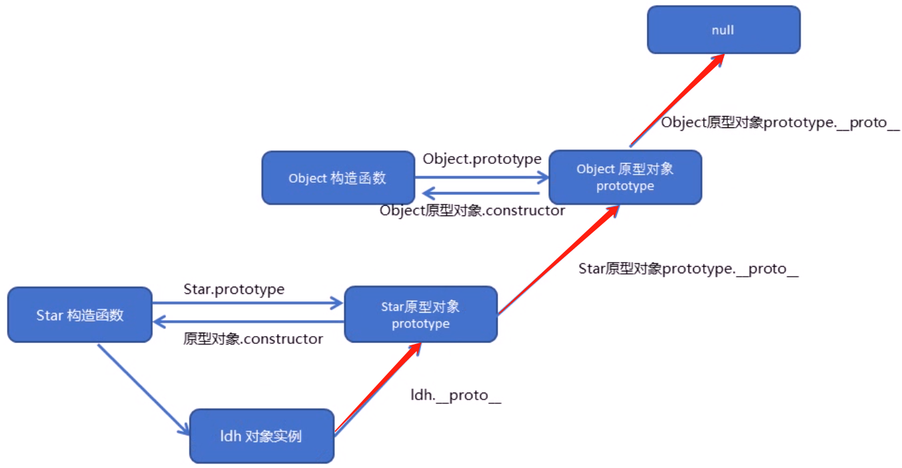

# 开场

1、自我介绍
2、为什么选择前端
3、平时如何学习前端
4、说说项目
5、项目中遇到了哪些问题
6、有没有考虑过如果优化项目

# css html

### 实现倒三角形

使宽高为 0，设置 border 的大小来改变三角形的大小，然后设置 border-bottom 的底部一个颜色，其余 border 为透明。

### 聊聊盒模型

- 盒模型分为标准盒模型和 IE 盒模型，标准盒模型即 content、元素的内容就是其宽度，不包含 padding 和 border 的大小。而 IE 盒模型的宽度包含了该元素的 padding 和 border。
- 在 css 中可以通过 box-sizing 来设置盒模型，content-box 对应标准模型，border-box 对应 IE 模型。

### position 的属性和区别

1、列举

- static 默认值
- fixed
- absolute
- relative
- sticky

2、说相对于谁进行定位

- static 是默认值，遵循文档流。
- fixed 是固定在我们可视窗口上的，不会随着滚动条的滚动而改变该元素在我们可视窗上的位置。
- relative 是相对定位，是相对其原本遵循标准流时的位置。
- absolute 是绝对定位，是相对于其有 relative 的父元素的定位，如果最近一级父元素没有 relative 属性，则再往上一级找，直至到 body 为止。我们可以通过改变 top、left、right、bottom 设置值来改变该元素的位置，但拥有该属性的元素不会占据空间，可能会与其他元素发生重叠。通常我们会用子绝父相的方式搭配使用。
- sticky 是当滚动条在没有滚动到一定位置时，该元素不会随着滚动条的滚动而滚动，当滚动到一定位置时，该元素随着滚动条的滚动而滚动，在我们的可视窗范围内位置固定。通常我们会用来实现页面的点击返回到页面顶部。

### CSS 布局，左边固定，右边自适应如何实现

两栏步局（多种方式）

### 水平垂直居中（多种方式）

margin 与 transform 实现水平垂直居中的区别
回流重绘

### 高度塌陷问题的解决方案

### BFC

如何开启 BFC

### 聊聊 rem 与 em 的区别

- em 是相对于当前对象内文本的字体尺寸，如果当前对行内文本的字体尺寸没有设置，则相对于浏览器的默认字体尺寸。
- rem 是 css3 的新增字体单位，是相对于 HTML 根元素的。

### 说说移动端如何适配

### 懒加载

# js

### 聊聊 JS 数据类型

1、基本数据类型
string
number
undefined
null
boolen

2、复杂数据类型
Object
array
date
regexp

3、其他
symbol
bigint

### 判断数据类型

typeof
Object.toString.call
instanceof
constructor

### Symbol 及使用

### 数据类型的判断方法

### 聊聊堆栈内存

### 聊聊 JS 的事件（捕获，响应，冒泡）

### 聊聊事件代理、事件委托

### DOM 事件有哪些

### 获取 DOM 事件的方法

li.onclick = funciton () {}
xxx.ondrag
ul.addEventListener('')

### 事件绑定的方法

#### onclick 与 addEventListener 的区别

1.onclick 事件在同一时间只能指向唯一对象

2.addEventListener 可以给一个事件注册多个 listener，这些 listener 会依次执行。通过 onclick 给一个对象绑定多次事件的话，只会出现最后的一个绑定。

3.addEventListener 对任何 DOM 都是有效的，而 onclick 仅限于 HTML

4.addEventListener 可以控制 listener 的触发阶段，（捕获/冒泡）。对于多个相同的事件处理器，不会重复触发，不需要手动使用 removeEventListener 清除.

1. onclick 绑定的事件不能通通过 removeEventListener 移除，只能通过使其等于 null 来移除。

### 注销事件绑定的方法

li.onclick = null
ul.removeEventListener('')

### let、const、var 的区别

### call、apply、bind 的区别和使用

### ES5

var
痛点：
变量提升
无块级作用域
for (var i = 0; i < 10; i++) {
li.onclick = i
}

### ES6

let const

### 聊聊 JS 线程

单线程
为什么是单线程
js 设计的初衷
让 dom 动起来
操作 dom 元素
bug

### 为什么要有异步？

异步任务时间长导致浏览器卡顿，

- 因为 js 单线程，同一时间只能做一件事

- 但是遇到等待 ( 网络请求、定时任务 ) 就会卡住，卡住的时候 CPU 就是空闲的，这种等待让人不甘心

- 异步不会阻塞代码执行，页面就不会卡住，所以使用异步

- 异步采用回调 callback 的形式

有哪些异步任务

1、定时器：settimeout setinterval
2、http
3、Js 事件触发的函数：onclick 这些
webworker

### 聊聊宏任务和微任务!!!!!!!!!!!!

宏任务
settimeout setinterval
微任务
promise.then()

### 聊聊 ES6

let
const
解构赋值
...
symbol
class
promise
async
set
map

### 聊聊闭包，以及闭包的作用

### 手写深拷贝

### ES6 去重

### 数组去重

5

### 原型链

1、什么是原型链
Father
Son
som.**proto** == father.prototype
father.**proto** == obj...

不要停留在概念!

2、应用
添加方法
instanceof
constructor

### 防抖、节流原理

### 聊聊 Promise

它的基础语法是什么，promise 为什么出现，解决了哪些问题
new Promise((resolve, reject) => {
成功...
resocer()
失败...
reject()
})

### 回调地狱

### Promise 的 API 有哪些，他们的具体作用

实现 Promise.all
promise.all()
promise.race()

### 数组去重的实现

### 数组 API（map、filter）

### 获取对象 key 值的方法（Object.keys）

for k in object

### JS 的基本数据类型

number
string
boolean
undefined
null

### [1,2,3] + 3 会输出什么以及为什么

### 0.1 + 0.2 等于 0.3 吗？为什么？解决方案？

### 聊聊原型与原型链

JavaScript 常被描述为一种基于原型的语言——每个实例对象（ object ）都有一个私有属性（称之为 \_\_proto\_\_ ）指向它的构造函数的原型对象（prototype ）。该原型对象也有一个自己的原型对象( \_\_proto\_\_ ) ，层层向上直到一个对象的原型对象为 null。根据定义，null 没有原型，并作为这个原型链中的最后一个环节。

### javascript 查找机制

① 当访问一个对象的属性(包括方法)时，首先查找这个对象自身有没有该属性，找到即返回，不再向上查找。

② 如果没有就查找它的原型（也就是\_\_proto\_\_ 指向的 prototype 原型对象）。

③ 如果还没有就查找原型对象的原型( Object 的原型对象）。

④ 依此类推一直找到 Object 为止( null )，返回 undefined。

*proto*对象原型的意义就在于为对象成员查找机制提供一个方向，或者说一条路线。

### 原型对象中 this 指向

- 在构造函数中，里面的 this 指向的是实例对象
- 原型对象函数里面的 this，是谁调用这个函数，this 就指向谁，因此也是指向实例对象

### 如何判断一个对象是否在原型链上(instanceof)

### 实现一下 instanceof

### 聊聊箭头函数

箭头函数和普通函数的区别：

1. 箭头函数语法上比普通函数更加简洁
2. 箭头函数没有自己的 this，它的 this 是继承函数所处上下文中的 this，。普通函数则是谁调用这个函数，this 就指向谁，并且可以通过 call、apply、bind 改变 this 指向，但箭头函数不可以。
3. 箭头函数中没有 arguments（类数组），只能基于...arg 获取传递的参数集合（数组）
4. 箭头函数不能被 new 执行（因为没有自己的 this 和 prototype）

当我们需要用到 this 的时候就好好好考虑要用哪一种形式的函数，假设我们给 html 元素绑定事件的时候使用箭头函数就会造成一个致命性错误，因为这里的 this 指向 window 而不是指向元素本身

### 箭头函数做构造函数会发生什么(报错)

const foo = () => {}
new foo()

### 手写一个 new

求结果

### "1" + 1

### "1" /\* 1

### 聊聊 null 和 undefined

### 聊聊作用域

### JS 的 map 和 weakMap 了解过吗

# Vue

### v-show 和 v-if 的区别

1. v-show 不管条件是真还是假，第一次渲染的时候都会编译出来，也就是标签都会添加到 DOM 中。之后切换的时候，通过 display: none;样式来显示隐藏元素。可以说只是改变 css 的样式，几乎不会影响什么性能。

2. 在首次渲染的时候，如果条件为假，什么也不操作，页面当作没有这些元素。当条件为真的时候，开始局部编译，动态的向 DOM 元素里面添加元素。当条件从真变为假的时候，开始局部编译，卸载这些元素，也就是删除。

### watch 和 computed 的区别

computed 计算属性

1. 在 computed 属性对象中定义计算属性的方法，和取 data 对象里的数据属性一样以属性访问的形式调用，即在页面中使用 {{ 方法名 }} 来显示计算的结果。 2. computed 一个重要的特点，就是 computed 带有缓存功能。依赖型数据发生改变，computed 才会重新计算。 3. 在 computed 中的属性都有一个 get 和一个 set 方法，当数据变化时，调用 set 方法。下面我们通过计算属性的 getter/setter 方法来实现对属性数据的显示和监视，即双向绑定。

watch 监听属性

1. 主要用来监听某些特定数据的变化，从而进行某些具体的业务逻辑操作，可以看作是 computed 和 methods 的结合体；
2. 可以监听的数据来源：data，props，computed 内的数据；
3. watch 支持异步；
4. 不支持缓存，监听的数据改变，直接会触发相应的操作；
5. 监听函数有两个参数，第一个参数是最新的值，第二个参数是输入之前的值，顺序一定是新值，旧值。

1.如果一个数据依赖于其他数据，那么把这个数据设计为 computed 的

2.如果你需要在某个数据变化时做一些事情，使用 watch 来观察这个数据变化

### Vue 生命周期、周期做了哪些事情

1. 什么是 vue 生命周期？

Vue 实例从创建到销毁的过程，就是生命周期。也就是从开始创建、初始化数据、编译模板、挂载 DOM-渲染、更新-渲染、卸载等一系列的过程，我们称这是 Vue 的生命周期。

生命周期中有多个事件钩子，在控制整个 vue 实例的过程时更容易形成好的逻辑。

2. 第一次页面加载会触发？

beforeCreate ， created ， beforeMount ，mounted 这几个钩子

- beforeCreate：创建前，此阶段为实例初始化之后，this 指向创建的实例，此时的数据观察事件机制都未形成，不能获得 DOM 节点。
- created：创建后，此阶段为实例已经创建，完成数据（data、props、computed）的初始化导入依赖项。

- beforeMount：挂载前，虽然得不到具体的 DOM 元素，但 vue 挂载的根节点已经创建，下面 vue 对 DOM 的操作将围绕这个根元素继续进行。beforeMount 这个阶段是过渡性的，一般一个项目只能用到一两次。

- mounted：挂载，完成创建 vm.\$el，和双向绑定
  完成挂载 DOM 和渲染，可在 mounted 钩子函数中对挂载的 DOM 进行操作。
  可在这发起后端请求，拿回数据，配合路由钩子做一些事情。

- beforeUpdate：数据更新前，数据驱动 DOM。
  在数据更新后虽然没有立即更新数据，但是 DOM 中的数据会改变，这是 vue 双向数据绑定的作用。
  可在更新前访问现有的 DOM，如手动移出添加的事件监听器。

- updated：
- activated
- deactivated：组件被移除时使用。
- beforeDestroy：销毁前
- destroyed：销毁后，当前组件已被删除，销毁监听事件，组件、事件、子实例也被销毁。
  这时组件已经没有了，无法操作里面的任何东西了。

### vue 响应式原理

### 组件通信的方式

父子通信：

1. 父组件 A 向 子组件 B 传递数据 通过 props 的方法 子组件 B 向 父组件 A 发送数据 通过 emit
2. 子实例可以用 this.\$parent 访问父实例 子实例被推入父实例的\$children
3. 父子、隔代、兄弟组件通信 \$emit \$on

### SPA

### 路由

- 前端 Router 基本功能
  一个基本的前端路由至少应该提供以下功能：

- 前端 Router 可以控制浏览器的 history，使的浏览器不会在 URL 发生改变时刷新整个页面。
- 前端 Router 需要维护一个 URL 历史栈，通过这个栈可以返回之前页面，进入下一个页面。
- 前端路由实现原理就是匹配不同的 url 路径，进行解析，然后动态的渲染出区域 html 内容。但是这样存在一个问题，就是 url 每次变化的时候，都会造成页面的刷新。那解决问题的思路便是在改变 url 的情况下，保证页面的不刷新。目前 Router 有两种实现方式 History 和 hash。

### 路由跳转的时候原来的页面去哪了

### Vue 路由的两种实现

- 第一种模式是 hash 模式
- 第二种是 H5 的 history 模式

### vue 双向绑定原理，为什么 vue3 放弃 defineProperty，使用 Proxy

### 聊聊路由守卫

### v-for 的 key 值的作用

### \$nextTick 用过吗

### 了解\$set 吗

# 网络

### 浏览器从输入 url 到页面展示经历了什么

1. DNS 解析

2. TCP 连接

3. 发送 HTTP 请求

4. 服务器处理请求并返回 HTTP 报文

5. 浏览器解析渲染页面

6. 连接结束

HTTP 状态码有哪些

1** 信息，服务器收到请求，需要请求者继续执行操作
2** 成功，操作被成功接收并处理
3** 重定向，需要进一步的操作以完成请求
4** 客户端错误，请求包含语法错误或无法完成请求
5\*\* 服务器错误，服务器在处理请求的过程中发生了错误

说说 HTTP 缓存

聊聊跨域

三次握手的意义

网络安全相关以及防护
聊聊 Cache Control
聊聊什么是无状态协议
同源的不同页面间如何传递数据
聊聊 XSS 攻击和 CSRF 攻击

# webpack

聊聊对 webpack 的认识

# 其他

数据存储的方式有哪些，以及他们的区别
cookie、localStorage、sessionStorage 的区别
首屏加速
如何学习新知识
Object.assign 是深拷贝还是浅拷贝

# 代码

19、--------------------------------------
let a = 10
function fn () {
console.log(a)
let a = 20
}
fn ()

---

function fn() {
console.log(i)
for (var i = 1; i < 2; i++) {
console.log(i)
}
}
8、--------------------------------------
const showThis = () => {
console.log(this)
}
var obj = {
showThis: showThis
}
showThis()
obj.showThis()
3、--------------------------------------
var a = 0, b = 0
function A(a) {
A = function (b) {
console.log(a + b++)
}
console.log(a++)
}
A(1)
A(2)

23、--------------------------------------
let a = 1
let obj = {
a: 2,
b: function () {
return () => {
console.log(this.a)
}
}
}
let bb = obj.b()
bb()
24、--------------------------------------
let a = 1
let obj = {
a: 2,
b: function () {
return function () {
console.log(this.a)
}
}
}
let bb = obj.b()
bb()

20、--------------------------------------
setTimeout(() => {
console.log(2)
}，0)
Promise((resolve, reject) => {
console.log(1)
resolve()
}).then(res => {
console.log(3)
})

9、--------------------------------------
new Promise(function (resolve, reject) => {
console.log('a')
setTimeout(function(){
console.log('b')
})
resolve()
}).then(() => {
console.log('c')
})
setTimeout(function () {
console.log('d')
})
console.log('e')

1、--------------------------------------
Promise.reject(2).catch(e => e).then(d => {
console.log(d)
}

12、--------------------------------------
const p1 = new Promise((resolve, reject) => {
resolve('hello')
}).then(result => result)
.catch(e => e)

const p2 = new Promise((resolve, reject) => {
throw new Error('报错了')
}).then(result => result)

Promise.all([p1, p2])
.then(result => console.log(result))
.catch(e => console.log(e))

13、--------------------------------------
const p1 = new Promise((resolve, reject) => {
resolve('hello')
}).then(result => result)
.catch(e => e)

const p2 = new Promise((resolve, reject) => {
throw new Error('报错了')
}).then(result => {
result
})
.catch(e => e)

Promise.all([p1, p2])
.then(result => console.log(result))
.catch(e => console.log(e))

14、--------------------------------------
function Foo() {
getName = function () {
alert(1);
};
return this;
}
Foo.getName = function () {
alert(2);
};
Foo.prototype.getName = function () {
alert(3);
};
var getName = function () {
alert(4);
};

function getName() {
alert(5);
}
Foo.getName()
getName();
Foo().getName()

11、--------------------------------------
var bar = {
myName: "bar",
printName: function () {
console.log(myName)
console.log(this)
}
}
function foo() {
let myName = "foo"
return bar.printName
}
let myName = "global"
let \_printName = foo()
\_printName()
bar.printName()
