## 阿里巴巴图标库的使用（包括在原有字体图标的基础上新增字体图标）

### 1. 添加字体图标

首先进入阿里巴巴图标库官网，选择想要的图标，将鼠标移动至图标上方则会出现以下情况。
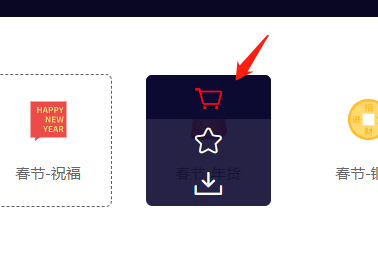

这时我们点击购物车这个图标将想要的图标添加至购物车。这里我选择了两个。选择好图标之后，如下图，下载代码。

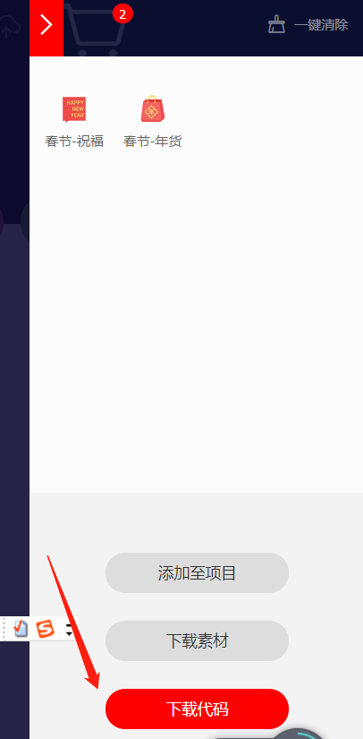

随后将下载的压缩包解压，放到指定的文件夹里存放（这里放在哪里都没关系，因为后续引用的时候可以修改地址，但这里我放到了我要演示的demo的根目录下）

解压后是这样子，为了好看，我把这个文件夹直接改名为font，如下下张图

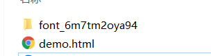 

改名为font

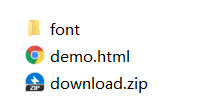

进去font文件夹我们可以看到很多文件，其中demo_index.html文件里有官方的使用步骤。（不要直接看我演示，先看官方的文档），官方有三种使用字体图标的方法，在这里我只演示Unicode的方法。

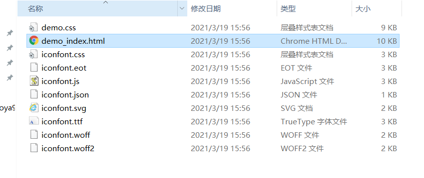

在官方文档中，开头我们看见的这个图标，最底下这个，红色框框圈住的就是我们在标签使用的时候需要用到的对应的命名。

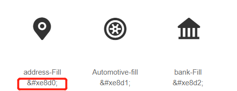

回到刚才的文件夹中，打开iconfont.css这个文件我们可以看到许多代码，其中开头的这两段是我们需要用到的：

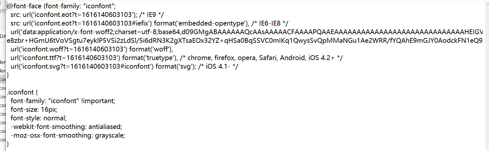

将这两段代码复制到我们编辑器中，如下图。注意一定要修改路径，否则无法显示
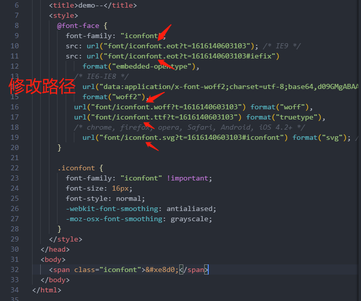

然后在我们复制古来的代码的第二段代码中，即 .iconfont类，是我们在标签使用字体图标时需要引用的类，如图：

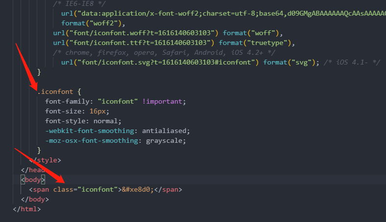

另外，在span标签中的 &#xe8d0 就是我们刚刚在官网文档中看到的图标对应的名字。其中e8d0是其图标的名，&#x是阿里巴巴图标的姓，后面我们用到的阿里巴巴的图标都要带上这个。最后我们再回到icofont.css中的代码中来

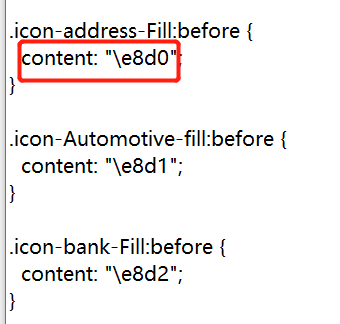

有没有发现content里面的e8d0就是我们这个字体图标的名字呢。

### 2. 在原有的图标上再添加字体图标

首先我们需要把字体图标下载到本地，步骤跟上一次的一样。并且改名为font2
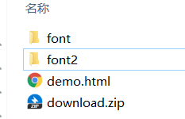

点开font2文件夹，并且打开我们的iconfont.css

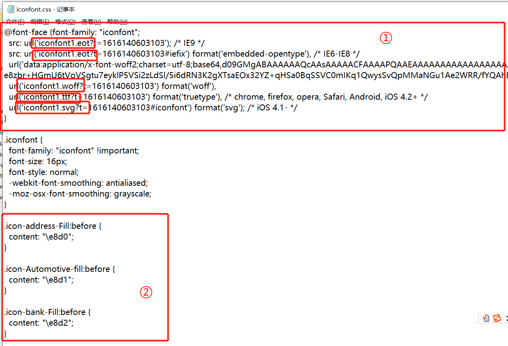
注意看红色框框①中的小框框，我是这里我给其路径改了名字，把原来的iconfont改为了iconfont1，这里的名字可以任意改，但最好不要彻底“改头换面”。

改完名字后，将①、②的代码复制到我们一开始的font文件中的iconfont.css文件中：
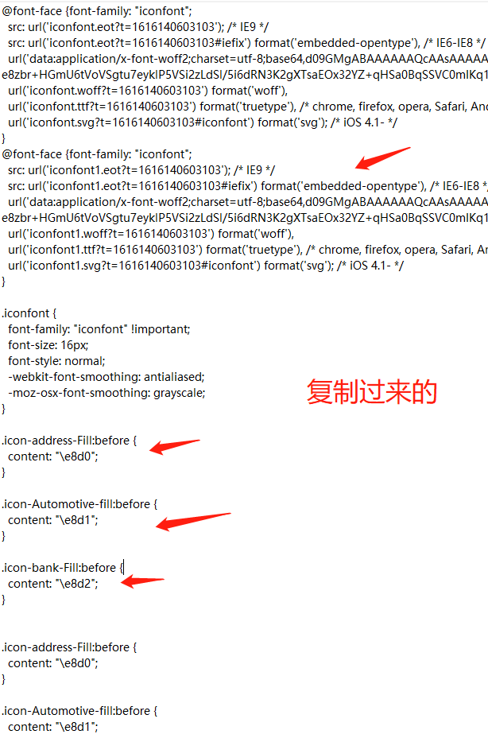

然后，我们再将这段@font-face代码复制到刚刚的编辑器中（这时编辑器中就有两段@font-face代码了！）

然后我们要用其中某个字体图标的时候，可以再打开刚刚的css文件看他们的名字是什么
，如在上图中最后一段icon的代码中可以看出，该图标的名字是e8d1，此时我们复制到编辑器中：

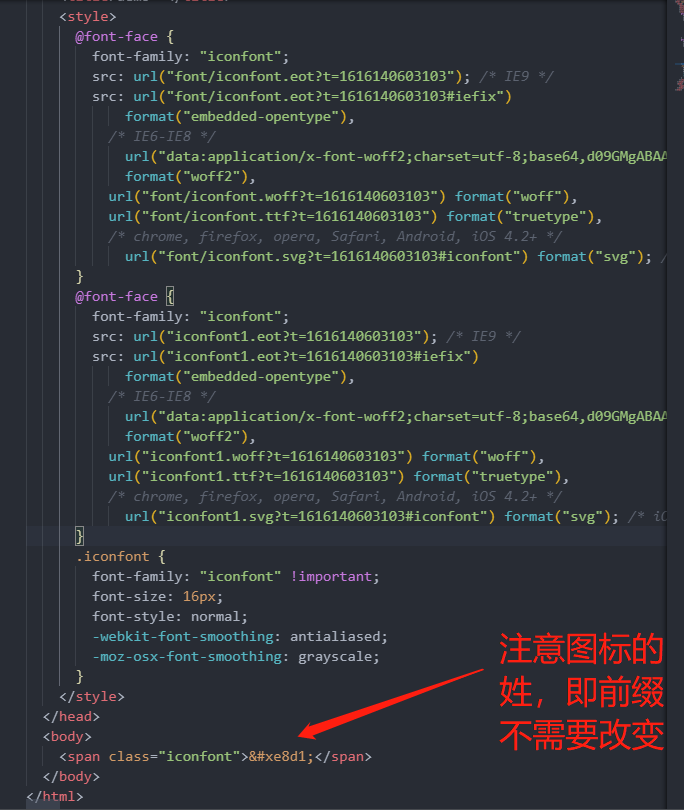

然后就大功告成啦！