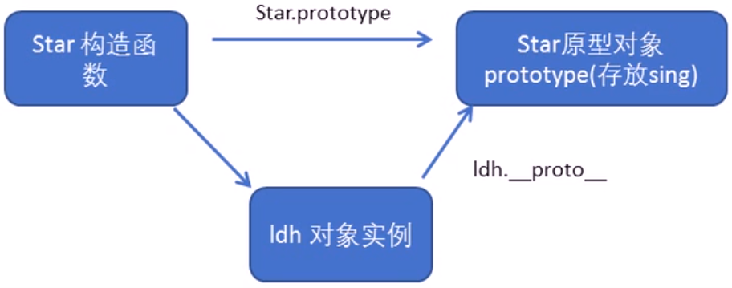
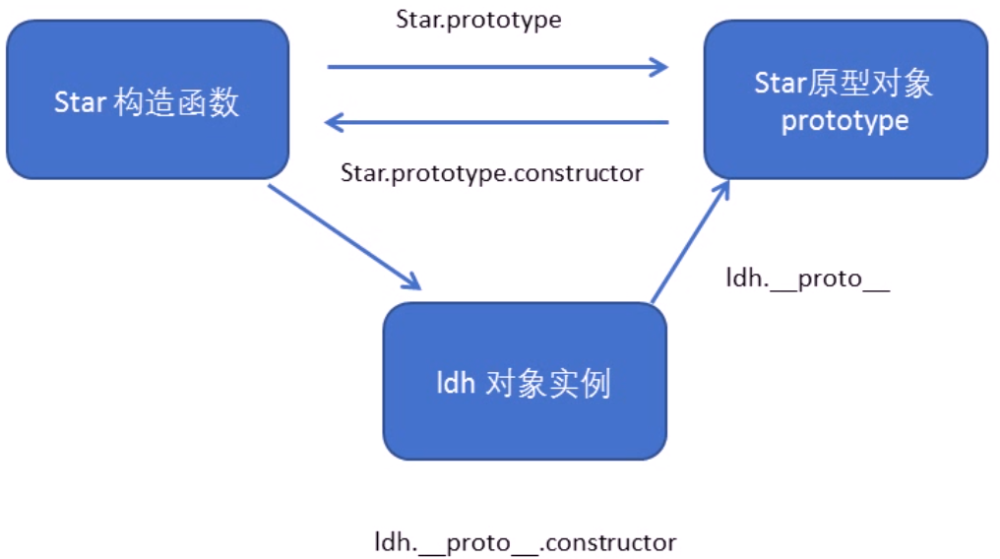
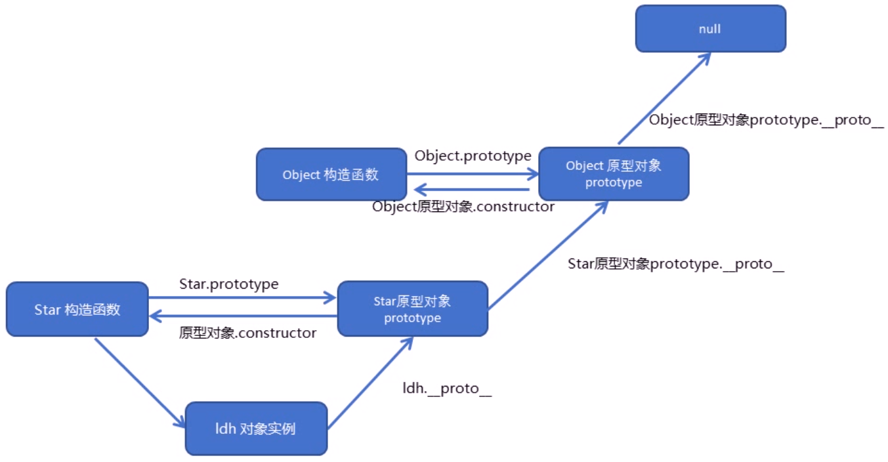
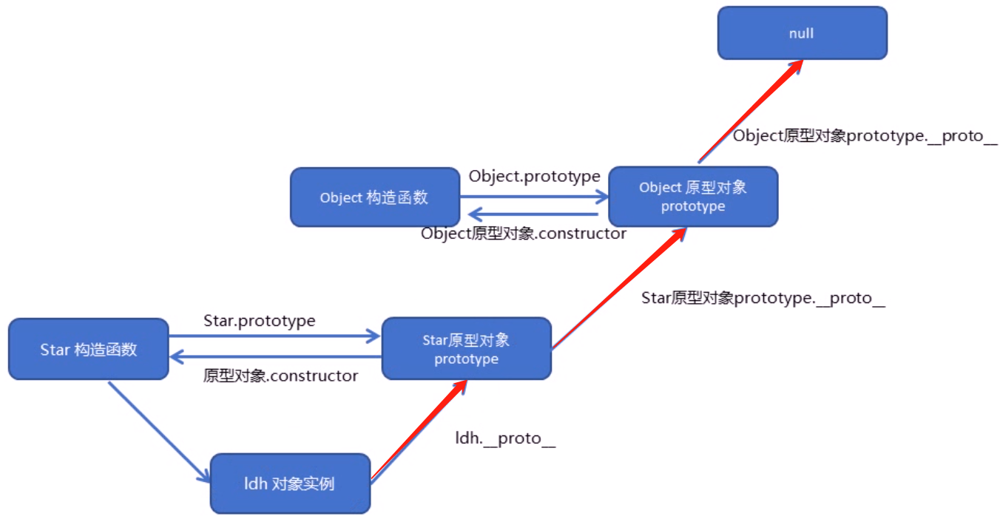

## 构造函数和原型
#### 概述
在典型的OOP的语言中(如Java )，都存在类的概念，类就是对象的模板，对象就是类的实例，但在ES6之前，JS中并没用引入类的概念。
ES6，全称ECMAScript 6.0，2015.06发版。但是目前浏览器的JavaScript是ES5版本，大多数高版本的浏览器也支持ES6，不过只实现了ES6的部分特性和功能。
在ES6之前，对象不是基于类创建的，而是用一种称为构建函数的特殊函数来定义对象和它们的特征。
创建对象可以通过以下三种方式∶

1. 对象字面量

var obj = {}

2. new Object()

3. 自定义构造函数

### 构造函数

构造函数是一种特殊的函数，主要用来初始化对象，即为对象成员变量赋初始值，它总与new一起使用。我们可以把对象中一些公共的属性和方法抽取出来，然后封装到这个函数里面。

<strong> new在执行时会做四件事情:</strong>

1. 在内存中创建一个新的空对象。
2. 让this指向这个新的对象。
3. 执行构造函数里面的代码，给这个新对象添加属性和方法。
4. 返回这个新对象(所以构造函数里面不需要return ).

构造函数中的属性和方法我们称为成员。
JavaScript的构造函数中可以添加一些成员，可以在构造函数本身上添加，也可以在构造函数内部的this上添加。通过这两种方式添加的成员，就分别称为静态成员和实例成员。

#### 静态成员∶
在构造函数本身上添加的成员称为静态成员，只能由构造函数本身来访问。
  
#### 实例成员∶
在构造函数内部创建的对象成员称为实例成员，只能由实例化的对象来访问（通过this添加的成员如：this.age = age;）

实例成员只能通过实例化的对象来访问

```javascript
function Star(uname, age) {
  this.uname = uname;  //uname和age都是实例成员
  this.age = age;
  this.sing =function(){
    console.log(123);
  }
}
var ldh = new Star("刘德华", 18);
var zxy = new Star('张学友',18);
console.log(ldh.age); //通过实例化的对象访问
console.log(Star.uname);//undefined，实例成员不可以通过构造函数访问

Star.sex='男';//这个就是静态成员，通过构造函数其本身创建
console.log(ldh.sex);
```

### 构造函数原型对象prototype

构造函数存在浪费内存的问题；属性是简单数据类型，而方法（函数）则是复杂数据类型；当构造函数里面有方法（函数）的时候，每 实例化一个对象，就会开辟一个内存空间来存放这个复杂数据类型。
```javascript
console.log(ldh.sing==zxy.sing);//false
```

构造函数原型 prototype

构造函数通过原型分配的函数是所有对象所共享的。
JavaScript规定，每一个构造函数都有一个prototype属性，指向另一个对象。注意这个prototype就是一个对象，这个对象的所有属性和方法都会被构造函数所拥有。

我们可以把那些不变的方法，直接定义在prototype对象上，这样所有对象的实例就可以共享这些方法。
```javascript
function Star(uname, age) {
  this.uname = uname;  //uname和age都是实例成员
  this.age = age;
  this.sing =function(){
    console.log(123);
  }
}
Star.prototype.sing=function(){
   console.log(123);
}
var ldh = new Star('刘德华',50);
var zxy = new Star('张学友',60);
console.log(ldh.sing == zxy.sing);//true
```
通过原型对象添加sing方法，这样每实例化一个对象就不会开辟一个新的内存空间来存放这个方法，而是对象直接指向原型对象中的sing方法

+ 原型是一个对象，也称为原型对象
+ 原型的作用是共享方法 
+ 一般我们将公共属性放到构造函数里面，而把公共的方法放到构造函数的原型对象里。

### 对象原型__proto__

对象都会有一个属性__proto__指向构造函数的prototype原型对象，之所以我们对象可以使用构造函数的prototype原型对象的属性和方法，就是因为对象有__proto__原型的存在
(prototype是原型对象，__proto__是对象原型)

+ prototype和__proto__是等价的。
+ __proto__对象原型的意义就在于为对象的查找机制提供一个方向，或者说一条路线，但是它是一个非标准属性，因此实际开发中，不可以使用这个属性，它只是内部指向原型对象prototype

### constructor构造函数
对象原型__proto__和构造函数的原型对象prototype里面都有一个属性constructor属性，constructor我们称为构造函数，因为它指回构造函数本身。

constructor主要用于记录该对象引用于哪个构造函数，它可以让原型对象重新指向原来的构造函数。

```javascript
function Star(uname, age) {
  this.uname = uname;  //uname和age都是实例成员
  this.age = age;
  this.sing =function(){
    console.log(123);
  }
}
//当我们需要写很多个方法时我们可以直接用赋值操作
Star.prototype={
  sing:function(){
   console.log(123);
  },
  movie:function(){
   console.log(123);
  },
}
//但由于这是一个赋值操作，prototype成为了构造函数的静态成员。原本在prototype里面的constructor属性被覆盖，因此无法指回构造函数，此时我们可以手动设置

Star.prototype = {
      constructor: Star,  //这样子prototype就指回了Star构造函数
      sing: function () {
        console.log(111);
      },
    };
```

### 构造函数、实例、原型对象三者之间的关系



+ 实例对象的__proto__指向其构造函数的原型对象prototype，因此：实例对象.\_\_proto\_\_==构造函数.prototype。
+ 每个构造函数中指向其原型对象prototype，而每个原型对象prototype又通过constructor指回其构造函数，因此实例对象.\_\_proto\_\_又可以通过constructor指回构造函数，本质上是通过原型对象指回构造函数。




+ 构造函数的原型对象prototype也有\_\_proto\_\_，指向Object.prototype.
+ Object.prototype原型对象里面的\_\_proto\_\_指向null

### javascript查找机制




① 当访问一个对象的属性(包括方法)时，首先查找这个对象自身有没有该属性，找到即返回，不再向上查找。

② 如果没有就查找它的原型（也就是_proto_指向的prototype原型对象）。

③ 如果还没有就查找原型对象的原型( Object的原型对象）。

④ 依此类推一直找到Object为止( null )，返回undefined。

_proto_对象原型的意义就在于为对象成员查找机制提供一个方向，或者说一条路线。

### 原型对象中this指向

+ 在构造函数中，里面的this指向的是实例对象
+ 原型对象函数里面的this，是谁调用这个函数，this就指向谁，因此也是指向实例对象

### 扩展内置对象

可以通过原型对象，对原来的内置对象进行扩展自定义的方法。

给数组添加一个求和的方法：
```javascript
Array.prototype.sum = function () {
  var sum = 0;
  for (var i = 0; i < this.length; i++) {
    sum += this[i];
  }
  return sum;
};
var arr = [1,2,3];
console.log(arr.sum());//6
```
数组和字符串内置对象不能给原型对象覆盖操作Array.prototype ={}，只能是Aray.prototype.xx = function(){}的方式.

```javascript
Array.prototype = {
  sum:function () {
    var sum = 0;
    for (var i = 0; i < this.length; i++) {
      sum += this[i];
    }
    return sum;
  }
};
var arr = [1,2,3];
console.log(arr.sum());//报错
```

## 原型继承

es6之前没有extends继承，但可以通过构造函数+原型对象模拟实现继承，被称为组合继承

### call() 
调用这个函数，并且修改调用call函数的函数的this指向。

call(this的指向,参数1,参数2);

```javascript
function fn(x, y) {
  console.log("hhhh");
  console.log(this);
}

var obj = {
  name: "andy",
};
fn.call(obj, 1, 2);//修改了fn的this指向
``` 

此时this指向obj，x为1，y为2.

通过call()我们可以实现继承
```javascript
function Father(uname, age) {
  this.uname = uname;
  this.age = age;
  console.log(this);
}
Father.prototype.money=function(){
  console.log(100000);
}

function Son(uname, age, sex) {
  Father.call(this, uname, age);
  this.sex = sex;
}
var son = new Son("Tom", 18, "男");
console.log(son);
//此时Father构造函数的this指向Son的实例对象
```

但我们无法继承Father()的prototype的属性，因为Son中没有任何对父构造函数的指向。
假设我们使用“Son.prototype=Father.prototype”来使其相等这时父构造函数的原型对象的地址给了子构造函数，这样会导致在修改子构造函数的同时也会修改父构造函数。