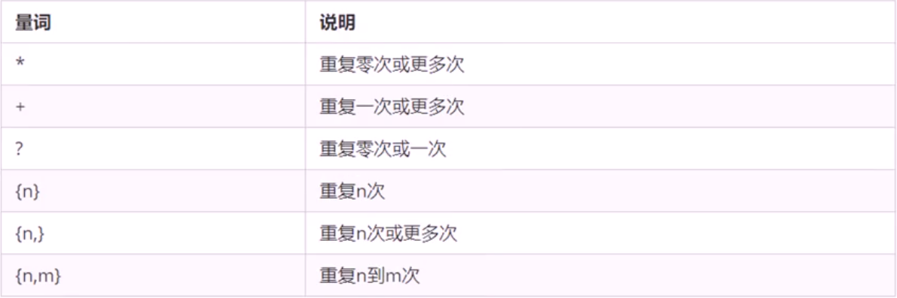
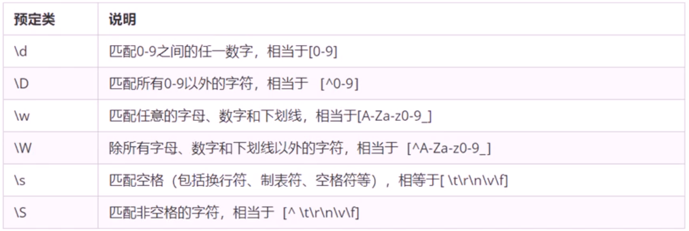

## 正则表达式

正则表达式(Regular Expression )是用于匹配字符串中字符组合的模式。在 JavaScript 中正则表达式也是对象。

正则表通常被用来检索、替换那些符合某个模式(规则)的文本，例如验证表单 ∶ 用户名表单只能输入英文字母、数字或者下划线，昵称输入框中可以输入中文(匹配)。此外，正则表达式还常用于过滤掉页面内容中的一些敏感词(替换)，或从字符串中获取我们想要的特定部分(提取)等。

### 创建正则表达式

在 JavaScript 中，可以通过两种方式创建一个正则表达式。

1.通过调用 RegExp 对象的构造函数创建

<p style='background-color:rgb(239,239,255);padding-left:20px;'>var变量名= new RegExp(/表达式/ );</p>

⒉ 通过字面量创建

<p style='background-color:rgb(239,239,255);padding-left:20px;'>var变量名=/表达式/;</p>

### 测试正则表达式 test

test()正则对象方法，用于检测字符串是否符合该规则，该对象会返回
true 或 false，其参数是测试字符串。

regexobj.test (str)

1. regexobj 是写的正则表达式 2. str 我们要测试的文本

2．就是检测 str 文本是否符合我们写的正则表达式规范.

```javascript
var reg1 = /123/; //只要包含有连续的123
console.log(reg1.test("13245"));

/*
false
*/
```

```javascript
var reg2 = /^abc/; //要以abc开头
console.log(reg2.test("abc"));
console.log(reg2.test("abcv"));
console.log(reg2.test("aabc"));
/*
true
true
false
*/
```

```javascript
var reg3 = /abc$/; //以abc结尾
console.log(reg3.test("abc"));
console.log(reg3.test("abcv"));
console.log(reg3.test("aabc"));
/*
true
false
true
*/
```

```javascript
var reg4 = /^abc$/; //只能输入abc
console.log(reg4.test("abc"));
console.log(reg4.test("abcv"));
console.log(reg4.test("aabc"));
/*
true
false
false
*/
```

```javascript
var reg5 = /[abc]/; //输入包含a或b或c
console.log(reg5.test("aqwe"));
console.log(reg5.test("baby"));
console.log(reg5.test("ert"));
/*
true
true
false
*/
```

```javascript
var reg6 = /^[abc]$/; //只能输入a或b或c
console.log(reg6.test("a"));
console.log(reg6.test("b"));
console.log(reg6.test("da"));
/*
true
true
false
*/
```

```javascript
var reg7 = /^[a-z]$/; //只能输入小写的英文字母a-z
console.log(reg7.test("a"));
console.log(reg7.test("z"));
console.log(reg7.test("A"));
console.log(reg7.test("0"));
/*
true
true
false
false
*/
```

```javascript
var reg8 = /^[a-zA-z]$/; //只能输入小写的英文字母a-z和或大写的字母A-Z
console.log(reg8.test("a"));
console.log(reg8.test("z"));
console.log(reg8.test("A"));
console.log(reg8.test(0));
/*
true
true
true
false
*/
```

```javascript
var reg9 = /^[a-zA-z0-9]$/; //只能输入小写的英文字母a-z和或大写的字母A-Z或数字0-9
console.log(reg9.test("a"));
console.log(reg9.test("z"));
console.log(reg9.test("A"));
console.log(reg9.test(0));
console.log(reg9.test("0"));
console.log(reg8.test(0));
/*
true
true
true
true
true
false
*/
```

```javascript
var reg10 = /^[^a-zA-z0-9]$/; //中括号里面的^是取反的意思，不能包含小写的英文字母a-z和或大写的字母A-Z或数字0-9
console.log(reg10.test("a"));
console.log(reg10.test("z"));
console.log(reg10.test("A"));
console.log(reg10.test(0));
console.log(reg10.test("20"));
console.log(reg10.test("@"));
/*
false
false
false
false
false
true
*/
```

### 正则表达式量词



```javascript
var reg1 = /^a*$/; //重复0或更多次
console.log(reg1.test(""));
console.log(reg1.test("a"));
console.log(reg1.test("aaa"));
/*
true
true
true
*/
```

```javascript
var reg2 = /^a+$/; //重复1或更多次
console.log(reg2.test(""));
console.log(reg2.test("a"));
console.log(reg2.test("aaa"));

/*
false
true
true
*/
```

```javascript
var reg3 = /^a?$/; //重复0或1次
console.log(reg3.test(""));
console.log(reg3.test("a"));
console.log(reg3.test("aaa"));
/*
true
true
false
*/
```

```javascript
var reg4 = /^a{3}$/; //重复3次
console.log(reg4.test(""));
console.log(reg4.test("a"));
console.log(reg4.test("aaa"));
console.log(reg4.test("aaaa"));
/*
false
false
true
false
*/
```

```javascript
var reg5 = /^a{3,}$/; //重复3次或以上
console.log(reg5.test(""));
console.log(reg5.test("a"));
console.log(reg5.test("aaa"));
console.log(reg5.test("aaaa"));
/*
false
false
true
true
*/
```

```javascript
var reg6 = /^a{3,6}$/; //重复大于等于3次并且小于等于6次
console.log(reg6.test(""));
console.log(reg6.test("a"));
console.log(reg6.test("aaa"));
console.log(reg6.test("aaaa"));
console.log(reg6.test("aaaaaaa"));
/*
false
false
true
true
false
*/

var reg7 = /^abc{3}$/; //abccc c重复3次
var reg8 = /^(abc){3}$/; //abcabcabc abc重复3次
```

这个模式用户只能输入英文字母 数字 下划线 中短横线{6,12}两个数字之间不能有空格

<p style='background-color:rgb(239,239,255);padding-left:20px;'>var reg = /^[a-zA-Z0-9_-]{3,6}$/;
</p>



### 正则表达式中的替换

#### replace 替换

replace()方法可以实现替换字符串操作，用来替换的参数可以是一个字符串或是一个正则表达式。

stringObject.replace(regexp/substr,replacement)

1. 第一个参数:被替换的字符串或者正则表达式
2. 第二个参数:替换为的字符串
3. 返回值是一个替换完毕的新字符串

```javascript
var str = "我是珍妮,珍妮";
var newStr = str.replace("珍妮", "Jenny");
//或 var newStr = str.replace(/珍妮/, "Jenny");
console.log(newStr); //我是Jenny，珍妮
```

replace 只能替换 第一个满足条件的字符串。如果需要全局替换的话需要用：/被替换的内容/g，忽略大小写则是：/被替换的内容/i，既全局替换又忽略大小写则/被替换的内容/gi

```javascript
var str = "我是珍妮,珍妮";
var newStr = str.replace(/珍妮|詹妮/gi, "Jenny");
console.log(newStr); //我是Jenny，Jenny
```
