### MVVM

MVVM（Model–view–viewmodel）是一种软件架构模式。


### v-for

```javascript
//vue的data： movies: ["a", "b", "c", "d"],
<ul>
  <li v-for="item in movies">{{ item }}</li>
</ul>
```

以上代码片段得：

<ul>
  <li>a</li>
  <li>b</li>
  <li>c</li>
  <li>d</li>
</ul>

### v-on 绑定事件监听

v-on:click="方法" 点击调用方法，相当于@click

```html
<button @click="add">+</button> <button v-on:click="sub">-</button>
```

v-on:mouseenter="方法"

v-on:blur="方法"

当通过 methods 中定义方法，以提供@click 调用时，需要注意参数的问题

1. 如果该方法不需要额外的参数，那么可以直接@click="方法"，可以省略()，但是方法本身是需要一个参数的，如果在调用方法时没有加()，并且在定义方法时需要传参，此时 Vue 会默认将浏览器生成的 event 事件对象作为参数

```javascript
window.onload = function () {
  new Vue({
    el: "#app",
    data: {},
    methods: {
      add(event) {
        console.log(event);
      },
    },
  });
};
```

```html
<button @click="add">+</button>
```

此时的 add 打印的是浏览器生成的 event 事件对象

2. 当我们需要 event 对象，同时又需要其他参数可以使用\$event 来获取浏览器参数的 event 对象

```javascript
window.onload = function () {
  new Vue({
    el: "#app",
    data: {},
    methods: {
      add(a, event) {
        console.log(a, event);
      },
    },
  });
};
```

```html
<button @click="add('123',$event)">+</button>
```

此时的 add 打印的是 123 和浏览器生成的 event 事件对象，如果 add 没有加()则打印的第一个是 event 事件对象，第二个是 undefined

### v-on 修饰符

1. 阻止冒泡 @事件.stop

```html
<div @click="externalClick">
  <button @click.stop="innerClick">+</button>
</div>
```

阻止了 button 的冒泡，相当于 event.stopPropagation()

2. 阻止默认事件 @事件.prevent

```html
<form action="baidu">
  <input type="submit" @click.prevent="submitClick" />
</form>
```

阻止 input 的提交,点击按钮不提交，而是执行 submitClick 函数

3. 监听键盘某个键 @事件.prevent

```html
<button type="submit" @click.once="clickMe">click</button>
```

第一次点击 button 的时候调用 clickMe，后面再点击则不会再调用

### v-once 不根据数据的改变而改变

4. 只允许事件调用一次 @事件.once

```html
<!--vue里的data：message: "哈哈哈",-->
<h3>{{message}}</h3>
//展示哈哈哈
<!--修改message的内容，h3展示的还是哈哈哈-->
```

该指令表示元素只渲染一次，不根据数据的改变而改变

### v-html 往 dom 插入 html 元素

```html
<!--vue里的data url: "<a href='http://www.baidu.com'>百度一下</a>"-->,

<h3 v-html="url"></h3>
```

正常展示链接，如果不加 v-html 则以字符串的形式展示"\<a href='http://www.baidu.com'>百度一下\</a>"

### v-text

```html
<h2>{{message}}</h2>
<h2 v-text="message"></h2>
```

上述两者的显示情况相同，但当我们需要在 message 后面自定义内容的话应该使用{{message}}+自定义内容，否则使用 v-text 指令会将我们的自定义内容覆盖掉

### v-pre

添加了 v-pre 指令的元素不会被 vue 进行解析

```html
<h2 v-pre>{{message}}</h2>
```

页面显示的是{{message}}，而不是 message 的内容

### v-bind 操作 dom 元素的属性

```javascript
window.onload = function () {
  const app = new Vue({
    el: "#app",
    data: {
      message: "hhh",
      imgURL: "img/MVVM.jpg",
    },
  });
};
```

```html
 
```

### 动态更改元素的 class

```javascript
window.onload = function () {
  const app = new Vue({
    el: "#app",
    data: {
      message: "hhh",
      isActive: true,
      isLine: true,
    },
    methods: {
      change: function () {
        this.isActive = !this.isActive;
      },
      getClasses: function () {
        return { active: this.isActive, line: this.isLine };
      },
    },
  });
};
```

```html
<div id="app">
  <h2 :class="{active:isActive,line:isLine}" @click="change">{{message}}</h2>
  <h2 :class="getClasses()" @click="change">{{message}}</h2>
</div>
```

绑定 class 可以使用:class="{类名:Boolean,类名:Boolean...}"
当布尔值为 true 则为该元素绑定该类，为 false 则不绑定.

我们也可以使用调用函数的方式返回绑定的类

### 绑定 style

```javascript
window.onload = function () {
  const app = new Vue({
    el: "#app",
    data: {
      finalFontSize: 100,
      baseStyle1: { backgroundColor: "pink" },
      baseStyle2: { fontSize: "50px" },
    },
  });
};
```

```html
<p :style="{color:'red',fontSize:finalFontSize+'px'}">hhh</p>
<p :style="[baseStyle1,baseStyle2]">hhh</p>
```

### computed 计算属性

用于当我们需要对某些数据进行某种变化再进行显示，可以在计算属性内再定义一个属性，并且返回变化后的数据。虽然定义变量的方式与定义方法的方式相同，但在 computed 里面定义的变量可直接作为属性来使用

```javascript
window.onload = function () {
  const app = new Vue({
    el: "#app",
    data: {
      firstName: "Zhang",
      lastName: "Jenny",
    },
    computed: {
      fullName: function () {
        return this.firstName + "  " + this.lastName;
      },
    },
    methods: {
      getFullName: function () {
        return this.firstName + "  " + this.lastName;
      },
    },
  });
};
```

```html
<div id="app">
  <p>{{getFullName()}}</p>
  <p>{{fullName}}</p>
</div>
```

两者效果等同，唯一的区别是在计算属性 computed 里面的变量直接作为属性使用，不需要在变量名称后加括号表示调用方法。注意，在 computed 内的变量最好不要取动词。

计算属性会有缓存，如果多次使用并且原先的计算数据没有更改，计算属性只会调用一次，因此计算属性的效率比 methods 要高。

### 计算属性的 setter 和 getter

我们写的计算属性的方法是已经简化过的实际上它是这样的：

```javascript
window.onload = function () {
  const app = new Vue({
    el: "#app",
    data: {
      firstName: "Zhang",
      lastName: "Jenny",
    },
    computed: {
      fullName: {
        set: function (newValue) {},
        get: function () {
          return this.firstName + "  " + this.lastName;
        },
      },
    },
  });
};
```

一般情况下计算属性是只读不写的，因为会省略 set，但如果需要设置值则会调用 set 方法

### v-if 决定元素是否要渲染

满足条件则渲染该元素

```html
<h3 v-if="num > 10">{{message}}</h3>
```

### v-else

满足条件则渲染该元素

```html
<h3 v-if="num > 0">{{message}}</h3>
<h3 v-else>略略略</h3>
```

### v-else-if

满足条件则渲染该元素

```html
<h3 v-if="score>=90">优秀</h3>
<h3 v-else-if="score>=80">良好</h3>
<h3 v-else-if="score>=60">及格</h3>
<h3 v-else>不及格</h3>
```

### v-show 决定元素是否要显示

```html
<h3 v-show="num > 10">{{message}}</h3>
```

### v-show 和 v-if 的区别

当条件为 false，包含 v-if 指令的元素，根本就不会存在 dom 中，是直接没有渲染。
而 v-show 是渲染了，只是给我们的元素添加了一个行内样式：display:none,元素还是存在于 dom 中。

当在显示和隐藏之间比较频繁时使用 v-show，只有一次切换则使用 v-if

### v-for

#### v-for 遍历数组

```html
<ul>
  <li v-for="(item,index) in movies">{{index+1}}.{{item}}</li>
</ul>
```

#### v-for 遍历对象

```html
<ul>
  <li v-for="(value,key) in obj">{{value}}.{{key}}</li>
</ul>
<ul>
  <li v-for="value in obj">{{value}}</li>
</ul>
```

### 数组的方法的响应式

通过这些方法修改数组可以做到响应式：
push()、
pop()、
shift()、
unshift()、
sort()、
reverse()

通过索引修改数组不能做到响应式：this.arr[0]='a';vue 没有监听，我们可以使用

<p style="background:pink">this.arr.splice(0,1,'a')或者Vue.set(this.arr,0,'a')</p>来使其做到响应式

### v-model 双向绑定

```html
<input type="text" v-model="message" /> {{message}}
```

当我们通过 input 改变框框内的内容时，message 也会跟着改变

相当于：

```html
<input type="text" :value="message" @input="message=$event.target.value" />
```

#### v-model 单选框 radio

```html
<label for="male">
  <input type="radio" id="male" value="男" v-model="sex" />男
</label>
<label for="female">
  <input type="radio" id="female" value="女" v-model="sex" />女
</label>
<h4>您选择的性别是：{{sex}}</h4>
```

有了 v-model 的绑定我们可以省略 name 的绑定来实现互斥。并且我们选择哪一个，sex 就会随着选项的改变而改变。

#### v-model 复选框 checkbox

```html
<input type="checkbox" value="足球" v-model="hobbies" />足球
<input type="checkbox" value="篮球" v-model="hobbies" />篮球
<input type="checkbox" value="乒乓球" v-model="hobbies" />乒乓球
<input type="checkbox" value="跳舞" v-model="hobbies" />跳舞
<h2>您选择的爱好是：{{hobbies}}</h2>
```

hobbies 是在 data 的空数组，当我们选择或取消选择某个选项时，hobbies 会相应的添加或删除项，每个项的内容是 input 的 value

值绑定：

myHobbies: ["a", "b", "c", "d"]

```html
<label v-for="item in myHobbies" :for="item">
  <input type="checkbox" :value="item" :id="item" v-model="hobbies" />{{item}}
</label>
```

#### v-model 选项框 select

```html
<select name="fruits" id="" v-model="fruits" multiple>
  <option value="苹果">苹果</option>
  <option value="香蕉">香蕉</option>
  <option value="榴莲">榴莲</option>
  <option value="火龙果">火龙果</option>
  <option value="青提">青提</option>
</select>
```

fruits 是在 data 的空数组，当我们选择或取消选择某个选项时，fruits 会相应的添加或删除项，每个项的内容是 input 的 value

### v-model 修饰符

#### 1. lazy

当我们使用 v-model 的时候 input 和 message 是实时绑定的，数据是同时改变，我们可以使用 lazy 修饰符使数据在 input 失去焦点或按下回车是才更新

```html
<input type="text" v-model.lazy="message" /> {{message}}
```

#### 2. number

当我们的 input 规定只能输入数字，但是获取到的 value 仍然是 String 类型，这时我们就可以使用 number 修饰符来自动转换数据类型

```html
<input type="number" v-model.number="age" />
<h3>{{typeof age}}</h3>
```

#### 3. trim

去除 value 前后两边的空格

```html
<input type="text" v-model.trim="message" />
```

### 注册组件的基本步骤

组件的使用分成三个步骤：

1. 调用 Vue.extend()方法创建组件构造器
2. 调用 Vue.component()方法注册组件
3. 在 Vue 实例的作用范围内使用组件

```javascript
window.onload = function () {
  //1.创建组件构造器对象，
  const cpnC = Vue.extend({
    template: `
        <div>
          <h2>cpnC</h2>
          <p>cpnC</p>
        </div>
        `,
  });
  const cpnCC = Vue.extend({
    template: `
        <div>
          <h2>cpnCC</h2>
          <p>cpnCC</p>
        </div>
        `,
  });
  //2. 注册组件,在这注册的是全局组件，所有的Vue实例都能使用
  Vue.component("my-cpn", cpnC);

  const app = new Vue({
    el: "#app",
    data: {},
    components: {
      cpn: cpnCC, //标签名，组件构造器，在这注册的是局部组件，只有这的实例才能使用
    },
  });
};
```

然后直接在 html 内部使用标签

```html
<div id="app">
  <!-- 3. 使用组件 -->
  <my-cpn></my-cpn>
  <cpn></cpn>
</div>
```

### 父子组件

```javascript
const cpnC1 = Vue.extend({
  template: `
    <div>
      <h2>cpnC1</h2>
    </div>
    `,
});
const cpnC2 = Vue.extend({
  template: `
    <div>
      <h2>cpnC2</h2>
      <cpn1></cpn1>
    </div>
    `,
  components: {
    cpn1: cpnC1,
  },
});
```

cpnC2 是 cpnC1 的父组件

### 注册组件的语法糖

```javascript
//创建并注册组件构造器对象
Vue.component("cpn1", {
  template: `
    <div>
      <h2>cpnC1</h2>
    </div>
    `,
});
```

### 组件的分离

```html
<template id="cpn3">
  <div>
    <h2>cpn3</h2>
  </div>
</template>

<div id="app">
  <!-- 使用组件 -->
  <cpn3></cpn3>
</div>
```

```javascript
const app = new Vue({
  el: "#app",
  data: {},
  components: {
    cpn3: {
      template: `#cpn3`,
    },
  },
});
```

### 组件内的数据

```javascript
const app = new Vue({
  el: "#app",
  data: {},
  components: {
    cpn3: {
      template: `#cpn3`,
      data() {
        return {
          message: "hhh",
        };
      },
    },
  },
});
```

```html
<template id="cpn3">
  <div>
    <h2>message</h2>
  </div>
</template>

<div id="app">
  <!-- 使用组件 -->
  <cpn3></cpn3>
</div>
```

注意，当组件内的元素比较多时需要用一个 div 把所有元素框起来

### 组件中的 data 为什么是函数

当我们重复使用同一个组件时，我们需要用到组件内的数据，但这些数据不能相互干扰，而 data 是函数时，每次返回一个对象，每使用一次这个组件就会调用这个函数，返回一个对象，每次调用函数都会返回不同的对象，因此数据就不会产生干扰。

### 父子组件的通信

#### 通过 props 向子组件传递数据

首先先定义一个 template

```html
<template id="cpn">
  <div>
    <h2>cpn</h2>
    <h3>{{cmovies}}</h3>
  </div>
</template>

<div id="app">
  <!--  使用组件，在组件内绑定属性 -->
  <cpn v-bind:cmovies="movies" :cmessage="message"></cpn>
</div>
```

在 js 代码中绑定组件

```javascript
const cpn = {
  template: `#cpn`,
  // props: ["cmovies", "cmessage"],
  props: {
    cmovies: {
      //类型是对象或者数组 默认值必须从一个工厂函数获取
      type: Array,
      default() {
        return [];
      },
    },
    cmessage: {
      type: String,
      default: "hhhh",
    },
  },
};

const app = new Vue({
  el: "#app",
  data: {
    movies: ["a", "b", "c"],
    message: "message",
  },
  components: {
    cpn,
  },
});
```

#### 通过自定义事件向父组件传递数据

```javascript
//1.创建组件构造器对象，子组件
const cpn = {
  template: `#cpn`,
  data() {
    return {
      categories: [
        { id: "a", name: "aa" },
        { id: "b", name: "bb" },
        { id: "c", name: "cc" },
        { id: "d", name: "dd" },
      ],
    };
  },
  methods: {
    btnClick(item) {
      this.$emit("itemclick", item, "123"); //itemclick是我们将要在父组件中使用的自定义事件，后面的则是要传过去的参数，使用emit发射数据
    },
  },
};
//创建父组件
const app = new Vue({
  el: "#app",
  methods: {
    cpnClick(item, a) {
      //接收数据
      console.log(item, a);
    },
  },
  components: {
    cpn,
  },
});
```

```html
<!-- 子组件模板 -->
<template id="cpn">
  <div>
    <!-- 每点击一次button就会调用btnClick，并且把item传过去，在btnClick中发送数据给父组件 -->
    <button v-for="item in categories" @click="btnClick(item)">
      {{item.name}}
    </button>
  </div>
</template>
<!-- 父组件模板 -->
<div id="app">
  <!-- 3. 使用自定义事件 -->
  <cpn @itemclick="cpnClick"></cpn>
</div>
```

### 父子组件的访问

#### 父组件访问子组件 $children $refs

```javascript
const cpn = {
  template: "#cpn",
  data() {
    return {
      cpnname: "cpnname",
    };
  },
  methods: {
    showMessage() {
      return "hhh";
    },
  },
};

new Vue({
  el: "#app",
  data: {},
  components: {
    cpn,
  },
  methods: {
    btnClick() {
      this.$children[0].showMessage(); //调用子组件的方法
      console.log(this.$children[0].cpnname); //获取子组件的数据

      console.log(this.$refs.rrr.cpnname + "这个是refs的"); //使用refs加对组件添加key的方式一一对应
    },
  },
});
```

```html
<template id="cpn">
  <div>
    <h2>{{showMessage()}}</h2>
  </div>
</template>

<div id="app">
  <cpn ref="rrr"></cpn>
  <cpn></cpn>
  <cpn></cpn>
  <button @click="btnClick">click</button>
</div>
```

#### 子组件访问父组件 \$parent

```javascript
const cpn = {
  template: "#cpn",
  data() {
    return {
      cpnname: "cpnname",
    };
  },
  methods: {
    btnClick() {
      console.log(this.$parent.parentname); //使用parent访问父组件的属性parentname
    },
  },
};
```

#### 访问根组件 \$root

```javascript
const cpn = {
  template: "#cpn",
  data() {
    return {
      cpnname: "cpnname",
    };
  },
  methods: {
    btnClick() {
      console.log(this.$root.rootname); //使用parent访问根组件的属性rootname，这里访问的一般是vue实例
    },
  },
};
```

### slot 插槽的基本使用

slot 可以使组件具备扩展性，假设我们多次使用同一个组件 cpn，但是每个该组件都想使其不同，第一个 cpn 组件想添加 button，第二个 cpn 组件想添加 i 标签等等，这时我们就可以使用 slot 完成这个需求

1. slot 直接定义在子组件的模板里

```html
<template id="cpn">
  <div>
    <h2>子组件</h2>
    <button @click="btnClick">click</button>
    <slot></slot>
  </div>
</template>
<!-- 在实例中使用： -->
<div id="app">
  <cpn>
    <input type="text" value="我是input" />
  </cpn>
</div>
<!-- 这样就可以在该组件中显示input了 -->
```

2. slot 插槽的默认值

```html
<template id="cpn">
  <div>
    <h2>子组件</h2>
    <button @click="btnClick">click</button>
    <slot><button>我是默认的button</button></slot>
  </div>
</template>
<!-- 在实例中使用： -->
<div id="app">
  <cpn>
    <input type="text" value="我是input" />
  </cpn>
</div>
<!-- 如果我们没有手动在cpn组件中添加元素，
则会自动添加<button> 我是默认的button </button>-->
```

3. 多个元素的添加也可以同时放入到 slot 中

```html
<template id="cpn">
  <div>
    <h2>子组件</h2>
    <button @click="btnClick">click</button>
    <slot><button>我是默认的button</button></slot>
  </div>
</template>
<!-- 在实例中使用： -->
<div id="app">
  <cpn>
    <input type="text" value="我是input1" />
    <input type="text" value="我是input2" />
    <input type="text" value="我是input3" />
  </cpn>
</div>
<!-- 组件中多了三个input-->
```

### 具名插槽的使用

当我们有多个 slot 的时候，实例中的 cpn 组件内的元素会一一插入 slot 中

```html
<template id="cpn">
  <div>
    <slot name="first"><span>第一个</span></slot>
    <slot name="second"><span>第二个</span></slot>
    <input type="text" />
    <slot name="last"><span>最后一个</span></slot>
  </div>
</template>
<!-- 在实例中使用： -->
<div id="app">
  <cpn><button slot="second">我变成button了</button></cpn>
</div>
<!-- "第二个"变成了"我变成button了" -->
```

### 组件作用域

```html
<template id="cpn">
  <div>
    <!-- 这里的isShow用的是组件里面的isShow -->
    <h2 v-show="isShow">子组件</h2>
  </div>
</template>
<!-- 在实例中使用： -->
<div id="app">
  <!-- 这里的isShow用的是vue实例里面的isShow -->
  <cpn v-show="isShow"></cpn>
</div>
```

### 作用域插槽

pLanguage 是组件 cpn 的数据

```html
<template id="cpn">
  <div>
    <slot>
      <ul>
        <li v-for="item in pLanguage">{{item}}</li>
      </ul>
    </slot>
  </div>
</template>
```

在这个组件的模板中的默认方式是将 pLanguage 以列表的形式展示。而有时候我们需要将 pLanguage 以不同的方式进行展示，又不想一个一个写元素来代替插槽的默认元素时，我们可以使用 v-slot 的方式：

```javascript
<script>
  window.onload = function () {
    //vue实例
    const app = new Vue({
      el: "#app",
      components: {
        cpn,
      },
    });
  };
  //组件
  const cpn = {
    template: "#cpn",
    data() {
      return {
        pLanguage: ["a", "b", "c", "d"],
      };
    },
  };
</script>
```

```html
<template id="cpn">
  <div>
    <slot :mydata="pLanguage" name="slot1">
      <ul>
        <li v-for="item in pLanguage">{{item}}</li>
      </ul>
    </slot>
  </div>
</template>

<div id="app">
  <cpn>
    <template v-slot:slot1="slotProps">
      <div>{{slotProps.mydata.join()}}</div>
    </template>
  </cpn>
</div>
```

- 首先我们需要在 template，组件模板中给 slot 绑定自定义属性（任取名字），这里的属性名字是 mydata，使其等于需要用到的数据"pLanguage"。
- 同时也需要为 slot 自定义名字，这里的 slot 命名为"slot1"。
- 当我们在 vue 实例使用组件 cpn 时，要结合 template 标签，使用 v-slot:slot 的命名="slotProps"。
- 这里的 slotProps（可自定义命名）接取的是子组件标签 slot 上属性数据的集合。
- slotProps 是一个对象，key 是在 slot 绑定的属性的名字，value 是该绑定的属性的值。
- 由于我们在 slot 只绑定了一个 mydata 属性，因此这里 slotProps 对象里接收的只有 mydata。
- 然后使用 slotProps.mydata 可以打印出 mydata 属性的值，在这个例子中即 pLanguage

### es 模块化的导出和导入

在多人开发过程中，每个人定义的变量可能会存在命名冲突，因此我们需要进行模块化开发，即将每个人负责的部分封装成一个模块。

1. 在 html 页面中，我们导入 js 文件时，需要添加 type="module"

```html
<script src="a1.js" type="module"></script>
<script src="a2.js" type="module"></script>
<script src="a11.js" type="module"></script>
```

假设 a11.js 需要用到 a1.js 中的变量，这时我们就需要 a1 导出变量，a11 导入变量。

a1.js

```javascript
var name = "小明";
var flag = true;
function sum(n1, n2) {
  return n1 + n2;
}

//1.导出方式一
export { flag, sum };
//2. 导出方式二
export var num = 3;
//3. 导出函数/类
export function xx(num1, num2) {
  return num1 * num2;
}
export class Person {
  constructor(name, age) {
    this.name = name;
    this.age = age;
  }
  run() {
    console.log("running");
  }
}

/*4. export default 某些情况下，我们并不希望导入的变量有其固定的名字，而是由我们自由命名
export default只能有一个
var address = "hhh";*/

//export default address;
export default function (num1) {
  return num1 * 10;
}
```

a11.js

```javascript
//1. 导入export{}中的变量
import { flag, sum } from "./a1.js";
console.log(sum(50, 10));
console.log(123);

//2. 导入在export时定义的变量
import { num } from "./a1.js";
console.log(num);

//3. 导入export的function和类

import { xx, Person } from "./a1.js";
console.log(xx(2, 3));

const p = new Person("jenny", 18);
p.run();

//4. export default导出的数据
import tenM from "./a1.js";
console.log(tenM(5));

//5. 把所有导出的数据都导入

import * as allData from "./a1.js";
console.log(allData);
console.log(allData.num, allData.Person);
```

### 什么是 webpack

webpack——现代 JavaScript 应用的静态模块打包工具

- webpack 其中一个核心就是让我们可能进行模块化开发，并且会帮助我们处理模块间的依赖关系。
- 而且不仅仅是 JavaScript 文件，我们的 CSS、图片、json 文件等等在 webpack 中都可以被当做模块来使用
- 打包就是讲 webpack 中的各种资源模块进行打包合成一个或多个包（Bundle）

* 在打包过程中可以对资源进行处理，比如压缩图片，将 sass 转成 css，es6 语法转成 es5 语法等等让浏览器可识别的操作

webpack 依赖于 node 环境，而 node 环境为了可以正常执行很多的代码，又必须包含各种依赖的包，而 npm(node package manager node 包管理器)则是管理这些包的工具。

### webpack 的基本使用

- 首先创建一个文件夹，里面包含 index.html 文件、 src 文件夹和 dist 文件夹。src 文件夹主要用来存放我们要开发的代码，dist 文件夹用来存放打包后的代码。
- 终端输入 npm init 建立 package.json 文件.
- 终端输入 npm run build 建立 package-lock.json 文件（用于保存 package.json 依赖的包）.

在 src 文件夹中创建两个文件，info.js 和 main.js

info.js

```javascript
let name = "jenny",
  age = 18,
  height = "1.77";
//使用es6的模块化规范
export { name, age, height };
```

main.js

```javascript
import { name, age, height } from "./info";
console.log(name, age, height);
```

但此时我们并不能直接执行 js 文件，而是要先在根文件夹终端中输入命令"\$webpack ./src/main.js ./dist/bundle.js"

意思是利用 webpack 将 main.js 及其依赖的文件打包成 bundle.js 文件并放在 dist 文件夹中。这里没有打包 info.js 文件是因为 webpack 会自动将我们输入的文件如 main.js 文件和与其有关的依赖的文件一起打包，我们只需要给 webpack 一个入口文件，剩余的工作它都会帮我们完成。

接下来我们需要在 index.html 中将打包好的 bundle.js 导入就可以使用上述两个 js 文件了

```html
<body>
  <script src="./dist/bundle.js"></script>
</body>
```

如果后续我们还添加了一些依赖的文件，则再输入一次命令"\$webpack ./src/main.js ./dist/bundle.js"即可

由于"\$webpack ./src/main.js ./dist/bundle.js"有点长，我们可以对 webpack 进行配置。

定义一个文件，命名为“webpack.config.js”，注意这里一定要存在 package.json 文件，即用 npm init 创建的文件

webpack.config.js

```javascript
const path = require("path"); //导入模块，从node的包中获取这个模块

module.exports = {
  entry: "./src/main.js",
  output: {
    path: path.resolve(__dirname, "dist"), //dirname保存的是当前文件所在的目录,这样就可以获得dist的绝对路径
    filename: "bundle.js",
  },
};
```

此时我们直接在终端输入 webpack 就可以打包啦

但我们如果想把“webpack”命令换成“npm run build”可以在 package.json 文件中的“scripts”下添加：

```javascript
  "scripts": {
    "test": "echo \"Error: no test specified\" && exit 1",
    "build": "webpack"//这里是自行添加的
  },
```

此时我们就可以在终端输入 npm run build 命令就可以打包啦

在 cmd 中安装的 webpack 是全局的，但当我们在开发时，我们需要用的版本可能跟我们全局的版本不太一样，这时我们可以在相应文件夹的终端下载局部的 webpack“npm install webpack@3.6.0 --save-dev” 其中的 3.6.0 可以改成自己需要的版本号

只要在终端敲的命令都是全局的，比如直接写 webpack，但使用自定义的 npm rum build 有线使用本地的

### loader

webpack 主要是用来处理我们写的 js 代码，并且 webpack 会自动处理 js 之间相关的依赖。但是在开发中我们不仅仅有基本的 js 代码处理，我们也需要加载 css、图片、也包括一些高级的将 es6 转成 es5 代码，将 typescript 转成 es5 代码等等，而 webpack 不支持这些转化，因此我们需要将 webpack 扩展对应的 loader

loader 使用过程：

1. 通过 npm 安装需要使用的 loader
2. 在 webpack.config.js 中的 modules 关键字下进行配置

### Vue CLI 脚手架

Vue CLI 依赖于 nodejs 和 webpack，因此需要安装 nodejs 和 webpack，在上面已经讲过要怎么安装了

1. 安装 Vue CLI，终端输入"npm install -g @vue/cli"
2. 使用命令 vue --version 检查自己安装的脚手架版本
3. 使用命令 npm uninstall -g @vue/cli 可卸载脚手架
4. 使用 npm install @vue/cli-init -g 可以下载 cli2

Vue CLI2 初始化项目：
vue init webpack projectname

Vue CLI3 初始化项目：
Vue create projectname

### runtime-compiler 和 runtime-only 的

1. runtime-compiler（代码更多）：
   把 template 传给 vue 时，会在 vm.options 保存，然后解析为 ast（abstract syntax tree 抽象语法树）
   ，再编译成 render 函数，通过 render 函数翻译成虚拟 dom，然后从 render 函数创建一些虚拟 dom 的节点，最终形成虚拟 dom 树，最终渲染成真实的 dom ，即 UI

2. runtime-only（性能更好，代码更少）：
   将组件解析为 ast（abstract syntax tree 抽象语法树），再编译成 render 函数，通过 render 函数翻译成虚拟 dom，然后从 render 函数创建一些虚拟 dom 的节点，最终形成虚拟 dom 树，最终渲染成真实的 dom ，即 UI

runtime-only 没有 template，而引用的组件是已经被解析过的对象，里面的 template 都已经通过 vue-template-compiler 转成了 render 函数。

假设在开发中依然使用 template 则选择 runtime-compiler，使用.vue 文件夹开发则选择 runtime-only

### vue ui

在终端输入 vue ui 可以启动 Vue 项目管理器

### vue.config.j

如果对配置不满意可以在文件根目录创建一个 vue.config.js 文件，只能是这个名字

### 前端渲染和后端渲染

- 后端渲染：用户输入网址，浏览器将网址发送到服务器，服务器将 html+css 渲染好页面后返回给浏览器。服务器直接生产渲染好的对应的 html 页面 ，返回给客户端进行展示

- 后端路由：后端处理 URL 和页面之间的映射关系。
- 前端渲染：浏览器中显示的网页中的大部分内容，都是由前端写的 js 代码在浏览器中执行，最终渲染出来的网页。用户输入网址，浏览器从静态资源服务器下载 html+css
  +js 代码，渲染到页面，然后再抢提供 API 接口的服务器请求数据，再一次渲染到页面

- 前端路由：SPA 页面（单页富应用），只有一个页面，最开始请求服务的时候就直接从服务器中下载一套 html+css+js 代码， 我们每点击一个需要跳转页面的元素，浏览器去对应的 js 代码寻找组件，一个 url 对应一个组件，这里就是前端路由，url 对应的组件不由后端管理，而是由前端管理

SPA 页面最主要的特点就是在前后端分离的基础上佳乐一层前端路由，改变 URL，但页面不进行整体的刷新

### URL 的 hash、history

URL 的 hash 也就是锚点（#），本质上是改变 window.location 的 href 属性。我们可以通过直接复制 location.hash 来改变 href，但是页面不发生刷新。改变 location.href 就会发生刷新。

#### history.pushState({},"",网址)

history.pushState({},"",home) 和 URL hash 的作用一样，但这个是类似于栈结构，先进后出。当我们使用多个 history.pushState 的时候如：

```javascript
history.pushState({}, "", home);
//此时的网址变为localhost:8081/home
history.pushState({}, "", about);
//此时的网址变为localhost:8081/about
history.pushState({}, "", aaa);
history.pushState({}, "", bbb);
//此时的网址变为localhost:8081/bbb
//输入history.back(),回到localhost:8081/aaa，向后一层
//输入history.back(),回到localhost:8081/about
//输入history.forward(),回到localhost:8081/aaa，向前一层
```

可以保留很多历史记录

#### history.go()

在使用 history.pushState 的基础上，输入 history.go(-1)则相当于 history.back()， history.go(-2)返回两层，history.go(2)进两层

#### history.replaceState

使用 history.replaceState 则是替换，而不是像栈结构一样，不能返回

### vue-router

vue-router 适用于构建单页面应用，映射组件渲染到页面 。

使用：

- 导入路由对象，并且滴啊哦哟恒 Vue.use(VueRouter)
- 创建路由实例，并且传入路由映射配置
- 在 Vue 实例中挂在创建的路由实例

router 文件夹中的 index.js


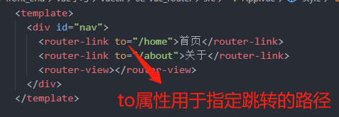

组件的渲染位置决定于 router-view 在 router-link 的上方还是下方。

当我们点击了某个 router-link 的时候，该组件对应的根元素就会自动添加"router-link-active"类，这时我们可以为这个类自定义一些属性。

但是如果我们需要把"router-link-active"这个类的名字改成其他相对比较简单的名字如“active”，我们可以在 router-link 中添加属性"active-link='active'"，但这需要给每 router-link 都添加。这时我们还可以到路由中的 router 实例中修改：
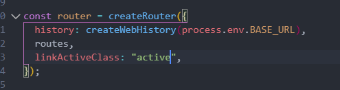

router-link 添加 replace 属性，禁止返回

如果我们不想要通过 router-link 刷新页面，我们可以通过监听事件来刷新：

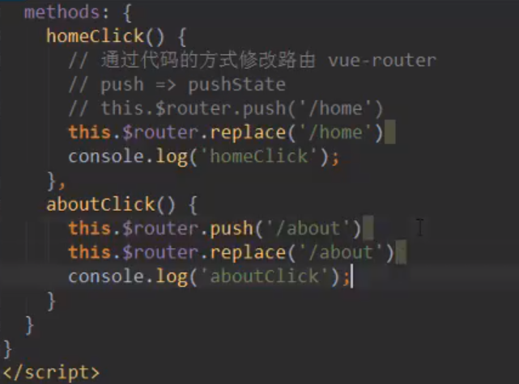

this.\$router.push('')是有返回的

this.\$router.replace('')没有返回

### 路由的懒加载（用到时再加载）

- 当打包构建应用时，Javascript 包会变得非常强大，影响页面加载。
- 如果我们能把不同路由对应的组件分割成不同的代码块，然后当路由被访问的时候才加载对应组件，这样就更加高效了

(+ 首先,我们知道路由中通常会定义很多不同的页面.

- 这个页面最后被打包在哪里呢?一般情况下，是放在一个 js 文件中.口但是,页面这么多放在一个 js 文件中,必然会造成这个页面非常的大
- 如果我们一次性从服务器请求下来这个页面,可能需要花费一定的时间,甚至用户的电脑上还出现了短暂空白的情况.
- 如何避免这种情况呢?使用路由懒加载就可以了.)

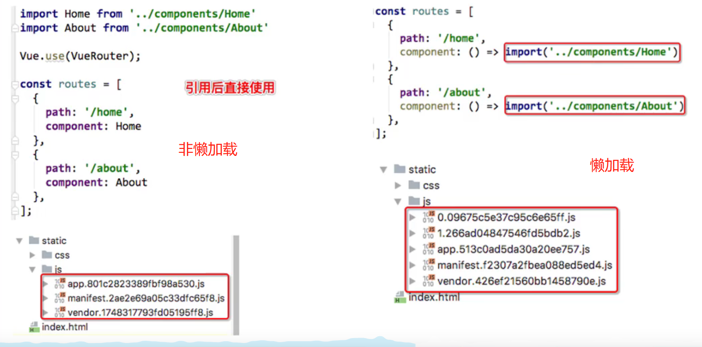

import 的位置改变了

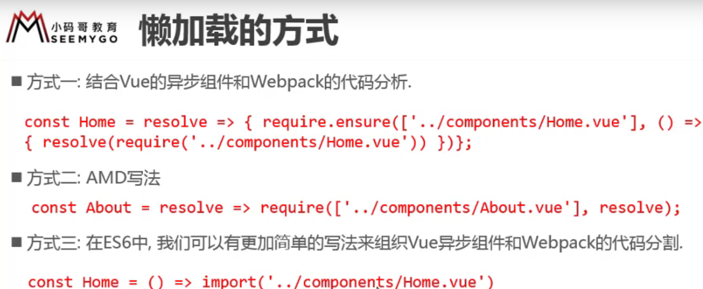

方式三有两种表达方式

1.  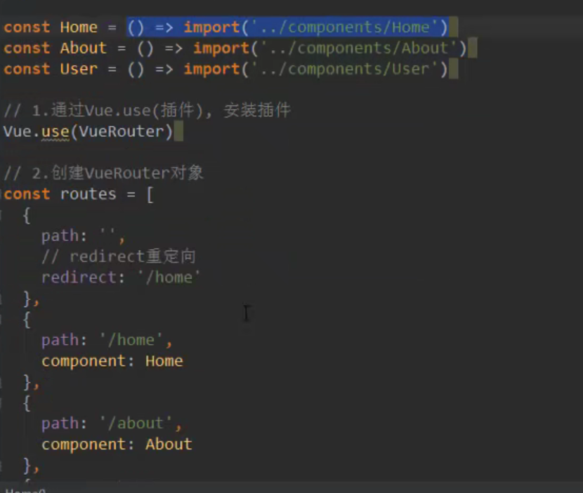

2.  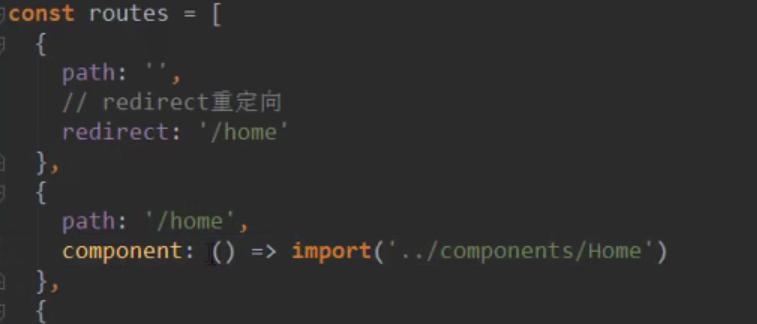

### 路由嵌套

- 创建对应的子组件，并且在路由映射中配置对应的子路由
- 在组件内部使用\<router-view>标签

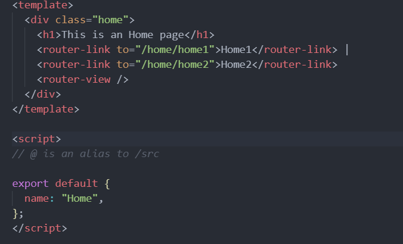
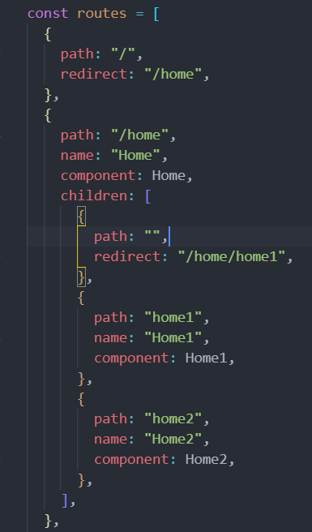

### vue-router 参数传递

传递参数的方式：

1. params

- 配置路由格式：/router/:自定义

```javascript
{
  path:'/user/:id',
  component:User
}
```

- 传递的方式： 在 path 后面跟上对应的值

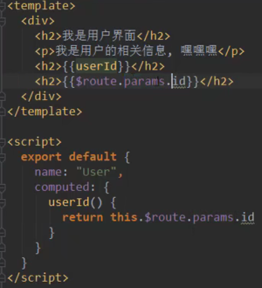

```javascript
 <router-link :to="'/user/'+userId">用户</router-link>
```

- 传递后形成的路径 ：/router/id1，/router/id2

query 的类型：

- 配置路由格式：/router，也就是普通配置
- 传递的方式：对象中使用 query 的 key 作为传递方式
- 传递后形成的路径：/router?id=123,//router?id=abc

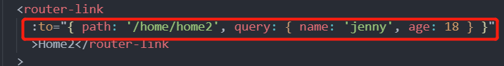

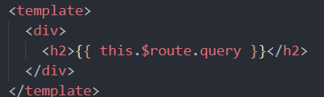

最终展示效果

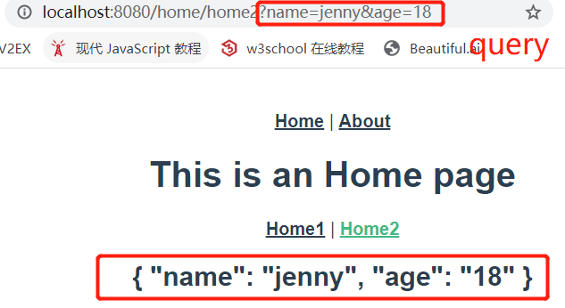

### 导航守卫

实现切换路由时 document 的标题随着改变
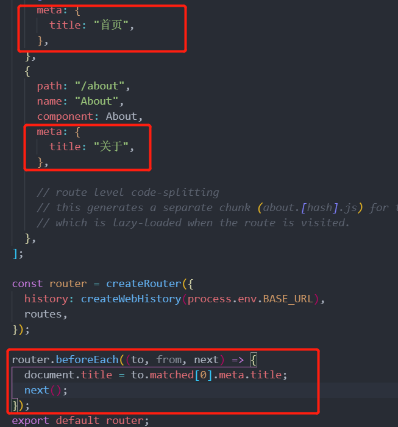

### keep-alive

每次我们切换组件时都是重新创建组件，要想保持每次组件的状态可以使用 keep-alive

- keep-alive 是 Vue 内置的一个组件，可以使被包含的组件保留状态，或避免重新渲染。

- router-view 也是一个组件，如果直接被包在 keep-alive 里面，所有路径匹配到的视图组件都会被缓存；

使用方法如下：

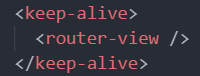

在 data 里面定义 path，也就是 Home 组件默认的路由（进入 Home 界面默认显示 home1 还是 home2）

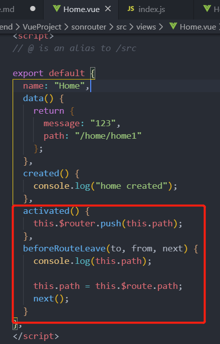

注意要把 Home 路由的子路由的重定向删除

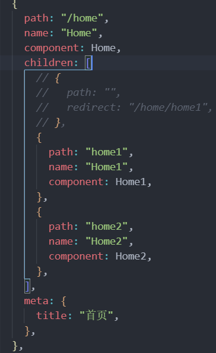

1. keep-alive 是 Vue 内置的一个组件，可以使被包含的组件保留状态，或避免重新渲染。它们有两个非常重要的属性:

- include -字符串或正则表达，只有匹配的组件会被缓存
- exclude - 字符串或正则表达式，任何匹配的组件都不会被缓存

2. router-view 也是一个组件，如果直接被包在 keep-alive 里面，所有路径匹配到的视图组件都会被缓存 ∶

假设在该包含了 keep-alive 的 router-view 里面有不想缓存的组件，可以在 keep-alive 中，添加 exclude='不想被缓存的组件的 name，有多个不缓存的组件则用逗号隔开（注意不能加空格）exclude='name1,name2'

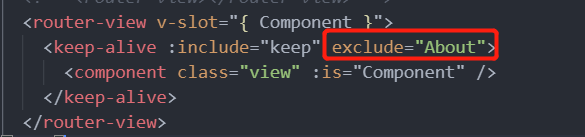

### promise

用来封装异步函数的，防止回调地狱

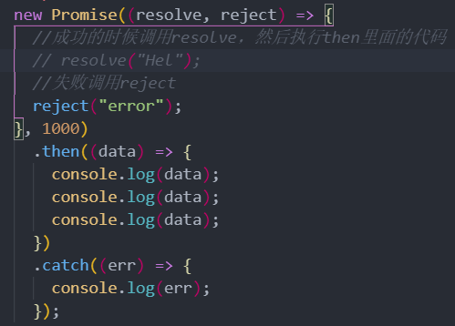

```javascript
Promise.all([
  new Promise((resolve, reject) => {
    setTimeout(() => {
      resolve("11");
    }, 3000);
  }),
  new Promise((resolve, reject) => {
    setTimeout(() => {
      resolve("13");
    }, 2000);
  }),
]).then((result) => {
  console.log(result);
});
```

Promise.all 是将所有的 promise 封装的异步函数执行完后再执行 then 里面的代码

### Vuex

Vuex 是专门为 Vue.js 应用程序开发的状态管理模式

- 它采用集中式存储管理应用的所有组件状态，并以相应的规则保证状态以一种可预测的方式发生变化

- Vuex 也集成到 Vue 的官方调试工具 devtools extension，提供了注入零配置的 time-travel 调试、状态快找导入导出等高级调试功能

总而言之，Vuex 使某个状态能在多个组件中共享的插件，是响应式的

#### 什么样的状态需要共享

- 用户的登录状态、名称、头像等信息
- 商品的收藏、购物车的商品等

#### vuex 的使用

- 在使用脚手架创建项目的时候选择 vuex
- 在 src 内的 store 文件夹中的 index.js，state 是用来存储共享的数据的

  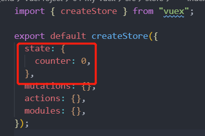

调用方法：\$store.state.被调用的数据

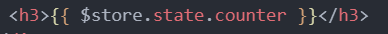

修改共享状态：

1. 可以用，但不建议用

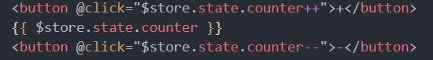

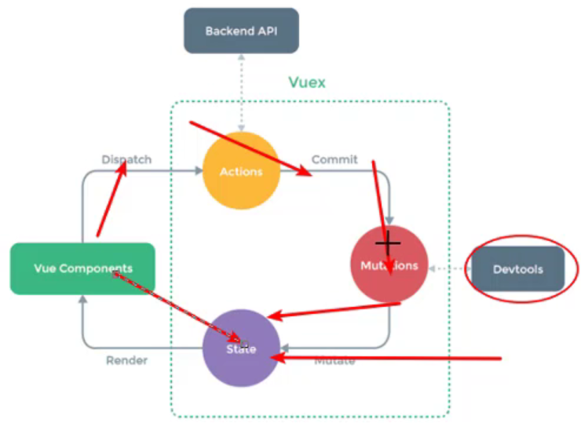

只要是修改 State 状态一定是通过 mutations 修改的，这样 Devtools 才会记录状态的修改日志，最终调错时才会更加方便

2.  通过 mutation 改变

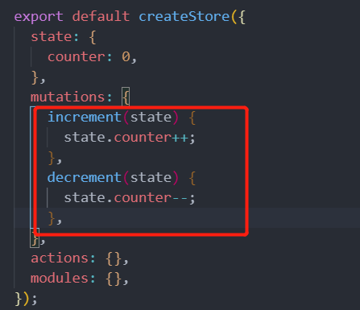

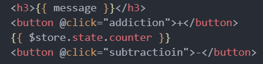

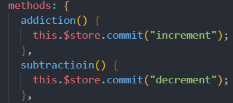

<strong>vuex 的 store 状态的更新唯一方式 Mutation</strong>

### Mutation 相应规则：

Vuex 的 store 中的 state 是响应式的,当 state 中的数据发生改变时, Vue 组件会自动更新.这就要求我们必须遵守一些 Vuex 对应的规则:

提前在 store 中初始化好所需的属性，已有的对象和属性的值的更改具有响应式，而对“对象的属性”或“属性”进行直接的增删，虽然能够使 state 里面的实际数据进行改变，但其不具有响应式，不能反映到页面中，因为这些数据没有被监听

当给 state 中的对象增删新属性时,使用下面的方式:

- 方式一:使用 Vue.set(obj, 'newProp',123)
- 方式二:用新对象给旧对象重新赋值
- 方式三：Vue.delete(state.obj,deleteProp)

<strong> Mutation必须进行同步方法，否则devtools无法对操作的变化进行跟踪,如果必须进行异步操作，则在Actoin进行异步操作</strong>


