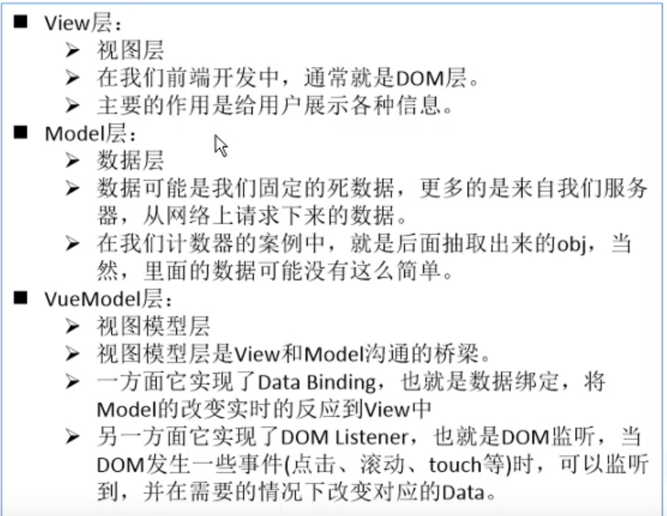

### MVVM

MVVM（Model–view–viewmodel）是一种软件架构模式。


### v-for

```javascript
//vue的data： movies: ["a", "b", "c", "d"],
<ul>
  <li v-for="item in movies">{{ item }}</li>
</ul>
```

以上代码片段得：

<ul>
  <li>a</li>
  <li>b</li>
  <li>c</li>
  <li>d</li>
</ul>

### v-on 绑定事件监听

v-on:click="方法" 点击调用方法，相当于@click

```html
<button @click="add">+</button> <button v-on:click="sub">-</button>
```

v-on:mouseenter="方法"

v-on:blur="方法"

当通过 methods 中定义方法，以提供@click 调用时，需要注意参数的问题

1. 如果该方法不需要额外的参数，那么可以直接@click="方法"，可以省略()，但是方法本身是需要一个参数的，如果在调用方法时没有加()，并且在定义方法时需要传参，此时 Vue 会默认将浏览器生成的 event 事件对象作为参数

```javascript
window.onload = function () {
  new Vue({
    el: "#app",
    data: {},
    methods: {
      add(event) {
        console.log(event);
      },
    },
  });
};
```

```html
<button @click="add">+</button>
```

此时的 add 打印的是浏览器生成的 event 事件对象

2. 当我们需要 event 对象，同时又需要其他参数可以使用\$event 来获取浏览器参数的 event 对象

```javascript
window.onload = function () {
  new Vue({
    el: "#app",
    data: {},
    methods: {
      add(a, event) {
        console.log(a, event);
      },
    },
  });
};
```

```html
<button @click="add('123',$event)">+</button>
```

此时的 add 打印的是 123 和浏览器生成的 event 事件对象，如果 add 没有加()则打印的第一个是 event 事件对象，第二个是 undefined

### v-on 修饰符

1. 阻止冒泡 @事件.stop

```html
<div @click="externalClick">
  <button @click.stop="innerClick">+</button>
</div>
```

阻止了 button 的冒泡，相当于 event.stopPropagation()

2. 阻止默认事件 @事件.prevent

```html
<form action="baidu">
  <input type="submit" @click.prevent="submitClick" />
</form>
```

阻止 input 的提交,点击按钮不提交，而是执行 submitClick 函数

3. 监听键盘某个键 @事件.prevent

```html
<button type="submit" @click.once="clickMe">click</button>
```

第一次点击 button 的时候调用 clickMe，后面再点击则不会再调用

### v-once 不根据数据的改变而改变

4. 只允许事件调用一次 @事件.once

```html
<!--vue里的data：message: "哈哈哈",-->
<h3>{{message}}</h3>
//展示哈哈哈
<!--修改message的内容，h3展示的还是哈哈哈-->
```

该指令表示元素只渲染一次，不根据数据的改变而改变

### v-html 往 dom 插入 html 元素

```html
<!--vue里的data url: "<a href='http://www.baidu.com'>百度一下</a>"-->,

<h3 v-html="url"></h3>
```

正常展示链接，如果不加 v-html 则以字符串的形式展示"\<a href='http://www.baidu.com'>百度一下\</a>"

### v-text

```html
<h2>{{message}}</h2>
<h2 v-text="message"></h2>
```

上述两者的显示情况相同，但当我们需要在 message 后面自定义内容的话应该使用{{message}}+自定义内容，否则使用 v-text 指令会将我们的自定义内容覆盖掉

### v-pre

添加了 v-pre 指令的元素不会被 vue 进行解析

```html
<h2 v-pre>{{message}}</h2>
```

页面显示的是{{message}}，而不是 message 的内容

### v-bind 操作 dom 元素的属性

```javascript
window.onload = function () {
  const app = new Vue({
    el: "#app",
    data: {
      message: "hhh",
      imgURL: "img/MVVM.jpg",
    },
  });
};
```

```html
 
```

### 动态更改元素的 class

```javascript
window.onload = function () {
  const app = new Vue({
    el: "#app",
    data: {
      message: "hhh",
      isActive: true,
      isLine: true,
    },
    methods: {
      change: function () {
        this.isActive = !this.isActive;
      },
      getClasses: function () {
        return { active: this.isActive, line: this.isLine };
      },
    },
  });
};
```

```html
<div id="app">
  <h2 :class="{active:isActive,line:isLine}" @click="change">{{message}}</h2>
  <h2 :class="getClasses()" @click="change">{{message}}</h2>
</div>
```

绑定 class 可以使用:class="{类名:Boolean,类名:Boolean...}"
当布尔值为 true 则为该元素绑定该类，为 false 则不绑定.

我们也可以使用调用函数的方式返回绑定的类

### 绑定 style

```javascript
window.onload = function () {
  const app = new Vue({
    el: "#app",
    data: {
      finalFontSize: 100,
      baseStyle1: { backgroundColor: "pink" },
      baseStyle2: { fontSize: "50px" },
    },
  });
};
```

```html
<p :style="{color:'red',fontSize:finalFontSize+'px'}">hhh</p>
<p :style="[baseStyle1,baseStyle2]">hhh</p>
```

### computed 计算属性

用于当我们需要对某些数据进行某种变化再进行显示，可以在计算属性内再定义一个属性，并且返回变化后的数据。虽然定义变量的方式与定义方法的方式相同，但在 computed 里面定义的变量可直接作为属性来使用

```javascript
window.onload = function () {
  const app = new Vue({
    el: "#app",
    data: {
      firstName: "Zhang",
      lastName: "Jenny",
    },
    computed: {
      fullName: function () {
        return this.firstName + "  " + this.lastName;
      },
    },
    methods: {
      getFullName: function () {
        return this.firstName + "  " + this.lastName;
      },
    },
  });
};
```

```html
<div id="app">
  <p>{{getFullName()}}</p>
  <p>{{fullName}}</p>
</div>
```

两者效果等同，唯一的区别是在计算属性 computed 里面的变量直接作为属性使用，不需要在变量名称后加括号表示调用方法。注意，在 computed 内的变量最好不要取动词。

计算属性会有缓存，如果多次使用并且原先的计算数据没有更改，计算属性只会调用一次，因此计算属性的效率比 methods 要高。

### 计算属性的 setter 和 getter

我们写的计算属性的方法是已经简化过的实际上它是这样的：

```javascript
window.onload = function () {
  const app = new Vue({
    el: "#app",
    data: {
      firstName: "Zhang",
      lastName: "Jenny",
    },
    computed: {
      fullName: {
        set: function (newValue) {},
        get: function () {
          return this.firstName + "  " + this.lastName;
        },
      },
    },
  });
};
```

一般情况下计算属性是只读不写的，因为会省略 set，但如果需要设置值则会调用 set 方法

### v-if 决定元素是否要渲染

满足条件则渲染该元素

```html
<h3 v-if="num > 10">{{message}}</h3>
```

### v-else

满足条件则渲染该元素

```html
<h3 v-if="num > 0">{{message}}</h3>
<h3 v-else>略略略</h3>
```

### v-else-if

满足条件则渲染该元素

```html
<h3 v-if="score>=90">优秀</h3>
<h3 v-else-if="score>=80">良好</h3>
<h3 v-else-if="score>=60">及格</h3>
<h3 v-else>不及格</h3>
```

### v-show 决定元素是否要显示

```html
<h3 v-show="num > 10">{{message}}</h3>
```

### v-show 和 v-if 的区别

当条件为 false，包含 v-if 指令的元素，根本就不会存在 dom 中，是直接没有渲染。
而 v-show 是渲染了，只是给我们的元素添加了一个行内样式：display:none,元素还是存在于 dom 中。

当在显示和隐藏之间比较频繁时使用 v-show，只有一次切换则使用 v-if

### v-for

#### v-for 遍历数组

```html
<ul>
  <li v-for="(item,index) in movies">{{index+1}}.{{item}}</li>
</ul>
```

#### v-for 遍历对象

```html
<ul>
  <li v-for="(value,key) in obj">{{value}}.{{key}}</li>
</ul>
<ul>
  <li v-for="value in obj">{{value}}</li>
</ul>
```

### 数组的方法的响应式

通过这些方法修改数组可以做到响应式：
push()、
pop()、
shift()、
unshift()、
sort()、
reverse()

通过索引修改数组不能做到响应式：this.arr[0]='a';vue 没有监听，我们可以使用

<p style="background:pink">this.arr.splice(0,1,'a')或者Vue.set(this.arr,0,'a')</p>来使其做到响应式

### v-model 双向绑定

```html
<input type="text" v-model="message" /> {{message}}
```

当我们通过 input 改变框框内的内容时，message 也会跟着改变

相当于：

```html
<input type="text" :value="message" @input="message=$event.target.value" />
```

#### v-model 单选框 radio

```html
<label for="male">
  <input type="radio" id="male" value="男" v-model="sex" />男
</label>
<label for="female">
  <input type="radio" id="female" value="女" v-model="sex" />女
</label>
<h4>您选择的性别是：{{sex}}</h4>
```

有了 v-model 的绑定我们可以省略 name 的绑定来实现互斥。并且我们选择哪一个，sex 就会随着选项的改变而改变。

#### v-model 复选框 checkbox

```html
<input type="checkbox" value="足球" v-model="hobbies" />足球
<input type="checkbox" value="篮球" v-model="hobbies" />篮球
<input type="checkbox" value="乒乓球" v-model="hobbies" />乒乓球
<input type="checkbox" value="跳舞" v-model="hobbies" />跳舞
<h2>您选择的爱好是：{{hobbies}}</h2>
```

hobbies 是在 data 的空数组，当我们选择或取消选择某个选项时，hobbies 会相应的添加或删除项，每个项的内容是 input 的 value

值绑定：

myHobbies: ["a", "b", "c", "d"]

```html
<label v-for="item in myHobbies" :for="item">
  <input type="checkbox" :value="item" :id="item" v-model="hobbies" />{{item}}
</label>
```

#### v-model 选项框 select

```html
<select name="fruits" id="" v-model="fruits" multiple>
  <option value="苹果">苹果</option>
  <option value="香蕉">香蕉</option>
  <option value="榴莲">榴莲</option>
  <option value="火龙果">火龙果</option>
  <option value="青提">青提</option>
</select>
```

fruits 是在 data 的空数组，当我们选择或取消选择某个选项时，fruits 会相应的添加或删除项，每个项的内容是 input 的 value

### v-model 修饰符

#### 1. lazy

当我们使用 v-model 的时候 input 和 message 是实时绑定的，数据是同时改变，我们可以使用 lazy 修饰符使数据在 input 失去焦点或按下回车是才更新

```html
<input type="text" v-model.lazy="message" /> {{message}}
```

#### 2. number

当我们的 input 规定只能输入数字，但是获取到的 value 仍然是 String 类型，这时我们就可以使用 number 修饰符来自动转换数据类型

```html
<input type="number" v-model.number="age" />
<h3>{{typeof age}}</h3>
```

#### 3. trim

去除 value 前后两边的空格

```html
<input type="text" v-model.trim="message" />
```

### 注册组件的基本步骤

组件的使用分成三个步骤：

1. 调用 Vue.extend()方法创建组件构造器
2. 调用 Vue.component()方法注册组件
3. 在 Vue 实例的作用范围内使用组件

```javascript
window.onload = function () {
  //1.创建组件构造器对象，
  const cpnC = Vue.extend({
    template: `
        <div>
          <h2>cpnC</h2>
          <p>cpnC</p>
        </div>
        `,
  });
  const cpnCC = Vue.extend({
    template: `
        <div>
          <h2>cpnCC</h2>
          <p>cpnCC</p>
        </div>
        `,
  });
  //2. 注册组件,在这注册的是全局组件，所有的Vue实例都能使用
  Vue.component("my-cpn", cpnC);

  const app = new Vue({
    el: "#app",
    data: {},
    components: {
      cpn: cpnCC, //标签名，组件构造器，在这注册的是局部组件，只有这的实例才能使用
    },
  });
};
```

然后直接在 html 内部使用标签

```html
<div id="app">
  <!-- 3. 使用组件 -->
  <my-cpn></my-cpn>
  <cpn></cpn>
</div>
```

### 父子组件

```javascript
const cpnC1 = Vue.extend({
  template: `
    <div>
      <h2>cpnC1</h2>
    </div>
    `,
});
const cpnC2 = Vue.extend({
  template: `
    <div>
      <h2>cpnC2</h2>
      <cpn1></cpn1>
    </div>
    `,
  components: {
    cpn1: cpnC1,
  },
});
```

cpnC2 是 cpnC1 的父组件

### 注册组件的语法糖

```javascript
//创建并注册组件构造器对象
Vue.component("cpn1", {
  template: `
    <div>
      <h2>cpnC1</h2>
    </div>
    `,
});
```

### 组件的分离

```html
<template id="cpn3">
  <div>
    <h2>cpn3</h2>
  </div>
</template>

<div id="app">
  <!-- 使用组件 -->
  <cpn3></cpn3>
</div>
```

```javascript
const app = new Vue({
  el: "#app",
  data: {},
  components: {
    cpn3: {
      template: `#cpn3`,
    },
  },
});
```

### 组件内的数据

```javascript
const app = new Vue({
  el: "#app",
  data: {},
  components: {
    cpn3: {
      template: `#cpn3`,
      data() {
        return {
          message: "hhh",
        };
      },
    },
  },
});
```

```html
<template id="cpn3">
  <div>
    <h2>message</h2>
  </div>
</template>

<div id="app">
  <!-- 使用组件 -->
  <cpn3></cpn3>
</div>
```

注意，当组件内的元素比较多时需要用一个 div 把所有元素框起来

### 组件中的 data 为什么是函数

当我们重复使用同一个组件时，我们需要用到组件内的数据，但这些数据不能相互干扰，而 data 是函数时，每次返回一个对象，每使用一次这个组件就会调用这个函数，返回一个对象，每次调用函数都会返回不同的对象，因此数据就不会产生干扰。

### 父子组件的通信

#### 通过 props 向子组件传递数据

首先先定义一个 template

```html
<template id="cpn">
  <div>
    <h2>cpn</h2>
    <h3>{{cmovies}}</h3>
  </div>
</template>

<div id="app">
  <!--  使用组件，在组件内绑定属性 -->
  <cpn v-bind:cmovies="movies" :cmessage="message"></cpn>
</div>
```

在 js 代码中绑定组件

```javascript
const cpn = {
  template: `#cpn`,
  // props: ["cmovies", "cmessage"],
  props: {
    cmovies: {
      //类型是对象或者数组 默认值必须从一个工厂函数获取
      type: Array,
      default() {
        return [];
      },
    },
    cmessage: {
      type: String,
      default: "hhhh",
    },
  },
};

const app = new Vue({
  el: "#app",
  data: {
    movies: ["a", "b", "c"],
    message: "message",
  },
  components: {
    cpn,
  },
});
```

#### 通过自定义事件向父组件传递数据

```javascript
//1.创建组件构造器对象，子组件
const cpn = {
  template: `#cpn`,
  data() {
    return {
      categories: [
        { id: "a", name: "aa" },
        { id: "b", name: "bb" },
        { id: "c", name: "cc" },
        { id: "d", name: "dd" },
      ],
    };
  },
  methods: {
    btnClick(item) {
      this.$emit("itemclick", item, "123"); //itemclick是我们将要在父组件中使用的自定义事件，后面的则是要传过去的参数，使用emit发射数据
    },
  },
};
//创建父组件
const app = new Vue({
  el: "#app",
  methods: {
    cpnClick(item, a) {
      //接收数据
      console.log(item, a);
    },
  },
  components: {
    cpn,
  },
});
```

```html
<!-- 子组件模板 -->
<template id="cpn">
  <div>
    <!-- 每点击一次button就会调用btnClick，并且把item传过去，在btnClick中发送数据给父组件 -->
    <button v-for="item in categories" @click="btnClick(item)">
      {{item.name}}
    </button>
  </div>
</template>
<!-- 父组件模板 -->
<div id="app">
  <!-- 3. 使用自定义事件 -->
  <cpn @itemclick="cpnClick"></cpn>
</div>
```

### 父子组件的访问

#### 父组件访问子组件 $children $refs

```javascript
const cpn = {
  template: "#cpn",
  data() {
    return {
      cpnname: "cpnname",
    };
  },
  methods: {
    showMessage() {
      return "hhh";
    },
  },
};

new Vue({
  el: "#app",
  data: {},
  components: {
    cpn,
  },
  methods: {
    btnClick() {
      this.$children[0].showMessage(); //调用子组件的方法
      console.log(this.$children[0].cpnname); //获取子组件的数据

      console.log(this.$refs.rrr.cpnname + "这个是refs的"); //使用refs加对组件添加key的方式一一对应
    },
  },
});
```

```html
<template id="cpn">
  <div>
    <h2>{{showMessage()}}</h2>
  </div>
</template>

<div id="app">
  <cpn ref="rrr"></cpn>
  <cpn></cpn>
  <cpn></cpn>
  <button @click="btnClick">click</button>
</div>
```

#### 子组件访问父组件 \$parent

```javascript
const cpn = {
  template: "#cpn",
  data() {
    return {
      cpnname: "cpnname",
    };
  },
  methods: {
    btnClick() {
      console.log(this.$parent.parentname); //使用parent访问父组件的属性parentname
    },
  },
};
```

#### 访问根组件 \$root

```javascript
const cpn = {
  template: "#cpn",
  data() {
    return {
      cpnname: "cpnname",
    };
  },
  methods: {
    btnClick() {
      console.log(this.$root.rootname); //使用parent访问根组件的属性rootname，这里访问的一般是vue实例
    },
  },
};
```

### slot 插槽的基本使用

slot 可以使组件具备扩展性，假设我们多次使用同一个组件 cpn，但是每个该组件都想使其不同，第一个 cpn 组件想添加 button，第二个 cpn 组件想添加 i 标签等等，这时我们就可以使用 slot 完成这个需求

1. slot 直接定义在子组件的模板里

```html
<template id="cpn">
  <div>
    <h2>子组件</h2>
    <button @click="btnClick">click</button>
    <slot></slot>
  </div>
</template>
<!-- 在实例中使用： -->
<div id="app">
  <cpn>
    <input type="text" value="我是input" />
  </cpn>
</div>
<!-- 这样就可以在该组件中显示input了 -->
```

2. slot 插槽的默认值

```html
<template id="cpn">
  <div>
    <h2>子组件</h2>
    <button @click="btnClick">click</button>
    <slot><button>我是默认的button</button></slot>
  </div>
</template>
<!-- 在实例中使用： -->
<div id="app">
  <cpn>
    <input type="text" value="我是input" />
  </cpn>
</div>
<!-- 如果我们没有手动在cpn组件中添加元素，
则会自动添加<button> 我是默认的button </button>-->
```

3. 多个元素的添加也可以同时放入到 slot 中

```html
<template id="cpn">
  <div>
    <h2>子组件</h2>
    <button @click="btnClick">click</button>
    <slot><button>我是默认的button</button></slot>
  </div>
</template>
<!-- 在实例中使用： -->
<div id="app">
  <cpn>
    <input type="text" value="我是input1" />
    <input type="text" value="我是input2" />
    <input type="text" value="我是input3" />
  </cpn>
</div>
<!-- 组件中多了三个input-->
```

### 具名插槽的使用

当我们有多个 slot 的时候，实例中的 cpn 组件内的元素会一一插入 slot 中

```html
<template id="cpn">
  <div>
    <h2>子组件</h2>
    <slot><button>我是默认的button</button></slot>
    <slot><button>我是默认的button</button></slot>
    <slot><button>我是默认的button</button></slot>
  </div>
</template>
<!-- 在实例中使用： -->
<div id="app">
  <cpn>
    <input type="text" value="我是input1" />
  </cpn>
</div>
<!-- 组件中三个slot都会显示input-->
```

### 组件作用域

```html
<template id="cpn">
  <div>
    <!-- 这里的isShow用的是组件里面的isShow -->
    <h2 v-show="isShow">子组件</h2>
  </div>
</template>
<!-- 在实例中使用： -->
<div id="app">
  <!-- 这里的isShow用的是vue实例里面的isShow -->
  <cpn v-show="isShow"></cpn>
</div>
```
